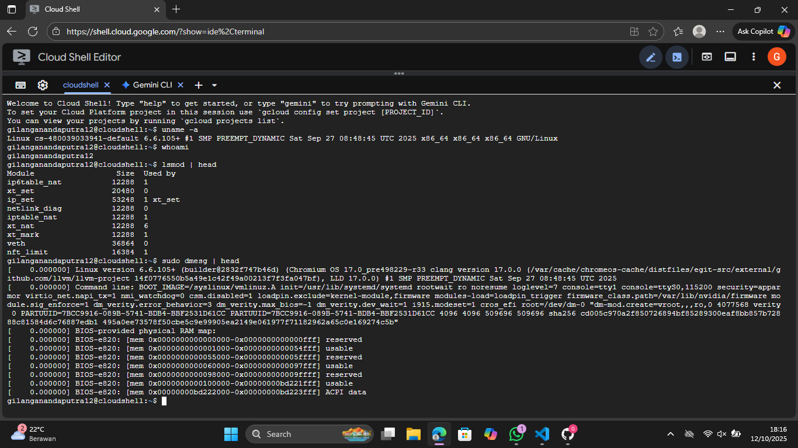

# Laporan Praktikum Minggu [1]
Topik: Arsitektur Sistem Operasi


---

## Identitas
- **Nama**  : Gilang Ananda Putra  
- **NIM**   : 250202939  
- **Kelas** : 1IKRB

---

## Tujuan
Tuliskan tujuan praktikum minggu ini.  
Contoh:  
1. Menjelaskan peran sistem operasi dalam arsitektur komputer.
2. Mengidentifikasi komponen utama OS (kernel, system call, device driver, file system).
3. Membandingkan model arsitektur OS (monolithic, layered, microkernel).
4. Menggambarkan diagram sederhana arsitektur OS menggunakan alat bantu digital (draw.io / mermaid).

---

## Dasar Teori
  **ringkasan teori**
   1. **Sistem operasi berperan sebagai penghubung utama** antara pengguna, aplikasi, dan perangkat keras. Komponen utamanya seperti kernel, system call, dan device driver bekerja sama untuk mengatur proses, memori, dan input/output.
   2. **Mode Eksekusi: Kernel Mode vs User Mode**
   - **Kernel Mode**: Memiliki akses penuh ke semua instruksi dan perangkat keras.
   - **User Mode**: Terbatas; digunakan oleh aplikasi biasa. Transisi dari user ke kernel mode terjadi melalui **system call** saat aplikasi memerlukan layanan OS.
   3. **System Call (Panggilan Sistem)**
   System call adalah antarmuka yang digunakan program untuk meminta layanan dari kernel OS. Contohnya termasuk membuka file, membaca data, atau mengakses perangkat. System call menjadi mekanisme utama interaksi antara aplikasi (user space) dan kernel (privileged space).

---

## Langkah Praktikum
1. Langkah-langkah yang dilakukan.
   1. **Setup Environment**
    - Pastikan Linux (Ubuntu/WSL) sudah terinstal.
   - Pastikan Git sudah dikonfigurasi dengan benar:
     ```bash
     git config --global user.name "Nama Anda"
     git config --global user.email "email@contoh.com"
     ```

   2. **Diskusi Konsep**
   - Baca materi pengantar tentang komponen OS.
   - Identifikasi komponen yang ada pada Linux/Windows/Android.

   3. **Eksperimen Dasar**
   Jalankan perintah berikut di terminal:
      ```bash
      uname -a
      whoami
      lsmod | head
      dmesg | head
      ```
      Catat dan analisis modul kernel yang tampil.

   4. **Membuat Diagram Arsitektur**
   - Buat diagram hubungan antara *User → System Call → Kernel → Hardware.*
   - Gunakan **draw.io** atau **Mermaid**.
   - Simpan hasilnya di:
     ```
     praktikum/week1-intro-arsitektur-os/screenshots/diagram-os.png
     ```

   5. **Penulisan Laporan**
   - Tuliskan hasil pengamatan, analisis, dan kesimpulan ke dalam `laporan.md`.
   - Tambahkan screenshot hasil terminal ke folder `screenshots/`.

   6. **Commit & Push**
   ```bash
   git add .
   git commit -m "Minggu 1 - Arsitektur Sistem Operasi dan Kernel"
   git push origin main
   ```

---

## Kode / Perintah
Tuliskan potongan kode atau perintah utama:
- perintah ```uname -a```
   - menghasilkan
   ```bash
   Linux cs-480039033941-default 6.6.105+ #1 SMP PREEMPT_DYNAMIC Sat Sep 27 08:48:45 UTC 2025 x86_64 x86_64 x86_64 GNU/Linux
   ```
- perintah ```lsmod | head```
   - menghasilkan
   ```bash
   Module                  Size  Used by
   ip6table_nat           12288  1
   xt_set                 20480  0
   ip_set                 53248  1 xt_set
   netlink_diag           12288  0
   iptable_nat            12288  1
   xt_nat                 12288  6
   xt_mark                12288  1
   veth                   36864  0
   nft_limit              16384  1
   ```
- perintah ```dmesg | head```
   - menghasilkan
   ```bash
   [    0.000000] Linux version 6.6.105+ (builder@2832f747b46d) (Chromium OS 17.0_pre498229-r33 clang version 17.0.0 (/var/cache/chromeos-cache/distfiles/egit-src/external/github.com/llvm/llvm-project 14f0776550b5a49e1c42f49a00213f7f3fa047bf), LLD 17.0.0) #1 SMP PREEMPT_DYNAMIC Sat Sep 27 08:48:45 UTC 2025
   [    0.000000] Command line: BOOT_IMAGE=/syslinux/vmlinuz.A init=/usr/lib/systemd/systemd rootwait ro noresume loglevel=7 console=tty1 console=ttyS0,115200 security=apparmor virtio_net.napi_tx=1 nmi_watchdog=0 csm.disabled=1 loadpin.exclude=kernel-module,firmware modules-load=loadpin_trigger firmware_class.path=/var/lib/nvidia/firmware module.sig_enforce=1 dm_verity.error_behavior=3 dm_verity.max_bios=-1 dm_verity.dev_wait=1 i915.modeset=1 cros_efi root=/dev/dm-0 "dm-mod.create=vroot,,,ro,0 4077568 verity 0 PARTUUID=7BCC9916-089B-5741-BDB4-BBF2531D61CC PARTUUID=7BCC9916-089B-5741-BDB4-BBF2531D61CC 4096 4096 509696 509696 sha256 cd005c970a2f850726894bf85289300eaf8bb857b72888c81584d6c76887edb1 495a0ee73578f50cbe5c9e99905ea2149e061977f71182962a65c0e169274c5b"
   [    0.000000] BIOS-provided physical RAM map:
   [    0.000000] BIOS-e820: [mem 0x0000000000000000-0x0000000000000fff] reserved
   [    0.000000] BIOS-e820: [mem 0x0000000000001000-0x0000000000054fff] usable
   [    0.000000] BIOS-e820: [mem 0x0000000000055000-0x000000000005ffff] reserved
   [    0.000000] BIOS-e820: [mem 0x0000000000060000-0x0000000000097fff] usable
   [    0.000000] BIOS-e820: [mem 0x0000000000098000-0x000000000009ffff] reserved
   [    0.000000] BIOS-e820: [mem 0x0000000000100000-0x00000000bd221fff] usable
   [    0.000000] BIOS-e820: [mem 0x00000000bd222000-0x00000000bd223fff] ACPI data
   ```

---

## Hasil Eksekusi
Sertakan screenshot hasil percobaan atau diagram:


---

## Analisis
- Jelaskan makna hasil percobaan. 
    1. `uname -a` menunjukan sistem menggunakan kernel linux, versi tertentu, tanggal pembuatan, dan arsitektur hardware.
    2. `whoami` menunjukan operasi saat ini berada di lingkungan **User Mode**.
    3. `lsmod | head` menampilkan **Loadable Kernel Modules (LKM)**. 
    4. `dmesg | head` menampilkan pesan-pesan kernel, yang mencakup inisialisasi device driver dan perangkat hardware saat booting.
- Hubungkan hasil dengan teori (fungsi kernel, system call, arsitektur OS).  
    1. **Fungsi Kernel** : Perintah `lsmod` dan `dmesg` membuktikan kernel bertanggung jawab atas Device Driver dan manajeman hardware.
    2. **System Call** : semua perintah yang dijalankan oleh shell ( sebagai proses penggunaan ) pasti menggunakan System Call untuk berinteraksi dengan kernel.
    3. **Arsitektur OS**: Perintah membuktikan arsitektur Linux yang **Monolithic**, tetapi dengan kapabilitas modular (LKM), menunjukkan bahwa model arsitektur di OS modern seringkali merupakan hibrida.
- Apa perbedaan hasil di lingkungan OS berbeda (Linux vs Windows)?  
    1. `lsmode`
          - **Linux** menampilkan LKM (Loadable Kernel Modules) yang dikembangkan oleh komunitas/vendor, sangat modular.
          - **Windows** tidak ada perintah langsung yang serupa. Modul kernel disebut drivers atau kernel-mode components (misalnya `.sys` files) yang dimuat oleh I/O manager atau Object Manager.

    2. Struktur Kernel
          - **Linux** sangat Monolithic dengan dukungan modularitas. Semua komponen utama berjalan di ruang kernel.
          - **windows Hybrid Kernel**. Sebagian besar berjalan di ruang kernel, tetapi subsystems lingkungan (misalnya Win32) berjalan di User Mode sebagai server untuk menjaga modularitas.

    3. Lisensi
          - **Linux** sumber terbuka (GPL)
          - **Windows** sumber tertutup (proprietari)

---

## Analisis 2

**Kernel dan Arsitektur Sistem Operasi**

**Kernel** adalah inti dari sistem operasi (OS) yang berfungsi sebagai penghubung antara perangkat keras (hardware) dan perangkat lunak (software) aplikasi. Kernel mengendalikan aspek penting dalam sistem dan menjalankan berbagai fungsi, seperti penjadwalan CPU, manajemen memori, serta pengolahan perangkat input/output (I/O).
Dalam desain kernel modern, terdapat upaya lanjutan untuk mengimbangi empat isu krusial seperti kinerja, keandalan, keamanan (*diukur melalui Trusted Computing Base*/TCB), dan modularitas.

Terdapat tiga arsitektur utama, yaitu **monolithic kernel, microkernel,** dan **layered architecture.**

## Perbedaan Arsitektur Kernel

**1. Monolithic Kernel**

Monolithic kernel menggabungkan seluruh layanan inti sistem, seperti manajemen proses, memori, sistem file, *device drivers*, dan **networking stacks**, ke dalam satu program besar yang berjalan di ruang kernel yang sama.
Metode komunikasi yang digunakan adalah pemanggilan fungsi langsung (*direct function calls*) antar-komponen, sehingga lebih efisien.
**Kelebihan:**
- Kinerja tinggi, karena tidak ada *overhead* dari komunikasi antar-proses (IPC) maupun *context switching.*
**Kelemahan:**
- Isolasi kesalahan buruk. Jika satu driver gagal, seluruh sistem bisa ikut terganggu (*kernel panic*).
-	TCB besar, karena semua kode driver yang kompleks dijalankan dengan hak istimewa penuh, sehingga meningkatkan risiko serangan.
**Contoh OS**: Linux, Unix Kernel, FreeBSD (umumnya menggunakan model monolithic modular dengan dukungan *Loadable Kernel Module*/LKM).
 	
**2. Microkernel**

Arsitektur microkernel berlandaskan prinsip minimalisme. Kernel inti hanya menyediakan mekanisme dasar seperti manajemen ruang alamat, manajemen *thread*, dan komunikasi antar-proses *(IPC)*.
Layanan sistem operasi tradisional seperti *device driver* dan sistem file dijalankan sebagai proses terpisah (*server*) di ruang pengguna.
Metode komunikasi dalam microkernel sepenuhnya mengandalkan *IPC* berbasis *message passing.*
**Kelebihan:**
- Keandalan dan keamanan lebih baik. Isolasi kesalahan kuat, karena kegagalan driver di *user space* hanya memengaruhi proses server tersebut, bukan kernel inti *(self-healing)*.
- TCB sangat kecil, sehingga permukaan serangan lebih terbatas.
**Kelemahan:**
- Tantangan kinerja, karena *overhead* IPC melibatkan *context switching* dan penyalinan data antar-ruang alamat.
**Contoh OS:** QNX, MINIX 3, keluarga kernel L4.

**3. Layered Architecture**

Model ini membagi sistem operasi ke dalam lapisan-lapisan hierarkis, di mana setiap lapisan menggunakan layanan dari lapisan tepat di bawahnya.
Metode komunikasi dilakukan melalui antarmuka antar-lapisan atau menggunakan mekanisme *message passing* yang terstruktur.
**Kelebihan:**
- Struktur jelas, sehingga mempermudah pengembangan, verifikasi, dan *debugging.*
**Kelemahan:**
- Kinerja lebih rendah. Banyaknya switching antar-lapisan dapat menimbulkan overhead komunikasi substansial.
**Contoh OS:** THE Multiprogramming System (kasus historis murni).

## Analisis Relevansi untuk Sistem Modern

Arsitektur yang paling relevan saat ini adalah **monolithic modular** dan **microkernel.**
- **Monolithic modular** tetap menjadi pilihan dominan untuk sistem tujuan umum (**general purpose**) dan server, misalnya Linux. Kecepatan bawaan arsitektur monolithic, ditambah fleksibilitas modul melalui LKM, membuatnya unggul dalam hal *throughput data* dan kinerja absolut.
- **Microkernel** lebih unggul untuk sistem misi kritis (*high-assurance*), real-time (RTOS), dan sistem tertanam (*embedded systems*), seperti QNX. Isolasi kesalahan yang kuat dan keandalan tinggi menjadikannya ideal di bidang otomotif, penerbangan, dan sistem yang tidak boleh gagal, meskipun ada sedikit kompromi pada kinerja.

Selain dua model tersebut, berkembang juga **model hibrida** sebagai kompromi. Contohnya Windows NT dan XNU (macOS/iOS), yang menggabungkan kecepatan monolithic dengan struktur modular seperti microkernel. Namun, hibrida sering mengorbankan isolasi kesalahan sejati dari microkernel.

## Kesimpulan

Tidak ada satu model arsitektur kernel yang benar-benar unggul untuk semua kebutuhan:
- **Monolithic modular** mendominasi pasar desktop dan server karena kinerja.
- **Microkernel unggul** di pasar sistem kritis karena keandalan dan keamanannya.
Masa depan arsitektur sistem operasi berfokus pada:
- Mengurangi *overhead* IPC pada microkernel.
- Meningkatkan keamanan monolithic, misalnya dengan penggunaan bahasa pemrograman aman memori seperti **Rust**.


---

## Kesimpulan
Tuliskan 2–3 poin kesimpulan dari praktikum ini.
1. **Sistem operasi berperan sebagai penghubung utama antara pengguna dan perangkat keras komputer.**
OS mengelola sumber daya seperti CPU, memori, dan perangkat I/O agar aplikasi dapat berjalan secara efisien dan aman melalui mekanisme *system call*.
2. **Kernel menjadi inti dari sistem operasi yang bekerja pada mode istimewa (kernel mode).**
Kernel menangani operasi penting seperti manajemen proses, memori, dan driver perangkat, sementara *user mode* membatasi akses agar sistem tetap stabil.

---

## Quiz
1. Sebutkan tiga fungsi utama sistem operasi.
   
   **Jawaban:**
   - Mengelola sumber daya (CPU, memori, I/O, dan penyimpanan)
   - Menyediakan layanan sistem untuk aplikasi.
   - Menjadi antarmuka antara pengguna dan perangkat keras.
2. Jelaskan perbedaan antara kernel mode dan user mode.
   
    **Jawaban:**
   - KERNEL MODE: akses penuh ke perangkat keras, di gunakan oleh kernel OS, jika error bisa merusak seluruh sistem.
   - USER MODE: akses terbatas, digunakan aplikasi, error hanya berdampak pada aplikasi tersebut.
3. Sebutkan contoh OS dengan arsitektur monolithic dan microkernel.
   
   **Jawaban:**
   - Monolithic: Linux, MS-DOS, UNIX
   - Microkernel: MINIX, QNX, MacOS x (mach)

---

## Refleksi Diri
Tuliskan secara singkat:
- Apa bagian yang paling menantang minggu ini?  
   Memahami cara kerja kernel dan perbedaan antara kernel mode, user mode, dan system call
- Bagaimana cara Anda mengatasinya?  
   Mempelajari ulang materi dan melakukan prcobaan di Linux.

---

**Credit:**   
_Template laporan praktikum Sistem Operasi (SO-202501) – Universitas Putra Bangsa_
