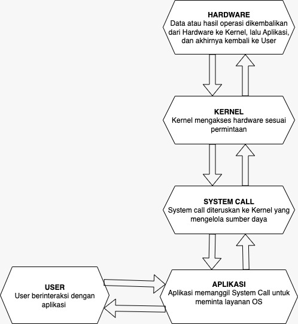
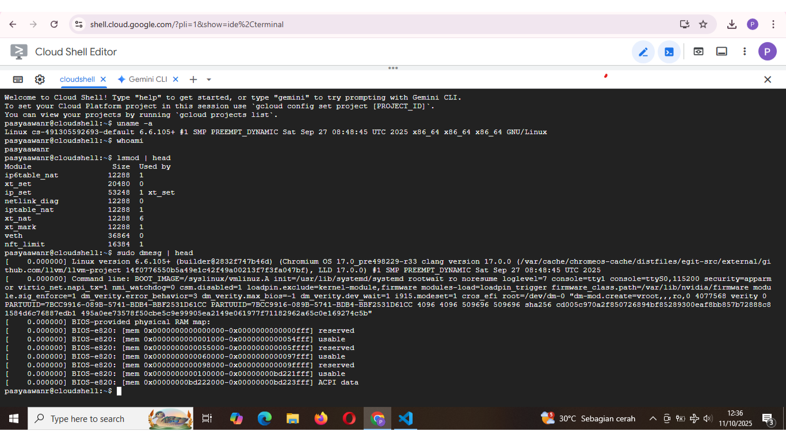

# Laporan Praktikum Minggu 1
Topik: Arsitektur Sistem Operasi dan Kernel

---

## Identitas
- **Nama**  : Pasya Awan Rizky Saputro  
- **NIM**   : 250202959 
- **Kelas** : 1IKRB

---

## Tujuan
Setelah menyelesaikan tugas ini, mahasiswa mampu:
1. Menjelaskan peran sistem operasi dalam arsitektur komputer.
2. Mengidentifikasi komponen utama OS (kernel, system call, device driver, file system).
3. Membandingkan model arsitektur OS (monolithic, layered, microkernel).
4. Menggambarkan diagram sederhana arsitektur OS menggunakan alat bantu digital (draw.io / mermaid).

---

## Dasar Teori
Pada praktikum minggu ini, mahasiswa akan mempelajari **arsitektur dasar sistem operasi**: bagaimana komponen OS bekerja, serta bagaimana interaksi antara user, aplikasi, kernel, dan hardware terjadi.  

Mahasiswa juga diperkenalkan pada:
- Perbedaan mode eksekusi **kernel mode** dan **user mode**.
- Mekanisme **system call** (panggilan sistem).
- Perbandingan model arsitektur OS seperti **monolithic kernel**, **layered approach**, dan **microkernel**.

Eksperimen akan dilakukan menggunakan perintah dasar Linux untuk melihat informasi kernel dan modul aktif.

---

## Langkah Praktikum
1. **Setup Environment**
   - Pastikan Linux (Ubuntu/WSL) sudah terinstal.
   - Pastikan Git sudah dikonfigurasi dengan benar:
   ```bash
     git config --global user.name "Nama Anda"
     git config --global user.email "email@contoh.com"
   ```

2. **Diskusi Konsep**
   - Baca materi pengantar tentang komponen OS.
   - Identifikasi komponen yang ada pada Linux/Windows/Android.

3. **Eksperimen Dasar**
   Jalankan perintah berikut di terminal:
   ```bash
   uname -a
   whoami
   lsmod | head
   dmesg | head
   ```
   Catat dan analisis modul kernel yang tampil.

4. **Membuat Diagram Arsitektur**
   - Buat diagram hubungan antara *User → System Call → Kernel → Hardware.*
   - Gunakan **draw.io** atau **Mermaid**.
   - Simpan hasilnya di:
     ```
     praktikum/week1-intro-arsitektur-os/screenshots/diagram-os.png
     ```

5. **Penulisan Laporan**
   - Tuliskan hasil pengamatan, analisis, dan kesimpulan ke dalam `laporan.md`.
   - Tambahkan screenshot hasil terminal ke folder `screenshots/`.

6. **Commit & Push**
   ```bash
   git add .
   git commit -m "Minggu 1 - Arsitektur Sistem Operasi dan Kernel"
   git push origin main
   ```

---

## Kode / Perintah
Tuliskan potongan kode atau perintah utama:
```bash
uname -a
whoami
lsmod | head
dmesg | head
```

---

## Hasil Eksekusi
Sertakan screenshot hasil percobaan atau diagram:




---

## Analisis 1
- Makna hasil percobaan
   * uname -a Linux atau sistem Unix-like itu berguna untuk mengecek info dasar tentang sistem operasi yang sedang di pakai
   * whoami berguna untuk melihat identitas user yang sedang login di terminal
   * lsmod | head digunakan untuk menginspeksi daftar modul kernel aktif, yaitu komponen modular yang dapat dimuat secara dinamis untuk mendukung perangkat keras, sistem file, atau fitur jaringan tanpa memerlukan reboot sistem
   * dmesg | head digunakan untuk menampilkan pesan-pesan diagnostik dari kernel Linux dengan membatasi output hanya pada baris-baris awal
- Hubungkan hasil dengan teori (fungsi kernel, system call, arsitektur OS).
   * Fungsi Kernel: Kernel bertanggung jawab atas manajemen hardware dan logging internal melalui fungsi printk() (atau variannya seperti dev_info()), yang menyimpan pesan di ring buffer (struktur sirkular di memori kernel space). 
   * System Call: Akses ke ring buffer dilakukan melalui system call seperti read() pada file virtual /proc/kmsg atau /dev/kmsg (di kernel modern), yang memetakan kernel space ke user space. 
   * Arsitektur OS: Dalam arsitektur Linux (monolitik dengan ekstensi modular), dmesg merepresentasikan interaksi antara kernel core dan modul (e.g., pesan dari driver USB atau filesystem).
- Apa perbedaan hasil di lingkungan OS berbeda (Linux vs Windows)?  
   * Perintah dan sintaks berbeda perintah terminal di Linux tidak sama dengan command prompt di Windows.

   * Struktur file dan path berbeda Linux memakai “/”, sedangkan Windows memakai “\”.

   * Output dan perilaku program bisa berbeda karena perbedaan sistem file, izin akses, dan manajemen proses.
## Analisis 2
- Perbedaan Monolithic kernel, microkernel, dan Layerd Architecture, beserta Contoh OS yang menerapkan tiap model.

  - Monolithic Kernel
Monolithic kernel merupakan arsitektur kernel yang menyatukan seluruh  layanan inti sistem operasi ke dalam satu ruang besar yang memiliki hak istimewa penuh. Desain ini menjadikan komunikasi antar komponen berlangsung cepat, karena semua modul dapat saling memanggil fungsi tanpa melalui perantara. Efisiensi ini menjadikannya unggul dalam hal performa. Sistem operasi dengan kernel monolitik biasanya mampu memberikan respons yang sangat cepat terhadap permintaan aplikasi maupun interaksi perangkat keras, sehingga banyak digunakan pada komputer pribadi dan server yang menuntut kecepatan tinggi. Selain itu, arsitektur ini relatif sederhana dari sisi konseptual karena seluruh bagian penting sistem berada di satu tempat.
Kelebihan
Monolithic kernel memiliki keunggulan utama dalam hal kinerja dan efisiensi. Karena semua komponen inti sistem operasi, seperti manajemen memori, penjadwalan proses, sistem berkas, dan driver perangkat keras, berada dalam satu ruang kernel, komunikasi antar komponen berlangsung sangat cepat tanpa memerlukan mekanisme tambahan seperti message passing. Hal ini membuat sistem dengan monolithic kernel mampu merespons permintaan dengan waktu yang lebih singkat dan bekerja optimal, terutama pada komputer pribadi dan server yang membutuhkan performa tinggi.
Kekurangan
Ukuran kernel yang besar dan kompleks membuatnya sulit dipelihara serta diuji. Setiap penambahan modul baru atau perubahan kecil di dalam kernel membawa risiko besar, sebab kesalahan dalam satu bagian dapat menjatuhkan seluruh sistem. Monolithic kernel juga cenderung rentan terhadap masalah keamanan karena semua layanan berjalan dengan hak istimewa yang sama. Kerusakan driver perangkat keras, misalnya, bisa berdampak fatal hingga mengakibatkan sistem gagal berfungsi.**Beberapa contoh: Linux, Unix Tradisional, MS-DOS, AIX (versi awal) dan Solaris Awal**.

  - Microkernel
Microkernel merupakan arsitektur kernel yang dirancang dengan prinsip meminimalkan fungsi yang dijalankan di dalam ruang kernel. Hanya layanan paling dasar seperti manajemen memori, komunikasi antarproses, dan penjadwalan proses yang ditempatkan di ruang kernel, sementara komponen lain seperti sistem berkas, driver perangkat, serta manajemen jaringan dijalankan di ruang pengguna. Pendekatan ini berbeda jauh dari monolithic kernel yang menempatkan semua layanan di satu ruang besar.
Kelebihan
Untuk kelebihan utama dari microkernel terletak pada stabilitas dan keamanannya. Karena sebagian besar layanan berjalan di ruang pengguna, kerusakan pada satu layanan tidak serta-merta mempengaruhi kernel atau layanan lainnya. Jika misalnya sebuah driver mengalami error, sistem masih dapat terus berjalan sementara driver tersebut dapat dimuat ulang tanpa harus me-restart seluruh sistem. Arsitektur ini juga memberikan modularitas yang tinggi, memudahkan pengembangan dan pemeliharaan, karena pengembang dapat menambah atau memperbarui layanan tanpa mengganggu kernel utama. Selain itu, microkernel lebih aman, sebab hanya sebagian kecil kode yang memiliki hak istimewa tertinggi, sehingga celah keamanan lebih mudah dikontrol.
Kekurangan
Karena layanan sistem tidak berada dalam satu ruang kernel, setiap interaksi antar layanan harus melalui mekanisme message passing yang melibatkan banyak pertukaran pesan antarproses. Hal ini menimbulkan overhead komunikasi yang cukup besar, sehingga sistem dengan arsitektur microkernel cenderung lebih lambat dibandingkan monolithic kernel. Selain itu, implementasi microkernel juga lebih kompleks, karena memerlukan manajemen komunikasi yang cermat agar tetap efisien dan stabil.**Beberapa contoh: Minix, QNX, Mach, Integrity dan L4**.

  - Layered Architecture
Layered architecture atau arsitektur berlapis merupakan salah satu pendekatan klasik dalam perancangan sistem operasi. Dalam model ini, sistem dibagi menjadi beberapa lapisan (layers) yang tersusun secara hierarkis. Setiap lapisan hanya dapat berinteraksi dengan lapisan di atas dan di bawahnya secara langsung. Tujuan utama dari desain ini adalah menciptakan sistem yang lebih terstruktur, mudah dipahami, dan lebih sederhana untuk dikelola.
Kelebihan
Karena setiap lapisan memiliki fungsi dan tanggung jawab yang jelas, pengembang dapat memodifikasi atau memperbarui satu lapisan tanpa perlu mengubah seluruh sistem. Hal ini juga membuat proses debugging menjadi lebih mudah, sebab kesalahan dapat dilacak berdasarkan lapisan tempat fungsi tersebut berada. Selain itu, model ini meningkatkan modularitas, memungkinkan pengembangan dilakukan secara bertahap atau terpisah oleh tim yang berbeda. Dari sisi keamanan dan stabilitas, layered architecture juga memberikan manfaat karena pemisahan antar lapisan membuat kontrol akses lebih terstruktur. Lapisan yang lebih tinggi, misalnya, tidak dapat langsung berinteraksi dengan perangkat keras tanpa melalui lapisan yang lebih rendah, sehingga risiko kerusakan sistem akibat kesalahan aplikasi menjadi lebih kecil. Desain ini juga mendukung dokumentasi yang lebih baik dan meningkatkan kejelasan konsep sistem operasi secara keseluruhan.
Kekurangan
Salah satu kekurangannya adalah penurunan efisiensi kerja. Setiap kali ada permintaan dari lapisan atas menuju lapisan bawah (misalnya dari aplikasi menuju perangkat keras), permintaan tersebut harus melewati beberapa lapisan perantara. Proses ini dapat memperlambat kinerja sistem karena menambah waktu komunikasi dan pemrosesan. Selain itu, menentukan pembagian lapisan yang ideal tidak selalu mudah; jika perancang sistem salah dalam menentukan fungsi suatu lapisan, maka interaksi antar lapisan bisa menjadi rumit dan tidak efisien.**Beberapa contoh: The Operating System, OS/2, Windows NT, Multics**.
- Analisis: Model Arsitektur Paling Relevan Saat Ini
Dalam sistem operasi modern, tidak ada satu model kernel yang sepenuhnya sempurna. Setiap model—monolithic, microkernel, dan layered architecture—memiliki kelebihan dan kekurangannya masing-masing. Namun, untuk kebutuhan masa kini yang menuntut kinerja tinggi, keamanan, dan stabilitas, model yang paling relevan adalah hybird kernel. Model ini merupakan gabungan antara monolithic dan microkernel. Ia mempertahankan kecepatan komunikasi langsung seperti pada monolithic kernel, tetapi juga mengadopsi modularitas dan isolasi proses seperti pada microkernel. Pendekatan ini membuat sistem lebih aman, mudah dikembangkan, dan tetap efisien.
Sebagai contoh, Windows NT, macOS (XNU kernel), dan Linux modern semuanya menggunakan konsep hybrid kernel. Sistem-sistem tersebut mampu berjalan stabil pada berbagai perangkat, mulai dari komputer pribadi hingga server dan perangkat seluler.
Jika dibandingkan, monolithic kernel unggul dalam kecepatan tetapi rentan terhadap kerusakan total, sedangkan microkernel lebih aman namun sering kali sedikit lebih lambat karena mekanisme komunikasi yang rumit. Layered architecture sendiri lebih cocok dijadikan dasar konsep, bukan implementasi utama.

---

## Kesimpulan
Sistem operasi berperan penting dalam mengelola seluruh sumber daya komputer agar dapat bekerja secara efisien dan terkoordinasi.

Melalui praktikum, pengguna dapat memahami cara kerja dasar manajemen proses, memori, dan file yang dilakukan oleh sistem operasi.

Pemahaman terhadap sistem operasi membantu dalam penggunaan komputer secara lebih efektif serta dalam pengembangan aplikasi yang kompatibel dengan lingkungan OS tertentu.

---

## Quiz
1. Sebutkan tiga fungsi utama sistem operasi.  
   **Jawaban:** Manajemen Proses (Process Management), Manajemen Memori (Memory Management), Manajemen Perangkat dan I/O (Device and I/O Management)  
2. Jelaskan perbedaan antara kernel mode dan user mode.  
   **Jawaban:**  Untuk kernel mode sendiri yaitu mode priviledged (berhak istimewa) di mana kernel sistem operasi (bagian inti OS seperti manajer memori, proses, dan driver perangkat) berjalan. Hanya kernel dan proses tepercaya yang bisa masuk ke mode ini. dan untuk user mode ini merupakan mode priviledged (berhak istimewa) di mana kernel sistem operasi (bagian inti OS seperti manajer memori, proses, dan driver perangkat) berjalan. Hanya kernel dan proses tepercaya yang bisa masuk ke mode ini.
3. Sebutkan contoh OS dengan arsitektur monolithic dan microkernel. 
   **Jawaban:**  untuk monolithic kernel contohnya yaitu Linux, Unix Tradisional, MS-DOS, AIX (versi awal) dan Solaris Awal. dan untuk microkernel sendiri contohnya Minix, QNX, Mach, Integrity dan L4.

---

## Refleksi Diri
Tuliskan secara singkat:
- Apa bagian yang paling menantang minggu ini?  
semuanya karena semua itu saya belum paham apa apa makannya saya bilang menantang semua.
- Bagaimana cara Anda mengatasinya?  
untuk diri pribadi saya cara mengatasinya tentu terus belajar dan belajar. 
---

**Credit:**  
_Template laporan praktikum Sistem Operasi (SO-202501) – Universitas Putra Bangsa_
