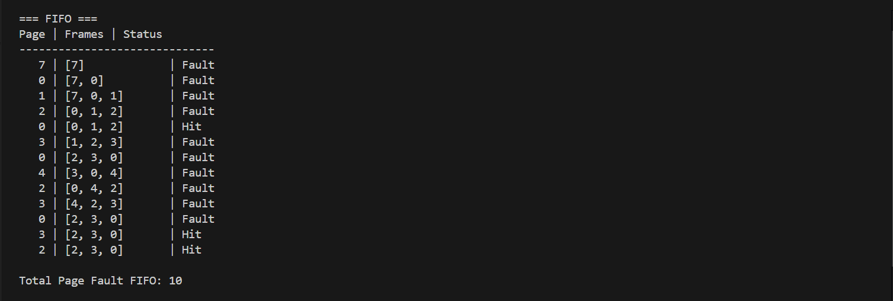
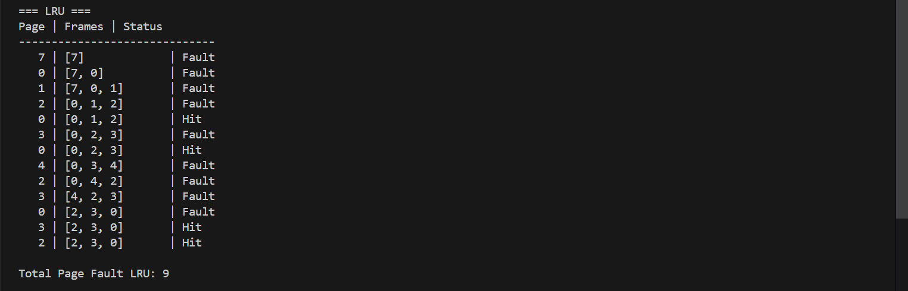

# Laporan Praktikum Minggu 10

Topik: Page Replacement (FIFO & LRU)

---

## Identitas
- **Nama**  : Pasya Awan Rizky Saputro 
- **NIM**   : 250202959
- **Kelas** : 1IKRB

---

## Tujuan
Setelah menyelesaikan tugas ini, mahasiswa mampu:

1. Mengimplementasikan algoritma page replacement FIFO dalam program.
2. Mengimplementasikan algoritma page replacement LRU dalam program.
3. Menjalankan simulasi page replacement dengan dataset tertentu.
4. Membandingkan performa FIFO dan LRU berdasarkan jumlah _page fault_.
5. Menyajikan hasil simulasi dalam laporan yang sistematis.

---

## Dasar Teori
Pada praktikum minggu ini, mahasiswa akan mempelajari **manajemen memori virtual**, khususnya mekanisme page replacement.
Fokus utama praktikum adalah memahami bagaimana sistem operasi mengganti halaman (page) di memori utama ketika terjadi page fault, serta membandingkan performa algoritma **FIFO (First-In First-Out)** dan **LRU (Least Recently Used)**.

Mahasiswa akan mengimplementasikan **program simulasi page replacement**, menjalankan dataset uji, dan menyajikan hasil dalam bentuk tabel atau grafik.

---

## Ketentuan Teknis
 - Bahasa pemrograman **bebas** (Python / C / Java / lainnya).
 - Program berbasis **terminal** (tidak wajib GUI).
 - Fokus penilaian pada **logika algoritma dan keakuratan hasil simulasi**.

Struktur folder (sesuaikan dengan template repo):
```bash
praktikum/week10-page-replacement/
├─ code/
│  ├─ page_replacement.*
│  └─ reference_string.txt
├─ screenshots/
│  └─ hasil_simulasi.png
└─ laporan.md
```

---

## Langkah Praktikum
1. **Menyiapkan Dataset**  
Gunakan _reference_ string berikut sebagai contoh:
   ```bash
   7, 0, 1, 2, 0, 3, 0, 4, 2, 3, 0, 3, 2
   ```  
2. **Implementasi FIFO**
   - Simulasikan penggantian halaman menggunakan algoritma FIFO.
   - Catat setiap _page hit_ dan _page fault_.
   - Hitung total _page fault_.
3. **Implementasi LRU**
   - Simulasikan penggantian halaman menggunakan algoritma LRU.
   - Catat setiap _page hit_ dan _page fault_.
   - Hitung total _page fault_.  
4. **Eksekusi & Validasi**  
   - Jalankan program untuk FIFO dan LRU.
   - Pastikan hasil simulasi logis dan konsisten.
   - Simpan screenshot hasil eksekusi.
5. **Analisis Perbandingan**  
Buat tabel perbandingan seperti berikut: 

   | Algoritma | Jumlah Page Fault | Keterangan |
   | --------- | ----------------- | ---------- |
   | FIFO      | …                 | …          |
   | LRU       | …                 | …          |
   - Jelaskan mengapa jumlah _page fault_ bisa berbeda.
   - Analisis algoritma mana yang lebih efisien dan alasannya.
6. **Commit & Push**
   ```bash
   git add .
   git commit -m "Minggu 10 - Page Replacement FIFO & LRU"
   git push origin main
   ```   

---

## Kode / Perintah
```bash
# ==========================================
# Page Replacement Simulation: FIFO & LRU
# Dataset sudah ditentukan
# ==========================================

reference_string = [7, 0, 1, 2, 0, 3, 0, 4, 2, 3, 0, 3, 2]
frame_size = 3


def fifo(reference, frames_count):
    frames = []
    page_fault = 0

    print("\n=== FIFO ===")
    print("Page | Frames | Status")
    print("-" * 30)

    for page in reference:
        if page in frames:
            status = "Hit"
        else:
            page_fault += 1
            status = "Fault"
            if len(frames) < frames_count:
                frames.append(page)
            else:
                frames.pop(0)
                frames.append(page)

        print(f"{page:>4} | {str(frames):<15} | {status}")

    print(f"\nTotal Page Fault FIFO: {page_fault}")
    return page_fault


def lru(reference, frames_count):
    frames = []
    recent = []
    page_fault = 0

    print("\n=== LRU ===")
    print("Page | Frames | Status")
    print("-" * 30)

    for page in reference:
        if page in frames:
            status = "Hit"
            recent.remove(page)
            recent.append(page)
        else:
            page_fault += 1
            status = "Fault"
            if len(frames) < frames_count:
                frames.append(page)
                recent.append(page)
            else:
                lru_page = recent.pop(0)
                frames.remove(lru_page)
                frames.append(page)
                recent.append(page)

        print(f"{page:>4} | {str(frames):<15} | {status}")

    print(f"\nTotal Page Fault LRU: {page_fault}")
    return page_fault


if __name__ == "__main__":
    fifo_fault = fifo(reference_string, frame_size)
    lru_fault = lru(reference_string, frame_size)

    print("\n=== PERBANDINGAN ===")
    print("Algoritma | Page Fault")
    print("----------------------")
    print(f"FIFO      | {fifo_fault}")
    print(f"LRU       | {lru_fault}")

```

---

## Hasil Eksekusi
Sertakan screenshot hasil percobaan atau diagram:
1. **FIFO**

2. **RLU**


---

## Analisis
1. **Analisis Perbandingan**
    | Algoritma | Jumlah Page Fault | Keterangan                                   |
    | --------- | ----------------- | -------------------------------------------- |
    | FIFO      | 10                | Tidak mempertimbangkan histori penggunaan    |
    | LRU       | 9                 | Mempertahankan halaman yang sering digunakan |
2. **Jelaskan mengapa jumlah page fault bisa berbeda**.  
Jumlah page fault bisa berbeda karena setiap algoritma page replacement menggunakan kriteria yang berbeda dalam memilih halaman yang akan diganti. FIFO mengganti halaman berdasarkan urutan kedatangan tanpa memperhatikan apakah halaman tersebut masih sering digunakan, sehingga halaman yang masih dibutuhkan dapat terhapus dan menimbulkan page fault tambahan. Sebaliknya, LRU mempertimbangkan riwayat penggunaan halaman, sehingga halaman yang sering diakses cenderung dipertahankan di memori.
3. **Analisis algoritma mana yang lebih efisien dan alasannya**.   
algoritma LRU lebih efisien dibandingkan FIFO karena menghasilkan jumlah page fault yang lebih sedikit. Hal ini terjadi karena LRU lebih sesuai dengan pola akses program yang umumnya mengakses halaman yang sama dalam waktu berdekatan, sehingga penggunaan memori menjadi lebih optimal meskipun implementasinya lebih kompleks.


---

## Kesimpulan
1. Praktikum ini menunjukkan bahwa algoritma FIFO dan LRU memiliki cara kerja yang berbeda dalam mengganti halaman, sehingga menghasilkan jumlah page fault yang berbeda meskipun menggunakan reference string dan jumlah frame yang sama.
2. Berdasarkan hasil simulasi, algoritma **LRU lebih efisien dibandingkan FIFO** karena mempertimbangkan penggunaan halaman terbaru, sehingga dapat mengurangi terjadinya page fault.
3. Melalui simulasi menggunakan program, proses kerja FIFO dan LRU menjadi lebih mudah dipahami karena setiap pergantian halaman dan page fault dapat diamati secara langsung, bukan hanya melalui perhitungan manual

---

## Quiz
1. Apa perbedaan utama FIFO dan LRU?  
   **Jawaban:**  
   FIFO mengganti halaman yang paling lama masuk ke memori, tanpa melihat apakah halaman tersebut masih sering digunakan, sedangkan LRU mengganti halaman yang paling lama tidak digunakan berdasarkan riwayat akses
2. Mengapa FIFO dapat menghasilkan _Belady’s Anomaly_?  
   **Jawaban:** 
   Karena FIFO tidak mempertimbangkan pola penggunaan halaman, penambahan jumlah frame justru bisa menyebabkan halaman penting terhapus lebih cepat, sehingga jumlah page fault malah meningkat. 
3. Mengapa LRU umumnya menghasilkan performa lebih baik dibanding FIFO?  
   **Jawaban:**  
   LRU mempertahankan halaman yang sering dan baru digunakan, sehingga lebih sesuai dengan pola akses program yang bersifat lokalitas, dan biasanya menghasilkan jumlah page fault yang lebih sedikit.

---

## Refleksi Diri
Tuliskan secara singkat:
- Apa bagian yang paling menantang minggu ini?  
  Kelupaan cara commit
- Bagaimana cara Anda mengatasinya?   
  Tanya AI.

---

**Credit:**  
_Template laporan praktikum Sistem Operasi (SO-202501) – Universitas Putra Bangsa_
