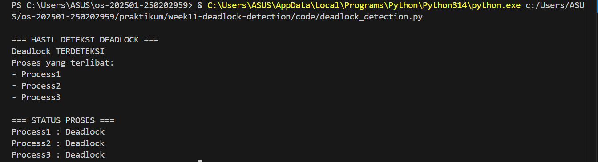

# Laporan Praktikum Minggu 11
Topik: Simulasi dan Deteksi Deadlock
---

## Identitas
- **Nama**  : Gilang Ananda Putra
- **NIM**   : 250202939 
- **Kelas** : 1IKRB

---

## Tujuan
Setelah menyelesaikan tugas ini, mahasiswa mampu:
1. Membuat program sederhana untuk mendeteksi deadlock.  
2. Menjalankan simulasi deteksi deadlock dengan dataset uji.  
3. Menyajikan hasil analisis deadlock dalam bentuk tabel.  
4. Memberikan interpretasi hasil uji secara logis dan sistematis.  
5. Menyusun laporan praktikum sesuai format yang ditentukan.

---

## Dasar Teori
1. **Deadlock** adalah kondisi dimana sekumpulan proses saling menunggu resource yang tidak pernah dilepas, sehingga tidak ada proses yang dapat melanjutkan eksekusi.  
2. Empat kondisi deadlock menurut Coffman:  
   - *Mutual Exclusion*: resource hanya bisa digunakan satu proses pada satu waktu.  
   - *Hold and Wait*: proses memegang resource sambil menunggu resource lain.  
   - *No Preemption*: resource tidak bisa diambil paksa dari proses.  
   - *Circular Wait*: terdapat siklus tunggu antar proses.  
3. **Deteksi Deadlock** dilakukan dengan algoritma yang memeriksa apakah ada siklus dalam *wait-for graph*.  
4. Jika siklus ditemukan, maka proses yang terlibat dianggap mengalami deadlock.  
5. Deadlock detection berbeda dengan *prevention* dan *avoidance* karena fokusnya adalah menemukan deadlock yang sudah terjadi.

---

## Langkah Praktikum
1. **Menyiapkan Dataset**

   Gunakan dataset sederhana yang berisi:
   - Daftar proses  
   - Resource Allocation  
   - Resource Request / Need

   Contoh tabel:

   | Proses | Allocation | Request |
   |:--:|:--:|:--:|
   | P1 | R1 | R2 |
   | P2 | R2 | R3 |
   | P3 | R3 | R1 |

2. **Implementasi Algoritma Deteksi Deadlock**

   Program minimal harus:
   - Membaca data proses dan resource.  
   - Menentukan apakah sistem berada dalam kondisi deadlock.  
   - Menampilkan proses mana saja yang terlibat deadlock.

3. **Eksekusi & Validasi**

   - Jalankan program dengan dataset uji.  
   - Validasi hasil deteksi dengan analisis manual/logis.  
   - Simpan hasil eksekusi dalam bentuk screenshot.

4. **Analisis Hasil**

   - Sajikan hasil deteksi dalam tabel (proses deadlock / tidak).  
   - Jelaskan mengapa deadlock terjadi atau tidak terjadi.  
   - Kaitkan hasil dengan teori deadlock (empat kondisi).

5. **Commit & Push**

   ```bash
   git add .
   git commit -m "Minggu 11 - Deadlock Detection"
   git push origin main
   ```

---

## Kode / Perintah
Potongan kode utama program Python:
```python
# Membaca dataset
with open(filename, 'r') as file:
    reader = csv.DictReader(file)
    for row in reader:
        proc = row['Proses']
        processes.append(proc)
        allocation[proc] = row['Allocation'].split(',') if row['Allocation'] else []
        request[proc] = row['Request'].split(',') if row['Request'] else []

# Deteksi deadlock
is_safe, deadlocked, safe_seq = detect_deadlock(processes, allocation, request, available)
```

---

## Hasil Eksekusi
Sertakan screenshot hasil percobaan atau diagram:


---

## Analisis
### Tabel Analisis Deadlock
| Kondisi Deadlock (Coffman) | Apakah Terpenuhi? | Penjelasan                                                                 |
|----------------------------|-------------------|----------------------------------------------------------------------------|
| **Mutual Exclusion**       | ✅ Ya             | Resource seperti *Dokter Umum*, *Perawat*, dan *Ruang Operasi* hanya bisa digunakan satu proses pada satu waktu. Tidak ada proses lain yang bisa mengakses resource yang sedang dipakai. |
| **Hold and Wait**          | ✅ Ya             | Setiap proses memegang satu resource sambil menunggu resource lain. Contoh: *Registrasi Pasien* memegang *Dokter Umum* sambil menunggu *Perawat*. |
| **No Preemption**          | ✅ Ya             | Resource tidak bisa diambil paksa dari proses yang sedang menggunakannya. Misalnya, *Operasi* tidak bisa dipaksa melepaskan *Ruang Operasi* sebelum selesai. |
| **Circular Wait**          | ✅ Ya             | Terjadi siklus tunggu: *Registrasi Pasien → Pemeriksaan → Operasi → Registrasi Pasien*. Siklus ini menyebabkan semua proses saling menunggu tanpa akhir. |

---

### Narasi Analisis
Deadlock terjadi karena **keempat kondisi Coffman terpenuhi secara bersamaan**.  
- **Mutual Exclusion**: Resource di rumah sakit (Dokter, Perawat, Ruang Operasi) bersifat eksklusif, hanya bisa digunakan satu proses pada satu waktu.  
- **Hold and Wait**: Proses tidak melepaskan resource yang sudah dipegang, tetapi tetap meminta resource lain. Misalnya, *Registrasi Pasien* sudah memegang Dokter Umum, namun masih menunggu Perawat.  
- **No Preemption**: Resource tidak bisa diambil paksa. Jika *Operasi* sedang menggunakan Ruang Operasi, proses lain tidak bisa merebutnya.  
- **Circular Wait**: Inilah inti deadlock. Terjadi siklus tunggu antar proses:  
  - *Registrasi Pasien* menunggu Perawat (yang dipegang *Pemeriksaan*).  
  - *Pemeriksaan* menunggu Ruang Operasi (yang dipegang *Operasi*).  
  - *Operasi* menunggu Dokter Umum (yang dipegang *Registrasi Pasien*).  
  - Siklus ini membuat semua proses saling menunggu tanpa ada yang bisa maju.  

Karena keempat kondisi ini terpenuhi, sistem masuk ke dalam **state deadlock**. Akibatnya, tidak ada proses yang bisa menyelesaikan tugasnya, dan resource tetap terkunci.  

Jika salah satu kondisi Coffman tidak terpenuhi, deadlock bisa dihindari. Misalnya:  
- Jika resource bisa dipaksa dilepas (*preemption*), maka siklus bisa diputus.  
- Jika proses tidak diperbolehkan menunggu sambil memegang resource (*hold and wait* dicegah), maka tidak akan terbentuk siklus.  

Namun pada simulasi ini, semua kondisi terpenuhi, sehingga deadlock **pasti terjadi**.

---

### Kesimpulan Analisis
Deadlock terjadi karena:  
1. Semua resource bersifat eksklusif.  
2. Proses menunggu resource lain sambil tetap memegang resource yang sudah ada.  
3. Resource tidak bisa diambil paksa.  
4. Terjadi siklus tunggu antar proses.  

Dengan demikian, hasil eksekusi program yang menandai semua proses sebagai *Deadlock* adalah **benar dan sesuai teori**.

---

## Kesimpulan
1. Deadlock terjadi ketika proses saling menunggu resource dalam siklus yang tidak pernah selesai.  
2. Algoritma deteksi deadlock dapat menemukan proses yang terlibat dengan membangun *wait-for graph*.  
3. Praktikum ini menunjukkan pentingnya deteksi deadlock agar sistem operasi dapat mengambil tindakan (misalnya menghentikan proses tertentu).

---

## Quiz
1. **Apa perbedaan antara deadlock prevention, avoidance, dan detection?**

   **Jawaban:**  

   - *Prevention*: mencegah deadlock dengan menghilangkan salah satu kondisi Coffman.  
   - *Avoidance*: menggunakan algoritma (misalnya Banker's) untuk menghindari state berbahaya.  
   - *Detection*: membiarkan deadlock terjadi lalu mendeteksi dan menangani.  

2. **Mengapa deteksi deadlock tetap diperlukan dalam sistem operasi?**  

   **Jawaban:**  

   Karena tidak semua deadlock bisa dicegah/diavoid, sehingga sistem perlu mendeteksi agar bisa mengambil tindakan korektif.  

3. **Apa kelebihan dan kekurangan pendekatan deteksi deadlock?** 

   **Jawaban:**  

   - Kelebihan: sederhana, tidak membatasi sistem, bisa digunakan kapan saja.  
   - Kekurangan: overhead tinggi, proses bisa lama terblokir sebelum deadlock terdeteksi.

---

## Refleksi Diri
Tuliskan secara singkat:
- Apa bagian yang paling menantang minggu ini?

   memahami bagaimana membangun *wait-for graph* dari dataset yang menggunakan kasus nyata (Dokter, Perawat, Ruang Operasi).
- Bagaimana cara Anda mengatasinya?  

   resource otomatis terbaca dari dataset, sehingga tidak perlu hardcode nama resource.

---

**Credit:**  
_Template laporan praktikum Sistem Operasi (SO-202501) – Universitas Putra Bangsa_
