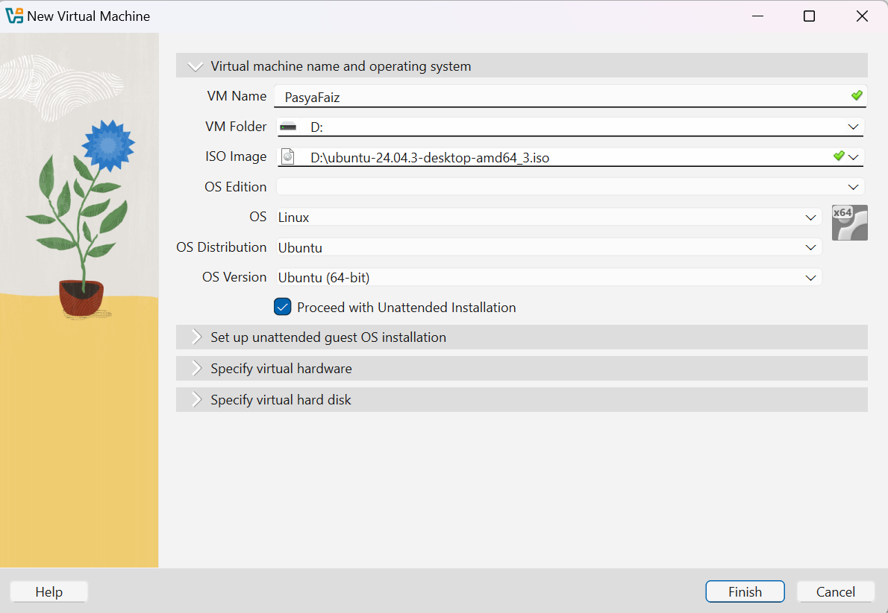
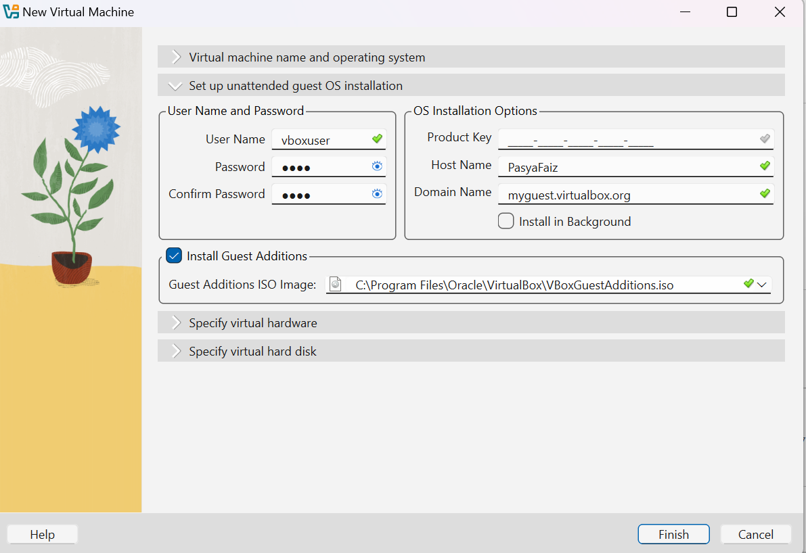
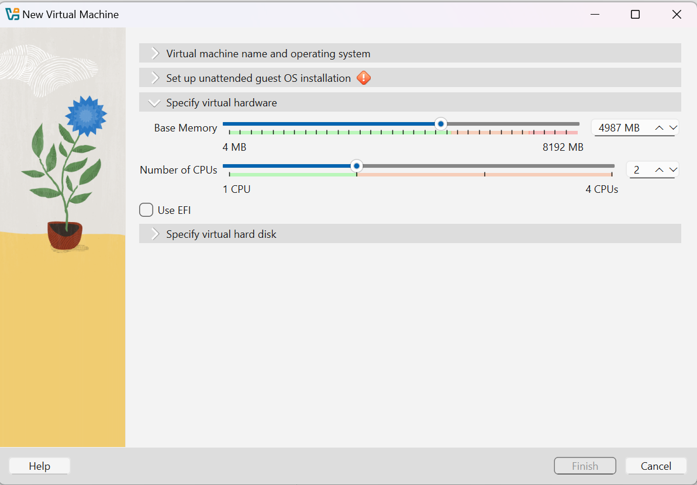
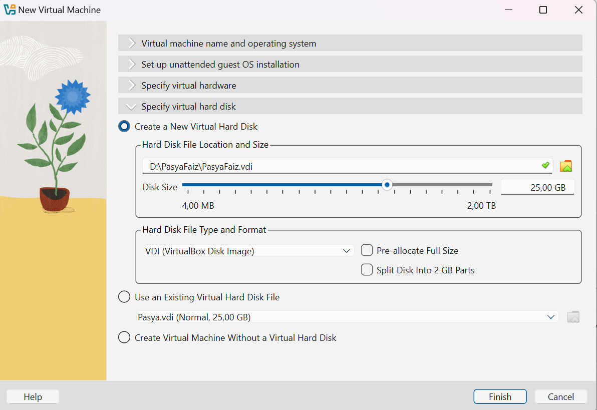
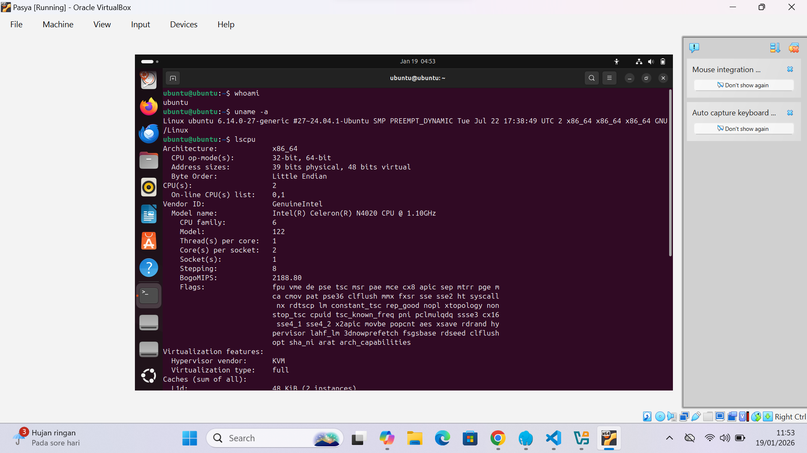
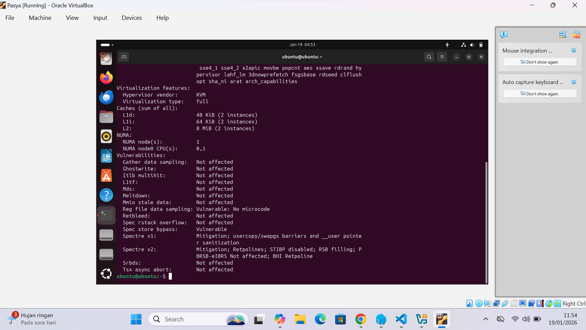
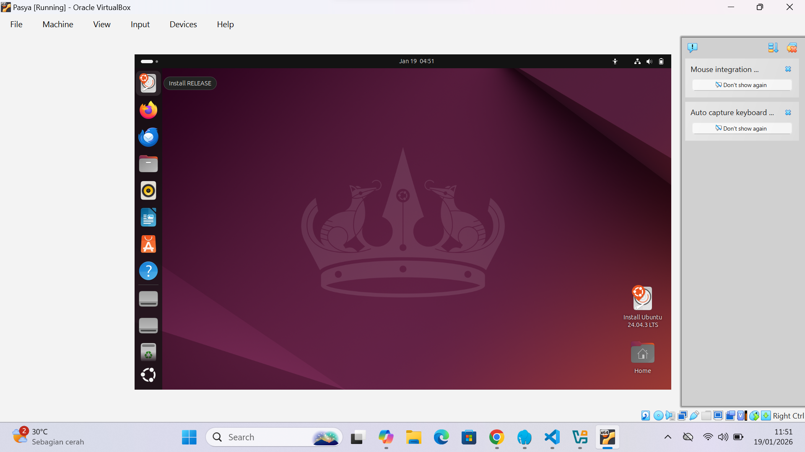
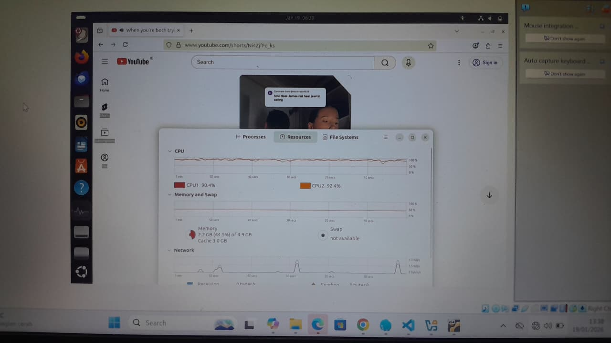
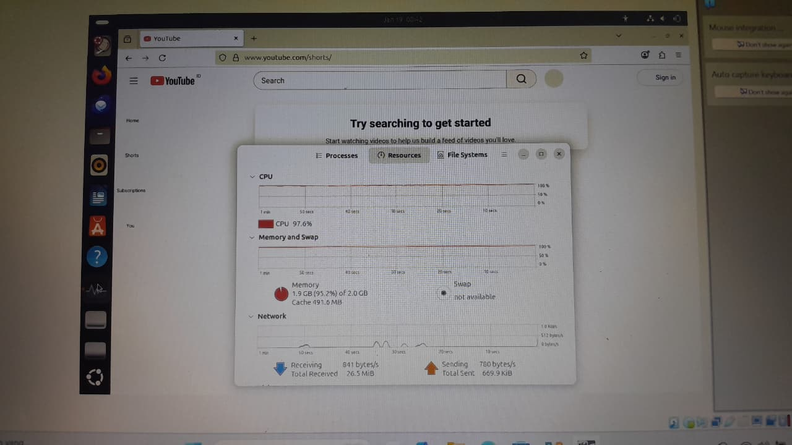

# Laporan Praktikum Minggu 12
Topik: Virtualisasi Menggunakan Virtual Machine

---

## Identitas
- **Nama**  : Pasya Awan Rizky Saputro  
- **NIM**   : 250202959  
- **Kelas** : 1IKRB

---

## Tujuan
Setelah menyelesaikan tugas ini, mahasiswa mampu:

1. Menginstal perangkat lunak virtualisasi (VirtualBox/VMware).
2. Membuat dan menjalankan sistem operasi guest di dalam VM.
3. Mengatur konfigurasi resource VM (CPU, RAM, storage).
4. Menjelaskan mekanisme proteksi OS melalui virtualisasi.
5. Menyusun laporan praktikum instalasi dan konfigurasi VM secara sistematis.

---

## Dasar Teori
Pada praktikum minggu ini, mahasiswa akan mempelajari konsep **virtualisasi sistem operasi** dengan menggunakan **Virtual Machine (VM)**.  
Mahasiswa diarahkan untuk menginstal dan menjalankan sistem operasi guest di atas host OS menggunakan perangkat lunak virtualisasi seperti **VirtualBox** atau **VMware**.

Praktikum ini menekankan pemahaman hubungan antara **host OS**, **guest OS**, dan **hypervisor**, serta bagaimana konfigurasi resource (CPU, memori, dan storage) memengaruhi kinerja dan isolasi sistem.

---

## Langkah Praktikum
1. **Instalasi Virtual Machine**
   - Instal VirtualBox atau VMware pada komputer host.
   - Pastikan fitur virtualisasi (VT-x / AMD-V) aktif di BIOS.
2. **Pembuatan OS Guest**
   - Buat VM baru dan pilih OS guest (misal: Ubuntu Linux).
   - Atur resource awal:
     - CPU: 1–2 core
     - RAM: 2–4 GB
     - Storage: ≥ 20 GB   
3. **Instalasi Sistem Operasi**
   - Jalankan proses instalasi OS guest sampai selesai.
   - Pastikan OS guest dapat login dan berjalan normal.
4. **Konfigurasi Resource**
   - Ubah konfigurasi CPU dan RAM.
   - Amati perbedaan performa sebelum dan sesudah perubahan resource.   
5. **Analisis Proteksi OS**
   - Jelaskan bagaimana VM menyediakan isolasi antara host dan guest.
   - Kaitkan dengan konsep _sandboxing_ dan _hardening OS_.  
6. **Dokumentasi**
   - Ambil screenshot setiap tahap penting.
   - Simpan di folder ```screenshots/```.
7. **Commit & Push**

   ```bash
   git add .
   git commit -m "Minggu 12 - Virtual Machine"
   git push origin main
   ```       

---

## Kode / Perintah
Tuliskan potongan kode atau perintah utama:
```bash
uname -a: Menampilkan informasi sistem operasi dan kernel
free -h: Menampilkan penggunaan memori (RAM dan swap).
lscpu: Menampilkan informasi detail CPU.
```

---

## Hasil Eksekusi
1. **Instalasi Virtual Machine**  
   Oracle VirtualBox versi 7.2.4 berhasil diinstal sebagai tahap awal penggunaan Virtual Machine.
   
2. **Pembuatan OS Guest**    
     - Konfigurasi Virtual Machine telah dilakukan dengan menentukan nama VM, lokasi penyimpanan, serta sistem operasi Ubuntu 64-bit.
     
     - Pada tahap ini dilakukan pengaturan unattended installation dengan penentuan nama pengguna, kata sandi, serta konfigurasi Guest Additions pada Virtual Machine.
         
     - Pada tahap ini dilakukan pengaturan perangkat keras Virtual Machine berupa alokasi memori sebesar 4987 MB dan penggunaan 2 CPU.
    
     - Dilakukan pengaturan media penyimpanan Virtual Machine berupa virtual hard disk berformat VDI dengan ukuran 25 GB.
     
3. **Eksperimen Desktop**
   - pada mesin virtual Ubuntu yang berjalan di atas VirtualBox. Sistem menggunakan prosesor Intel Celeron N4020 dengan dua inti CPU dan arsitektur x86_64. Kernel yang digunakan adalah Linux versi 6.14.0-27-generic. Fitur virtualisasi terdeteksi dengan KVM tipe full. Informasi cache menunjukkan L1 Data 48 KiB, L1 Instruction 64 KiB, dan L2 sebesar 8 MiB. Dari sisi keamanan, sebagian besar kerentanan prosesor sudah dimitigasi, meskipun masih terdapat celah pada Speculative Store Bypass dan Reg File Data Sampling.
   
   
   - Sistem Operasi Ubuntu 24.04.3 LTS telah berhasil dijalankan (running) di atas VirtualBox sebagai Guest OS.
   
   -  CPU pada sistem virtual Ubuntu cukup tinggi, dengan CPU1 mencapai 90,4% dan CPU2 mencapai 92,4%. Pemakaian memori tercatat sebesar 2,2 GB dari total 4,9 GB (44,5%), sementara swap tidak aktif. Aktivitas jaringan terlihat fluktuatif sesuai grafik pemantauan.
   
   - Berdasarkan pemantauan melalui System Monitor, penggunaan CPU mencapai 97.6% dan memori terpakai 1.9 GB dari total alokasi 2.0 GB. Hal ini menunjukkan sistem sedang berada pada titik penggunaan sumber daya yang tinggi saat menjalankan aplikasi fire fox.
   
       

---

## Analisis
1. **Analisis CPU 1 Ram 2.**
   - Status CPU: Beban kerja sangat kritis mencapai 97.6%. Hal ini terjadi karena hanya 1 Core yang menangani seluruh proses sistem dan aplikasi sekaligus.
   - Status RAM: Penggunaan memori sangat tinggi, yaitu 1.9 GB dari 2.0 GB (95.2%). Sistem hampir kehabisan ruang untuk menjalankan proses baru.
   - Status Swap: Terdeteksi not available (tidak tersedia). Tanpa Swap, sistem berisiko crash atau freeze total jika RAM penuh karena tidak ada memori cadangan di disk.
   - Kesimpulan: Spesifikasi ini menyebabkan bottleneck. Sistem tidak stabil untuk multitasking berat karena kurangnya alokasi sumber daya hardware.
2. **Analisis CPU 2 Ram 4.**
   - Kapasitas CPU: Perintah lscpu mengonfirmasi alokasi meningkat menjadi 2 Core CPU (CPU0 & CPU1).
   - Beban Kerja CPU: Beban terdistribusi ke dua core (CPU1: 90.4% dan CPU2: 92.4%). Meskipun masih tinggi, sistem lebih responsif karena beban tidak menumpuk di satu titik.
   - Manajemen Memori: Penggunaan RAM jauh lebih lega, yaitu 2.2 GB dari 4.9 GB (44.5%).
   - Optimalisasi Cache: Sistem secara otomatis mengalokasikan 3.0 GB untuk Cache, yang berfungsi mempercepat akses data dan performa OS.
   - Status Swap: Tetap not available karena masih dalam mode Live Session (belum instalasi permanen).
   - Kesimpulan: Penambahan sumber daya ini secara signifikan meningkatkan stabilitas sistem. Sistem memiliki ruang napas yang cukup (sisa RAM ~2.7 GB) untuk menjalankan multitasking tanpa risiko crash. 
3. **Isolasi Sistem Host dan Guest pada Virtual Machine.**
   - Virtual Machine menyediakan isolasi dengan cara memisahkan sumber daya host melalui hypervisor. Guest hanya berinteraksi dengan perangkat keras virtual, sehingga tidak bisa langsung mengakses hardware asli. Dengan mekanisme ini, aktivitas guest tidak memengaruhi host maupun VM lain.
     

---

## Kesimpulan
1. **Efisiensi Manajemen Sumber Daya (Resource Management)** Alokasi hardware yang tepat sangat menentukan performa sistem. Berdasarkan observasi, peningkatan RAM dari 2 GB (utilitas 95%) menjadi 4.9 GB (utilitas 44%) serta penambahan core CPU terbukti menghilangkan bottleneck, sehingga sistem mampu menjalankan proses berat (seperti YouTube) dengan stabil.
2. **Pentingnya Isolasi melalui Hypervisor** Praktikum ini membuktikan bahwa VirtualBox (Hypervisor) berhasil menyediakan isolasi total antara Host (Windows) dan Guest (Ubuntu). Eksperimen perubahan spesifikasi dan beban kerja di Ubuntu tidak mempengaruhi stabilitas Windows, karena seluruh sumber daya dikelola dalam lingkungan sandbox.
3. **Validasi Sistem melalui CLI dan GUI** Monitoring sistem secara visual (GUI) sangat membantu untuk melihat tren beban kerja secara cepat, namun perintah CLI (``uname``, ``lscpu``, ``free``) memberikan data teknis yang lebih akurat dan detail. Penggunaan keduanya sangat krusial dalam administrasi sistem untuk memverifikasi apakah hardware virtual yang dialokasikan sudah terbaca dengan benar oleh Kernel Linux.

---

## Quiz
1. Apa perbedaan antara host OS dan guest OS?  
   **Jawaban:**  Host OS adalah sistem operasi utama yang berjalan langsung di atas hardware fisik, sedangkan guest OS adalah sistem operasi yang dijalankan di dalam mesin virtual melalui hypervisor. Host mengontrol sumber daya fisik, sementara guest hanya berinteraksi dengan perangkat keras virtual.
2. Apa peran hypervisor dalam virtualisasi?  
   **Jawaban:**  Hypervisor berfungsi sebagai penghubung antara hardware host dan guest OS. Ia mengalokasikan CPU, memori, dan perangkat I/O secara terpisah, sehingga beberapa guest OS dapat berjalan bersamaan tanpa saling mengganggu.
3. Mengapa virtualisasi meningkatkan keamanan sistem?  
   **Jawaban:**  Virtualisasi meningkatkan keamanan karena setiap guest OS berjalan dalam lingkungan terisolasi. Jika satu guest mengalami gangguan atau serangan, dampaknya tidak langsung memengaruhi host maupun guest lain.

---

## Refleksi Diri
Tuliskan secara singkat:
- Apa bagian yang paling menantang minggu ini?  
- Bagaimana cara Anda mengatasinya?  

---

**Credit:**  
_Template laporan praktikum Sistem Operasi (SO-202501) – Universitas Putra Bangsa_
