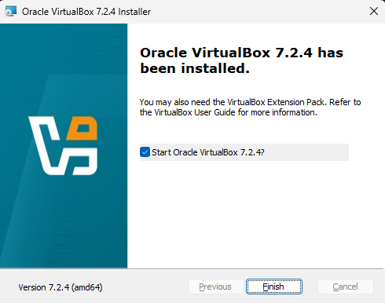
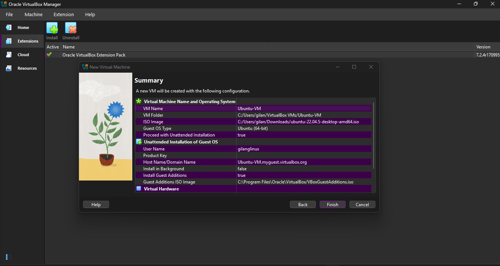
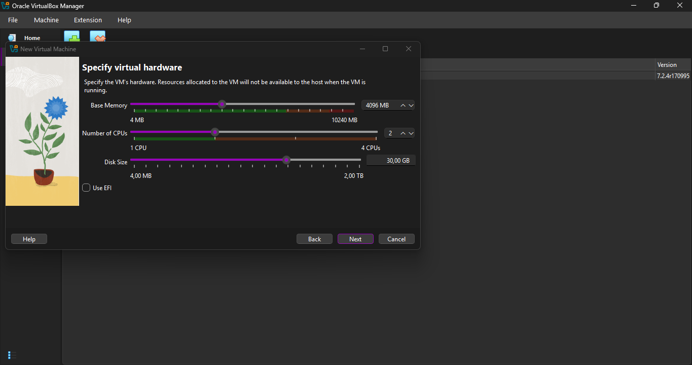
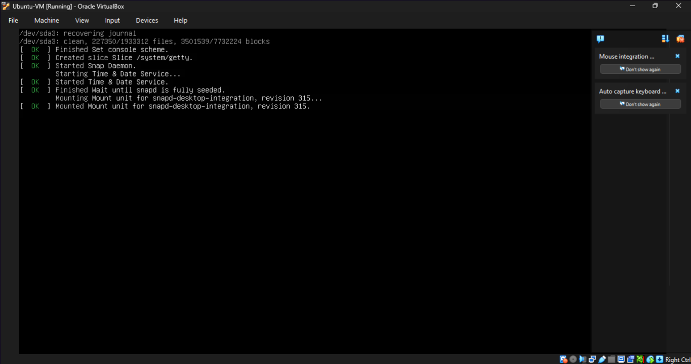
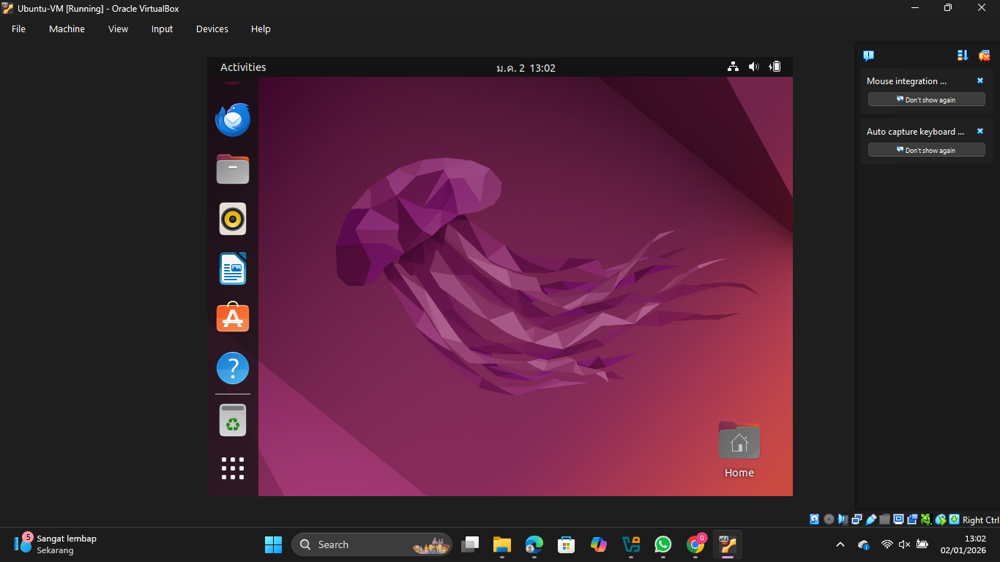
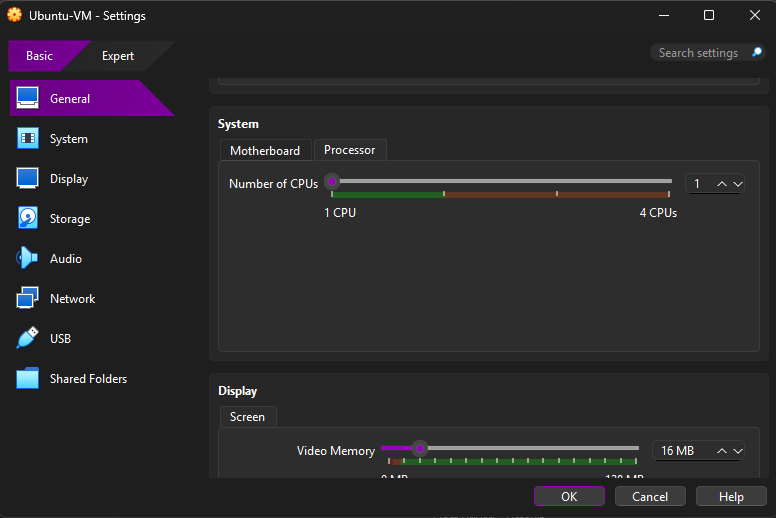
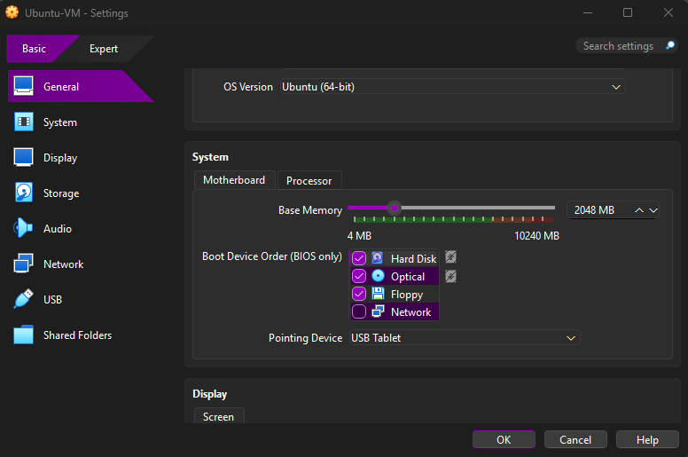
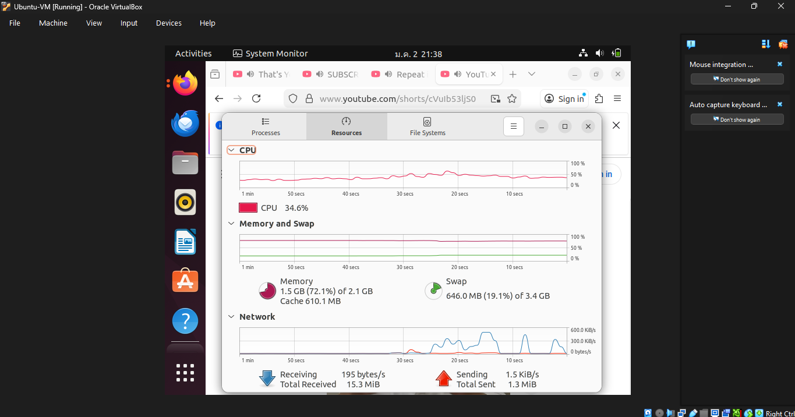
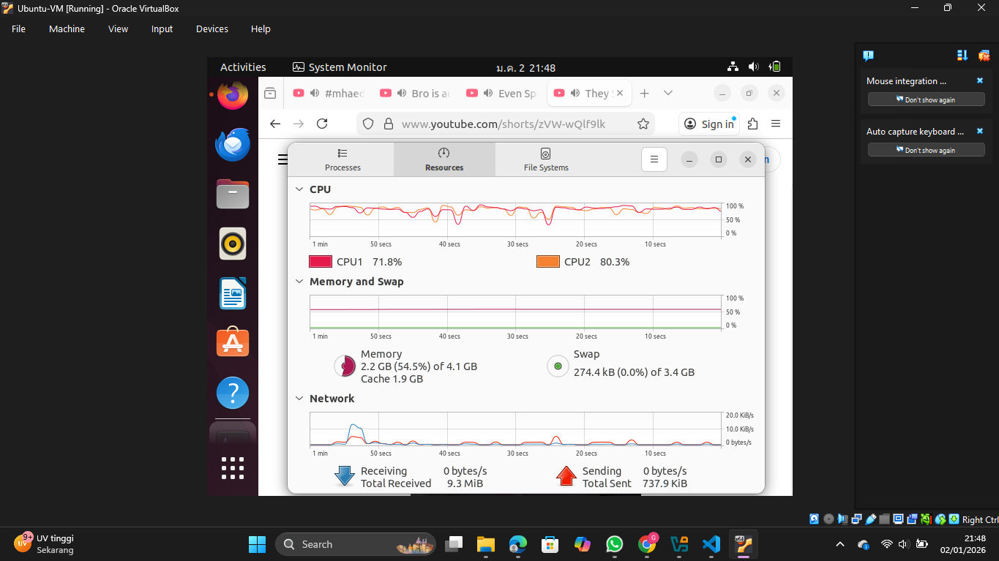

# Laporan Praktikum Minggu 12
Topik: Virtualisasi Menggunakan Virtual Machine  

---

## Identitas
- **Nama**  : Gilang Ananda Putra
- **NIM**   : 250202939 
- **Kelas** : 1IKRB

---

## Tujuan
Setelah menyelesaikan tugas ini, mahasiswa mampu:
1. Menginstal perangkat lunak virtualisasi (VirtualBox/VMware).  
2. Membuat dan menjalankan sistem operasi guest di dalam VM.  
3. Mengatur konfigurasi resource VM (CPU, RAM, storage).  
4. Menjelaskan mekanisme proteksi OS melalui virtualisasi.  
5. Menyusun laporan praktikum instalasi dan konfigurasi VM secara sistematis.

---

## Dasar Teori
1. **Virtualisasi**: Teknologi yang memungkinkan pembuatan representasi virtual dari resource fisik (seperti CPU, RAM, dan Storage) untuk menjalankan beberapa OS secara bersamaan pada satu mesin fisik.
2. **Hypervisor (VMM)**: Perangkat lunak yang mengatur pembuatan dan pengelolaan Virtual Machine. VirtualBox termasuk dalam *Type-2 Hypervisor* (Hosted), yang berjalan di atas sistem operasi utama (Windows).
3. **Host vs Guest OS**: Host OS adalah sistem operasi utama yang terpasang pada hardware, sedangkan Guest OS adalah sistem operasi yang berjalan di dalam lingkungan virtual.
4. **Isolasi**: Mekanisme keamanan di mana kegagalan atau aktivitas pada Guest OS tidak akan memengaruhi kestabilan Host OS.

---

## Langkah Praktikum
1. **Instalasi Virtual Machine**
   - Instal VirtualBox atau VMware pada komputer host.  
   - Pastikan fitur virtualisasi (VT-x / AMD-V) aktif di BIOS.

2. **Pembuatan OS Guest**
   - Buat VM baru dan pilih OS guest (misal: Ubuntu Linux).  
   - Atur resource awal:
     - CPU: 1–2 core  
     - RAM: 2–4 GB  
     - Storage: ≥ 20 GB

3. **Instalasi Sistem Operasi**
   - Jalankan proses instalasi OS guest sampai selesai.  
   - Pastikan OS guest dapat login dan berjalan normal.

4. **Konfigurasi Resource**
   - Ubah konfigurasi CPU dan RAM.  
   - Amati perbedaan performa sebelum dan sesudah perubahan resource.

5. **Analisis Proteksi OS**
   - Jelaskan bagaimana VM menyediakan isolasi antara host dan guest.  
   - Kaitkan dengan konsep *sandboxing* dan *hardening* OS.

6. **Dokumentasi**
   - Ambil screenshot setiap tahap penting.  
   - Simpan di folder `screenshots/`.

7. **Commit & Push**
   ```bash
   git add .
   git commit -m "Minggu 12 - Virtual Machine"
   git push origin main
   ```

---

## Kode / Perintah

```bash
uname -a             # Mengecek kernel yang digunakan guest OS
free -h              # Melihat penggunaan RAM di dalam VM
lscpu                # Melihat jumlah core CPU yang terdeteksi oleh VM
```

---

## Hasil Eksekusi

### A. Tahap Instalasi dan Persiapan VM

Pada tahap ini, perangkat lunak virtualisasi disiapkan dan mesin virtual dibuat.

**1. Instalasi VirtualBox**

Proses instalasi Oracle VirtualBox versi 7.2.4 berhasil dilakukan pada sistem operasi host. Aplikasi siap digunakan untuk membuat lingkungan virtual.



**2. Konfigurasi Awal VM**

Membuat VM baru dengan nama "Ubuntu-VM". Lokasi penyimpanan VM dan file ISO Ubuntu 22.04 LTS telah ditentukan. Opsi *Unattended Installation* dinonaktifkan agar bisa melakukan instalasi manual jika diperlukan.



**3. Menu Spesifikasi Hardware**

Tampilan awal menu konfigurasi hardware sebelum OS diinstal. Mengubah RAM 4096 MB, CPU 2, dan DISK 30GB.


---

### B. Tahap Booting dan Lingkungan Desktop

Setelah instalasi selesai, VM dijalankan untuk masuk ke lingkungan grafis.

**1. Proses Booting Systemd**



Ini adalah tampilan *booting* Linux Ubuntu.

* **Observasi:** Pada percobaan pertama booting dengan CPU 2 dan RAM 4, proses ini memakan waktu yang **lama**. Sistem membutuhkan waktu lebih untuk memuat layanan (*services*) dasar seperti `snapd` dan `Time & Date Service` karena keterbatasan memori.

**2. Tampilan Desktop Ubuntu**



VM berhasil masuk ke halaman utama (*Desktop*). Meskipun tampilan terlihat normal, responsivitas sistem (seperti membuka menu atau terminal) terasa lambat dan patah-patah (*laggy*).

---

### C. Eksperimen Skenario 1: Resource Terbatas (Penyebab Masalah)

Pada skenario ini, menurunkan spesifikasi VM untuk melihat dampaknya.

* **Kondisi Pengujian:** Membuka Firefox dengan 4 Tab YouTube Shorts.
* **Gejala:** Booting lama, aplikasi sering *crash*, kursor mouse *freeze*.

**1. Pengurangan Resource**
Mengubah pengaturan VM menjadi **1 CPU** dan menurunkan memori menjadi **2048 MB / 2 GB**.




**2. Analisis System Monitor saat Lag**
Gambar ini menunjukkan kondisi sistem saat mengalami performa buruk (lag parah).



* **Analisis CPU (34.6%):** Penggunaan CPU terlihat rendah secara menipu. Ini bukan karena sistem ringan, melainkan CPU sering dalam keadaan *Idle* menunggu data dari hardisk (*I/O Wait*).
* **Analisis Memori & Swap:** RAM fisik 2GB hampir penuh (72.1%). Akibatnya, sistem terpaksa menggunakan **Swap sebesar 646.0 MB**.
* **Kesimpulan Gambar:** Penggunaan Swap yang besar menyebabkan *bottleneck*. Hardisk tidak secepat RAM, sehingga saat Firefox mencoba memuat video, sistem menjadi tidak responsif dan menyebabkan aplikasi *crash*.

### D. Eksperimen Skenario 2: Resource Optimal (Solusi)

Pada skenario ini, spesifikasi dinaikkan untuk menangani beban kerja modern.



**1. Analisis System Monitor saat Lancar**
Setelah resource dinaikkan menjadi **2 CPU** dan **4096 MB (4 GB) RAM**, menjalankan beban kerja yang sama (4 Tab YouTube Shorts).

* **Analisis CPU (71.8% - 80.3%):** Penggunaan CPU melonjak tinggi. Ini adalah tanda positif, artinya kedua core CPU bekerja secara paralel (*parallelism*) memproses video tanpa hambatan.
* **Analisis Memori & Swap:** Dengan RAM 4GB, penggunaan Swap turun drastis menjadi **274.4 kB (hampir nol)**. Seluruh data browser tersimpan di RAM yang cepat.
* **Kesimpulan Gambar:** Hilangnya ketergantungan pada Swap membuat sistem menjadi responsif. Video YouTube berjalan lancar tanpa *buffering* atau *crash*.

---

## Analisis
Berdasarkan percobaan menjalankan aplikasi berat (Firefox dengan 4 tab video) pada dua konfigurasi berbeda, ditemukan hasil yang menarik dan perlu analisis mendalam, terutama pada perbedaan statistik System Monitor (CPU 1 & RAM 2048 vs CPU 2 & RAM 4096 MB).

### 1. Analisis Fenomena "CPU Rendah tapi Lag" (CPU 1 & RAM 2048 MB)

Pada konfigurasi **1 CPU dan 2 GB RAM**, mengalami sistem yang sangat lambat, booting lama, dan aplikasi sering *crash* sebentar. Namun, anehnya grafik CPU hanya menunjukkan penggunaan **34.6%**.

* **Penyebab (Memory Bottleneck):** Masalah utamanya bukan pada kemampuan CPU, melainkan **kekurangan RAM**. Grafik menunjukkan RAM terpakai 72.1% (1.5 GB), namun sistem terpaksa menggunakan **Swap sebesar 646 MB**.
* **I/O Wait:** Ketika RAM penuh, sistem memindahkan data aktif Firefox ke *Swap* (virtual memory di hardisk). Karena kecepatan disk jauh lebih lambat dari RAM, CPU menghabiskan sebagian besar waktunya dalam status **Idle (menunggu data)** dari disk. Ini disebut *I/O Wait*.
* **Kesimpulan:** Angka CPU 34.6% di sini adalah *false positive*. Sistem tidak bekerja efisien karena terhambat antrean data (bottleneck), menyebabkan lag parah dan crash.

### 2. Analisis Performa Optimal (CPU 2 & RAM 4096 MB)

Pada konfigurasi **2 CPU dan 4 GB RAM**, sistem berjalan jauh lebih lancar dan responsif. Grafik CPU menunjukkan penggunaan tinggi (**71.8% dan 80.3%**).

* **Pemanfaatan Resource Efektif:** Dengan RAM 4 GB, penggunaan **Swap hampir 0 (274 KB)**. Ini berarti seluruh data Firefox tersimpan di RAM yang sangat cepat.
* **Parallelism:** Karena data tersedia cepat (tanpa menunggu disk), kedua core CPU dapat bekerja maksimal memproses rendering video secara paralel. Penggunaan CPU yang tinggi di sini adalah pertanda baik: sistem benar-benar bekerja memproses tugas, bukan menunggu.
* **Stabilitas:** Tidak ada *crash* karena memori cukup untuk menampung seluruh proses browser.

### 3. Keamanan dan Isolasi

Meskipun pada eksperimen pertama Guest OS (Ubuntu) mengalami *hang* atau *crash* akibat kekurangan memori, **Host OS (Windows) tetap berjalan normal** dan tidak terpengaruh. Ini membuktikan konsep isolasi dalam virtualisasi, di mana kegagalan pada lingkungan virtual tidak merusak sistem fisik utama.

---

## Kesimpulan
1. **Alokasi Resource Sangat Krusial:** Kinerja VM sangat bergantung pada alokasi RAM dan CPU. Memberikan RAM yang terlalu sedikit (2GB untuk OS modern seperti Ubuntu + Browser) memaksa sistem menggunakan Swap, yang menurunkan performa secara drastis.
2. **Indikator CPU Bisa Menipu:** Penggunaan CPU yang rendah tidak selalu berarti sistem ringan. Jika disertai penggunaan Swap yang tinggi, itu menandakan CPU sedang "menganggur" menunggu data dari disk (*bottleneck* I/O).
3. **Virtualisasi Memberikan Keamanan:** VirtualBox berhasil melakukan *sandboxing* sistem operasi guest, sehingga eksperimen berat yang dilakukan di dalam VM aman bagi komputer host.

---

## Quiz
**1. Apa perbedaan antara host OS dan guest OS?**

**Jawaban:**

   * **Host OS** adalah sistem operasi fisik yang terinstal langsung pada perangkat keras komputer (dalam kasus ini: Windows). Ia bertugas mengelola hardware fisik.
   * **Guest OS** adalah sistem operasi virtual yang berjalan di dalam mesin virtual (dalam kasus ini: Ubuntu). Ia melihat perangkat keras virtual yang disediakan oleh hypervisor.

**2. Apa peran hypervisor dalam virtualisasi?**

**Jawaban:**

   Hypervisor (atau Virtual Machine Monitor) berperan sebagai jembatan yang mengelola distribusi sumber daya (CPU, RAM, Storage) dari Host ke Guest. Ia memastikan isolasi antar VM dan menerjemahkan instruksi dari Guest OS agar bisa dieksekusi oleh hardware fisik.

**3. Mengapa virtualisasi meningkatkan keamanan sistem?**

**Jawaban:**

   Virtualisasi menyediakan lingkungan terisolasi (*sandbox*). Jika Guest OS terserang virus atau mengalami kerusakan sistem (seperti crash saat praktikum tadi), kerusakan tersebut terkurung di dalam file VM dan tidak menyebar atau merusak Host OS maupun data pribadi pengguna di komputer fisik.

---

## Refleksi Diri
Tuliskan secara singkat:
- Apa bagian yang paling menantang minggu ini?  

   Saat menjalankan VM dengan RAM 2GB. Sistem menjadi sangat lambat (*laggy*) dan mouse sulit digerakkan saat membuka Firefox, sehingga pengambilan screenshot (SS) menjadi sulit karena respon yang tertunda.

- Bagaimana cara Anda mengatasinya?  

   Belajar bahwa untuk OS modern dengan antarmuka grafis (GUI), RAM 2GB tidak lagi ideal. Solusinya adalah bersabar menunggu proses loading swap selesai, atau mematikan VM paksa dan menaikkan resource menjadi 4GB RAM dan 2 Core CPU agar praktikum dapat berjalan lancar kembali.

---

**Credit:**  
_Template laporan praktikum Sistem Operasi (SO-202501) – Universitas Putra Bangsa_
