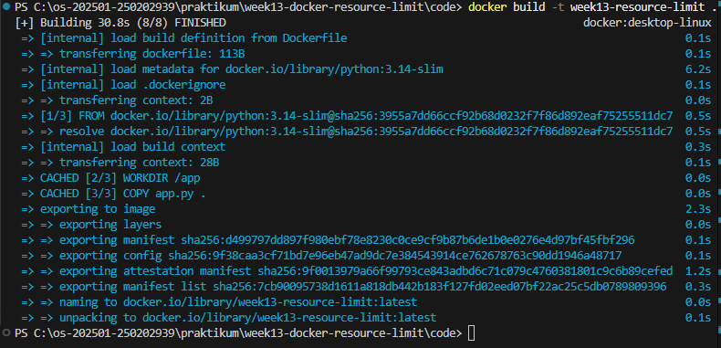
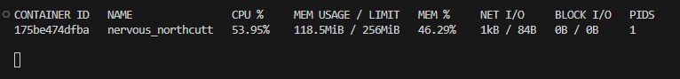
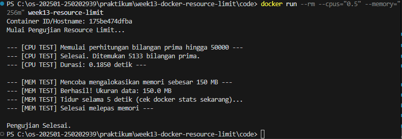

# Laporan Praktikum Minggu [X]
Topik: Docker – Resource Limit (CPU & Memori)

---

## Identitas
- **Nama**  : Gilang Ananda Putra
- **NIM**   : 250202939 
- **Kelas** : 1IKRB

---

## Tujuan
Setelah menyelesaikan tugas ini, mahasiswa mampu:
1. Menulis Dockerfile sederhana untuk sebuah aplikasi/skrip.
2. Membangun image dan menjalankan container.
3. Menjalankan container dengan pembatasan **CPU** dan **memori**.
4. Mengamati dan menjelaskan perbedaan eksekusi container dengan dan tanpa limit resource.
5. Menyusun laporan praktikum secara runtut dan sistematis.

---

## Dasar Teori
Containerization menggunakan mekanisme kernel Linux untuk mengisolasi proses. Dua komponen utama yang memungkinkan hal ini adalah:

1. **Namespaces:** Memberikan isolasi tampilan sistem (seperti PID, Network, Mount) sehingga container merasa berjalan di sistem sendiri.
2. **Cgroups (Control Groups):** Mengontrol dan membatasi penggunaan sumber daya (CPU, RAM, Disk I/O) dari sebuah grup proses. Docker menggunakan cgroups untuk memastikan satu container tidak menghabiskan seluruh sumber daya host.

Berbeda dengan Virtual Machine (VM) yang memvirtualisasi perangkat keras (Hardware Virtualization), Container berbagi kernel dengan host, menjadikannya lebih ringan namun tetap terisolasi.

---

## Langkah Praktikum
1. **Persiapan Lingkungan**

   - Pastikan Docker terpasang dan berjalan.
   - Verifikasi:
     ```bash
     docker version
     docker ps
     ```

2. **Membuat Aplikasi/Skrip Uji**

   Buat program sederhana di folder `code/` (bahasa bebas) yang:
   - Melakukan komputasi berulang (untuk mengamati limit CPU), dan/atau
   - Mengalokasikan memori bertahap (untuk mengamati limit memori).

3. **Membuat Dockerfile**

   - Tulis `Dockerfile` untuk menjalankan program uji.
   - Build image:
     ```bash
     docker build -t week13-resource-limit .
     ```

4. **Menjalankan Container Tanpa Limit**

   - Jalankan container normal:
     ```bash
     docker run --rm week13-resource-limit
     ```
   - Catat output/hasil pengamatan.

5. **Menjalankan Container Dengan Limit Resource**

   Jalankan container dengan batasan resource (contoh):
   ```bash
   docker run --rm --cpus="0.5" --memory="256m" week13-resource-limit
   ```
   Catat perubahan perilaku program (mis. lebih lambat, error saat memori tidak cukup, dll.).

6. **Monitoring Sederhana**

   - Jalankan container (tanpa `--rm` jika perlu) dan amati penggunaan resource:
     ```bash
     docker stats
     ```
   - Ambil screenshot output eksekusi dan/atau `docker stats`.

7. **Commit & Push**

   ```bash
   git add .
   git commit -m "Minggu 13 - Docker Resource Limit"
   git push origin main
   ```

---

## Kode / Perintah

**1. Dockerfile**

```dockerfile
FROM python:3.14-slim
WORKDIR /app
COPY app.py .
CMD ["python", "app.py"]

```

**2. Perintah Build & Run**

```bash
# Build Image
docker build -t week13-resource-limit .

# Run Tanpa Limit (Baseline)
docker run --rm week13-resource-limit

# Run Dengan Limit (0.5 CPU, 256MB RAM)
docker run --rm --cpus="0.5" --memory="256m" week13-resource-limit

# Monitoring Stats
docker stats

```

---

## Hasil Eksekusi
### 1. Proses Build Image



*Proses pembuatan image berhasil menggunakan base image python:3.14-slim.*

### 2. Eksekusi Tanpa Limit (Baseline)


*Output program saat dijalankan tanpa batasan. Durasi CPU: **0.1774 detik**.*


*Monitoring `docker stats` pada container tanpa limit. Terlihat Limit Memori mengikuti total RAM host (sekitar 4.7GB).*

### 3. Eksekusi Dengan Limit Resource (CPU 0.5 & RAM 256MB)



*Output program dengan limit. Durasi CPU sedikit meningkat menjadi **0.1850 detik**.*



*Monitoring `docker stats`. Terlihat kolom **LIMIT** berubah menjadi **256MiB**, membuktikan pembatasan memori aktif.*

---

## Analisis
Berdasarkan percobaan yang dilakukan, berikut adalah analisis perilaku container:

1. **Analisis Pembatasan Memori (Memory Limit)**
   * Pada **Eksekusi Tanpa Limit**, kolom `LIMIT` menunjukkan angka **4.744GiB**, yang merupakan total RAM yang tersedia di laptop/host. Ini berarti container bebas menggunakan memori sebanyak mungkin hingga host kehabisan RAM.
   * Pada **Eksekusi Dengan Limit**, kolom `LIMIT` berubah menjadi **256MiB**. Ini membuktikan flag `--memory="256m"` berhasil memerintahkan *cgroups* untuk membatasi alokasi.
   * Aplikasi mengalokasikan data sebesar **150MB**. Karena 150MB < 256MB, program tetap berjalan lancar. Namun, jika limit diubah di bawah 150MB (misalnya 100MB), container akan mengalami *OOM Kill (Out of Memory)* dan dimatikan paksa oleh kernel.


2. **Analisis Pembatasan CPU (CPU Limit)**
   * Pada percobaan tanpa limit (**Gambar 2**), durasi komputasi adalah **0.1774 detik**.
   * Pada percobaan dengan limit `--cpus="0.5"` (**Gambar 4**), durasi meningkat menjadi **0.1850 detik**.
   * **Penjelasan:** Limit `0.5` berarti container hanya boleh menggunakan 50% dari siklus 1 core CPU setiap periodenya. Meskipun perbedaannya terlihat kecil (karena beban komputasi 50.000 prima masih tergolong ringan untuk prosesor modern), adanya kenaikan waktu eksekusi menunjukkan bahwa *throttling* CPU sedang terjadi. Jika beban komputasi diperberat (misal: 1 juta bilangan prima), perbedaan waktu akan menjadi jauh lebih signifikan (bisa 2x lebih lambat).

---

## Kesimpulan
1. **Docker Resource Limit** bekerja dengan memanfaatkan fitur kernel Linux (*cgroups*) untuk membatasi akses container terhadap CPU dan Memori host.
2. Perintah `docker stats` sangat krusial untuk memantau apakah limitasi yang kita set (seperti `--memory="256m"`) benar-benar diterapkan pada container yang berjalan.
3. Pembatasan resource sangat penting dalam lingkungan produksi untuk mencegah satu container yang "rakus" (misalnya karena *memory leak* atau *infinite loop*) menghabiskan sumber daya server yang dapat menyebabkan layanan lain terganggu (*Noisy Neighbor effect*).

---

## Quiz
1. **Mengapa container perlu dibatasi CPU dan memori?**

**Jawaban:** 

   Untuk mencegah satu container memonopoli sumber daya host yang dapat menyebabkan sistem operasi host atau container lain menjadi lambat atau crash (*resource starvation*). Ini menjamin ketersediaan resource yang adil bagi semua layanan.

2. **Apa perbedaan VM dan container dalam konteks isolasi resource?**

**Jawaban:** 

   VM melakukan isolasi pada level perangkat keras (Hardware Virtualization) sehingga setiap VM memiliki kernel dan alokasi resource fisik yang kaku (fixed). Container melakukan isolasi pada level OS (menggunakan Namespaces & Cgroups) berbagi kernel yang sama, sehingga alokasi resource lebih elastis namun tetap bisa dibatasi.

3. **Apa dampak limit memori terhadap aplikasi yang boros memori?**

**Jawaban:** 

   Jika aplikasi mencoba menggunakan memori melebihi batas (`hard limit`) yang ditentukan container, kernel akan mematikan proses tersebut dengan status **OOM Killed (Out of Memory)**. Jika hanya mencapai `soft limit`, sistem mungkin akan mulai melakukan *swapping* yang menyebabkan kinerja aplikasi melambat drastis.

---

## Refleksi Diri
Tuliskan secara singkat:
- Apa bagian yang paling menantang minggu ini?  

   Bagian yang paling menantang minggu ini adalah menangani masalah koneksi jaringan saat melakukan `docker build`. Muncul error "TLS handshake timeout" karena masalah koneksi internet ke Docker Hub.

- Bagaimana cara Anda mengatasinya?  

   Saya mengatasinya dengan memastikan koneksi internet stabil, mematikan VPN, dan mengganti konfigurasi DNS pada Docker Engine ke DNS Google (8.8.8.8) agar proses pull image berjalan lancar.

---

**Credit:**  
_Template laporan praktikum Sistem Operasi (SO-202501) – Universitas Putra Bangsa_
