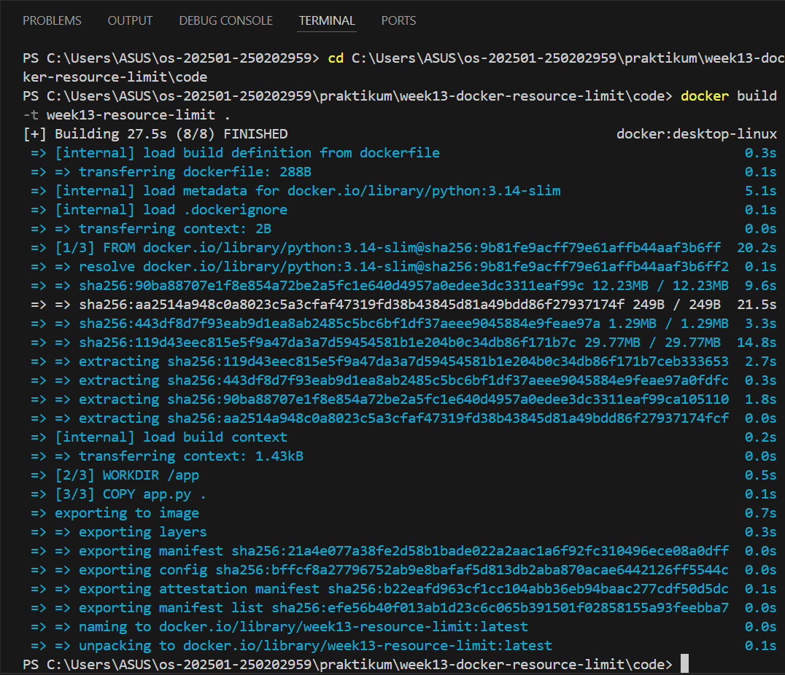
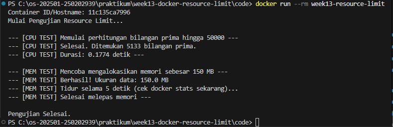
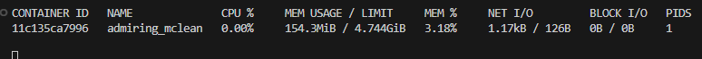
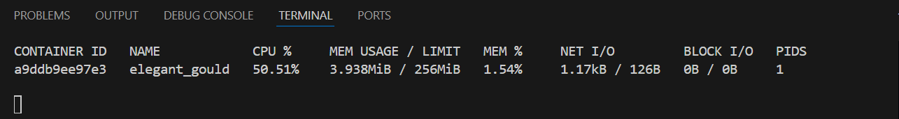
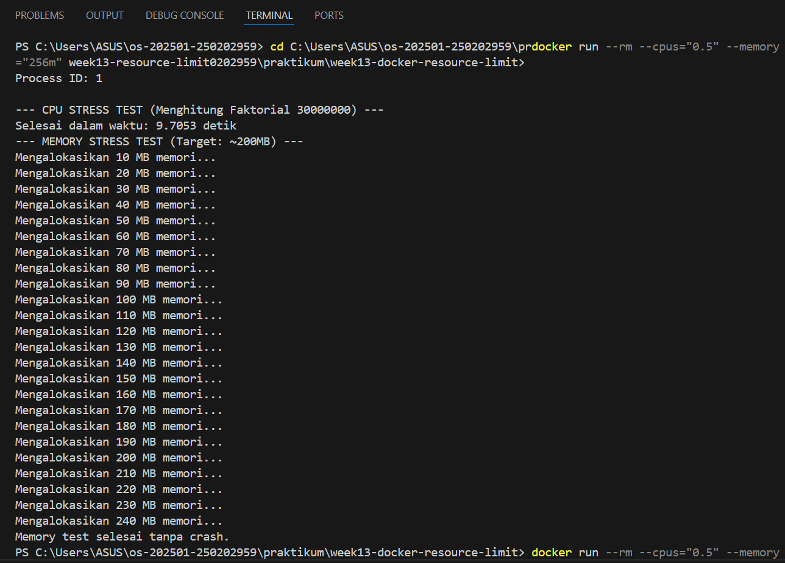

# Laporan Praktikum Minggu 13
Topik: Docker – Resource Limit (CPU & Memori)

---

## Identitas
- **Nama**  : Pasya Awan Rizky Saputro  
- **NIM**   : 250202959  
- **Kelas** : 1IKRB

---

## Tujuan
Setelah menyelesaikan tugas ini, mahasiswa mampu:
1. Menulis Dockerfile sederhana untuk sebuah aplikasi/skrip.
2. Membangun image dan menjalankan container.
3. Menjalankan container dengan pembatasan **CPU** dan **memori**.
4. Mengamati dan menjelaskan perbedaan eksekusi container dengan dan tanpa limit resource.
5. Menyusun laporan praktikum secara runtut dan sistematis.

---

## Dasar Teori
Pada praktikum minggu ini, mahasiswa mempelajari konsep **containerization** menggunakan Docker, serta bagaimana sistem operasi membatasi pemakaian sumber daya proses melalui mekanisme isolasi dan kontrol resource (mis. cgroups pada Linux). 

Fokus praktikum adalah:
1. Membuat **Dockerfile sederhana** untuk menjalankan aplikasi/skrip.
2. Menjalankan container dengan **pembatasan resource** (CPU dan memori).
3. Mengamati dampak pembatasan resource melalui output program dan monitoring sederhana.

---

## Ketentuan Teknis
- Sistem operasi host bebas (Windows/macOS/Linux). Disarankan memakai **Docker Desktop** (atau Docker Engine di Linux).
- Program berbasis **terminal**.
- Fokus penilaian pada keberhasilan **build & run container, penerapan resource limit**, serta **kualitas analisis**.

Struktur folder (sesuaikan dengan template repo):
```bash
praktikum/week13-docker-resource-limit/
├─ code/
│  ├─ app.py
│  └─ dockerfile
├─ screenshots/   
│  ├─ build_image.png
│  ├─ docker_256_stats.png
│  ├─ docker_256.png
│  ├─ docker_run_stats.png
│  ├─ docker_run.png
└─ laporan.md
```

---

## Langkah Praktikum
1. **Persiapan Lingkungan**
   - Pastikan Docker terpasang dan berjalan.
   - Verifikasi
     ```bash
     docker version
     docker ps
     ```
2. **Membuat Aplikasi/Skrip Uji**  
Buat program sederhana di folder ``code/`` (bahasa bebas) yang:
   - Melakukan komputasi berulang (untuk mengamati limit CPU), dan/atau
   - Mengalokasikan memori bertahap (untuk mengamati limit memori).     
3. **Membuat Dockerfile**  
   - Tulis ``Dockerfile`` untuk menjalankan program uji.
   - Build image:
     ```bash
     docker build -t week13-resource-limit .   
     ```
4. **Menjalankan Container Tanpa Limit**  
    - Jalankan container normal:      
      ```bash
      docker run --rm week13-resource-limit
      ```
   - Catat output/hasil pengamatan.
5. **Menjalankan Container Dengan Limit Resource**
   - Jalankan container dengan batasan resource (contoh):      
     ```bash
     docker run --rm --cpus="0.5" --memory="256m" week13-resource-limit
     ```
   - Catat perubahan perilaku program (mis. lebih lambat, error saat memori tidak cukup, dll.).
6. **Monitoring Sederhana**
   - Jalankan container (tanpa --rm jika perlu) dan amati penggunaan resource:
     ```bash
     docker stats
     ``` 
   - Ambil screenshot output eksekusi dan/atau ```docker stats```.       
7. **Commit & Push**
   ```bash
   git add .
   git commit -m "Minggu 13 - Docker Resource Limit"
   git push origin main
   ```

---

## Kode / Perintah
Tuliskan potongan kode atau perintah utama:
1. Dockerfile
   ```bash
   FROM python:3.14-slim
   WORKDIR /app
   COPY app.py .
   CMD ["python", "app.py"]
   ```
2. File App.py
   ```bash
   # code/app.py
   import time
   import sys
   import os

   def memory_stress_test(limit_mb=100):
       print(f"--- MEMORY STRESS TEST (Target: ~{limit_mb}MB) ---")
      dummy_data = []
      chunk_size_mb = 10
    
    try:
        for i in range(1, (limit_mb // chunk_size_mb) + 5):
            # Alokasi string sekitar 10MB
            print(f"Mengalokasikan {i * chunk_size_mb} MB memori...")
            dummy_data.append(' ' * (chunk_size_mb * 1024 * 1024))
            time.sleep(1) # Jeda agar terlihat di stats
        print("Memory test selesai tanpa crash.")
    except MemoryError:
        print("Error: Memory Limit Terlampaui (Python MemoryError)!")
    except Exception as e:
        print(f"Error tidak terduga: {e}")

    def cpu_stress_test(n=50000):
    print(f"\n--- CPU STRESS TEST (Menghitung Faktorial {n}) ---")
    start_time = time.time()
    
    # Komputasi berat
    result = 1
    for i in range(1, n + 1):
        result = i * i 
    
    end_time = time.time()
    duration = end_time - start_time
    print(f"Selesai dalam waktu: {duration:.4f} detik")

    if __name__ == "__main__":
    print(f"Process ID: {os.getpid()}")
    
    # 1. Jalankan tes CPU
    cpu_stress_test(30000000) # Angka besar agar butuh waktu
    
    # 2. Jalankan tes Memori
    # Kita coba alokasikan total 200MB secara bertahap
    memory_stress_test(limit_mb=200)
   ```   
3. Perintah Container
   ```bash
   1. docker build -t week13-resource-limit .
   2. docker run --rm week13-resource-limit
   3. docker run --rm --cpus="0.5" --memory="256m" --memory-swap="256m" week13-resource-limit
   ```


---

## Hasil Eksekusi
1. **Build Image**  
   Proses pada terminal menunjukkan pembuatan Docker image menggunakan perintah docker build. Docker membaca instruksi dari Dockerfile, mengunduh base image python:3.14-slim, menyalin file aplikasi app.py, lalu menyusun layer menjadi image akhir bernama week13-resource-limit:latest yang siap dijalankan sebagai container.
   
2. **Tanpa Limit**
   
   
3. **Limit Resource (CPU 0.5 & RAM 256MB)**
   
      

---

## Analisis
1. Eksekusi Container Tanpa Resource Limit
   - CPU test (faktorial 30 juta) selesai cepat (~4,2 detik).
   - Memory test berhasil alokasi hingga 240 MB tanpa crash.
   - Monitoring (docker stats) menunjukkan penggunaan CPU rendah (~2%) dan memori kecil (~44 MB dari 3,7 GB).
   - Makna: Container bebas menggunakan resource host, performa optimal.
2. Eksekusi Container Dengan Resource Limit
   - CPU dibatasi 0.5 core → waktu eksekusi naik drastis (~9,7 detik).
   - Memory dibatasi 256 MB → tetap aman karena target alokasi (240 MB) < limit.
   - Monitoring menunjukkan CPU usage tinggi (~50%) sesuai batas, memori tetap rendah (~3,9 MB dari 256 MB).
   - Makna: Resource limit efektif menahan container agar tidak melebihi jatah yang diberikan.
3. Perbandingan Tanpa vs Dengan Limit
   - CPU-bound task (faktorial) sangat terpengaruh oleh limit → performa menurun signifikan.
   - Memory-bound task aman selama kebutuhan < limit → tidak ada crash.
   - Monitoring memperlihatkan perbedaan jelas: tanpa limit resource usage kecil dibanding kapasitas host, dengan limit container “terpaksa” bekerja maksimal dalam jatah terbatas.


---

## Kesimpulan
1. Resource Limit Mengontrol Performa Container
   - Pembatasan CPU dan memori pada container membuat aplikasi berjalan sesuai jatah yang diberikan.
   - CPU-bound tasks (seperti perhitungan faktorial) langsung terasa lebih lambat saat CPU dibatasi.
   - Memory-bound tasks tetap aman selama kebutuhan tidak melebihi limit yang ditentukan.
2. Tanpa Limit vs Dengan Limit
   - Tanpa limit: container berjalan cepat dan bebas menggunakan resource host.
   - Dengan limit: performa menurun sesuai batas, tetapi host tetap stabil dan tidak terganggu.
   - Ini menunjukkan pentingnya konfigurasi limit agar container tidak “rakus” resource.
3. Monitoring Memberikan Bukti Nyata
   - docker stats memperlihatkan penggunaan CPU, memori, I/O, dan jumlah proses secara real-time.
   - Data monitoring membuktikan bahwa limit benar-benar diterapkan dan container bekerja sesuai konfigurasi.
   - Hal ini penting untuk menjaga fairness dan stabilitas di lingkungan multi-container.

---

## Quiz
1. Mengapa container perlu dibatasi CPU dan memori?
Jawaban:
   - Agar container tidak menghabiskan seluruh resource host dan mengganggu aplikasi lain.
   - Membatasi resource membuat sistem lebih stabil dan adil dalam lingkungan multi-container.
   - Membantu menjaga performa host serta mencegah satu container “rakus” CPU/memori.
2. Apa perbedaan VM dan container dalam konteks isolasi resource?
Jawaban:
   - VM (Virtual Machine): Isolasi resource dilakukan di level hypervisor, setiap VM punya OS sendiri sehingga overhead lebih besar.
   - Container: Isolasi resource dilakukan di level kernel (cgroups, namespaces), berbagi OS host, lebih ringan dan cepat.
   - VM lebih kuat dalam isolasi penuh, sedangkan container lebih efisien namun tetap bisa dibatasi dengan konfigurasi.
3. Apa dampak limit memori terhadap aplikasi yang boros memori?
Jawaban:
   - Jika aplikasi melebihi limit memori, container bisa crash atau proses dihentikan oleh sistem (OOM – Out Of Memory).
   - Aplikasi akan berjalan lebih terbatas, tidak bisa mengalokasikan memori lebih dari jatah yang diberikan.
   - Dampaknya bisa berupa performa menurun, error, atau termination, tergantung bagaimana aplikasi menangani keterbatasan memori.


---

## Refleksi Diri
Tuliskan secara singkat:
- Apa bagian yang paling menantang minggu ini?  
- Bagaimana cara Anda mengatasinya?  

---

**Credit:**  
_Template laporan praktikum Sistem Operasi (SO-202501) – Universitas Putra Bangsa_
