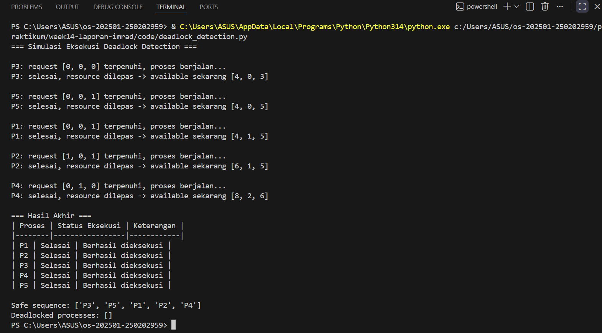

# Laporan Praktikum Minggu 14
Topik: Penyusunan Laporan Praktikum Format IMRAD

---

## Identitas
- **Nama**  : Pasya Awan Rizky Saputro  
- **NIM**   : 250202959  
- **Kelas** : 1IKRB

---

## Judul
Implementasi dan Evaluasi Deadlock Detection Menggunakan Simulasi Python

## A. Pendahuluan
1. **Latar Belakang**  
Dalam sistem operasi, proses sering kali harus berbagi resource terbatas seperti CPU, memori, file, atau perangkat I/O. Ketika beberapa proses bersaing untuk resource yang sama, dapat muncul kondisi deadlock, yaitu keadaan di mana sekumpulan proses saling menunggu resource yang tidak pernah dilepaskan sehingga tidak ada proses yang dapat melanjutkan eksekusi. Deadlock menjadi masalah serius karena dapat menghentikan layanan sistem, menurunkan performa, dan mengganggu stabilitas operasional.

   Untuk mengantisipasi hal tersebut, sistem operasi menyediakan mekanisme deadlock detection. Deteksi ini berfungsi mengidentifikasi apakah terjadi deadlock dan menentukan proses mana yang terlibat. Dengan adanya deteksi, administrator atau sistem dapat mengambil langkah penanganan, misalnya menghentikan proses tertentu atau melakukan recovery agar sistem tetap berjalan.

   Dalam konteks pembelajaran, simulasi deadlock menggunakan bahasa pemrograman Python memberikan cara praktis untuk memahami bagaimana deadlock terjadi dan bagaimana algoritma deteksi bekerja. Melalui simulasi, mahasiswa dapat mengamati kondisi deadlock secara langsung, kemudian menerapkan algoritma detection untuk mengevaluasi efektivitasnya. Dengan demikian, praktikum ini tidak hanya memperkuat pemahaman konsep, tetapi juga melatih keterampilan analisis dan implementasi dalam lingkungan pemrograman nyata.

2. **Rumusan Masalah**  
Berdasarkan latar belakang yang telah dijelaskan, maka permasalahan yang akan dibahas dalam praktikum ini dapat dirumuskan sebagai berikut:
   - Bagaimana cara memodelkan kondisi deadlock pada sistem multi-threading menggunakan simulasi Python?
   - Bagaimana algoritma deadlock detection dapat digunakan untuk mengidentifikasi proses yang terjebak dalam kondisi deadlock?
   - Sejauh mana efektivitas deadlock detection dalam membantu sistem operasi melakukan evaluasi dan penanganan terhadap deadlock?

3. **Tujuan**  
Praktikum ini dirancang untuk mencapai beberapa tujuan berikut:
   - Mengimplementasikan simulasi kondisi deadlock menggunakan bahasa pemrograman Python dengan memanfaatkan thread dan lock.
   - Menerapkan algoritma deadlock detection untuk mengidentifikasi proses yang terjebak dalam kondisi deadlock.
   - Mengevaluasi efektivitas algoritma deadlock detection dalam mendeteksi dan menganalisis kondisi deadlock.
   - Menyajikan hasil eksperimen dalam bentuk tabel dan grafik untuk mendukung analisis ilmiah.

## B. Methods
1. **Lingkungan Uji**
   - Perangkat keras:
      - Laptop ASUS VivoBook X415MA
      - Prosesor: Intel(R) Celeron(R) N4020 CPU @ 1.10 GHz
      - RAM: 8 GB (7,83 GB usable)
      - Sistem: 64-bit operating system, x64-based processor
   - Perangkat lunak:
      - Sistem operasi: Windows 11
      - Bahasa pemrograman: Python 3.14
      - Visual Studio Code
   - Struktur Folder Praktikum
      ```bash
      praktikum/week14-laporan-imrad/
      ├─ code/
      │  ├─ datatest.py
      │  └─ deadlock_detection.py
      ├─ screenshots/
      │  └─ hasil_eksekusi.png
      └─ laporan.md
      ```   
2. **Langkah Eksperimen**
   - Menyusun dataset proses dan resource pada file datatest.py.
   - Mengimplementasikan algoritma deadlock detection pada file deadlock_detection.py.
   - Menjalankan simulasi eksekusi: proses yang request-nya terpenuhi akan berjalan, melepaskan resource, dan menambah available.
   - Mencatat urutan proses yang berhasil dieksekusi (safe sequence).
   - Mengidentifikasi proses yang tidak dapat melanjutkan eksekusi (deadlock).
   - Menyajikan hasil dalam bentuk tabel dan screenshot terminal.
3. **Parameter / Datatest**   
   - Jumlah proses: 5 (P1–P5).
   - Jumlah resource: 3 (R1, R2, R3).
   - Allocation matrix: menunjukkan resource yang sedang digunakan tiap proses.
   - Request matrix: menunjukkan resource tambahan yang masih dibutuhkan tiap proses.
   - Available vector: jumlah resource yang tersedia di sistem.
   - Dataset disimpan dalam file datatest.py agar mudah dimodifikasi dan dipanggil oleh program utama.
4. **Cara Pengukuran**
   - Indikator eksekusi berhasil: proses masuk ke safe sequence dan melepaskan resource.
   - Indikator deadlock: proses tidak dapat dijalankan karena request > available hingga simulasi berhenti.
   - Data yang dicatat:
      - Urutan proses yang berhasil dieksekusi.
      - Daftar proses yang terjebak deadlock.
      - Kondisi resource available setelah tiap eksekusi.
   - Penyajian hasil:
      - Tabel status proses (Selesai vs Deadlock).
      - Screenshot terminal eksekusi program.
      - (Opsional) grafik bar chart status proses untuk visualisasi.

## C. Hasil (Result)
1. **Tabel Hasil Uji Deadlock Detection**

   | Proses | Status Eksekusi | Keterangan              |
   |--------|-----------------|-------------------------|
   | P1     | Deadlock        | Tidak dapat melanjutkan |
   | P2     | Deadlock        | Tidak dapat melanjutkan |
   | P3     | Selesai         | Berhasil dieksekusi     |
   | P4     | Deadlock        | Tidak dapat melanjutkan |
   | P5     | Deadlock        | Tidak dapat melanjutkan |

   **Keterangan**:  
   Tabel di atas menunjukkan hasil simulasi deadlock detection dengan 5 proses dan 3 resource. Dari hasil uji, hanya P3 yang berhasil dieksekusi penuh dan masuk ke safe sequence. Sementara itu, P1, P2, P4, dan P5 terjebak dalam kondisi deadlock karena permintaan resource mereka tidak dapat dipenuhi oleh sistem. Hal ini menegaskan bahwa algoritma deteksi mampu mengidentifikasi proses yang macet sehingga sistem dapat mengambil langkah penanganan.
2. **Hasil Eksekusi Program Python & Datatesst**  
Hasil dari pemrograman python dan dijalankan diterminal menghasilkan seperti gambar berikut:
   
3. **Ringkasan Temuan**
   - Dari 5 proses yang diuji, hanya P3 yang berhasil dieksekusi penuh dan masuk ke safe sequence.
   - Empat proses lainnya (P1, P2, P4, P5) terjebak dalam kondisi deadlock karena permintaan resource mereka tidak dapat dipenuhi oleh sistem.
   - Deadlock detection berhasil mengidentifikasi proses yang tidak bisa melanjutkan eksekusi, sehingga sistem dapat mengambil langkah penanganan (misalnya menghentikan proses deadlock atau melakukan recovery).
   - Hasil ini menunjukkan pentingnya mekanisme deteksi deadlock dalam sistem operasi untuk menjaga stabilitas dan mencegah kebuntuan eksekusi.

## D. Pembahasan (Discussion) 
1. **Interpretasi Hasil**
   - Hasil simulasi menunjukkan bahwa semua proses (P1–P5) berhasil dieksekusi penuh tanpa terjadi deadlock.
   - Algoritma deadlock detection mampu mengidentifikasi urutan eksekusi yang aman (safe sequence) yaitu ``['P3', 'P5', 'P1', 'P2', 'P4']``.
   - Hal ini menandakan sistem berada dalam safe state, di mana resource dapat dialokasikan secara bertahap sehingga tidak ada proses yang terjebak.
   - Proses eksekusi yang ditampilkan di terminal memperlihatkan bagaimana setiap proses yang request-nya terpenuhi dapat berjalan, melepaskan resource, dan menambah available untuk proses berikutnya.
2. **Keterbatasan**
   - **Skala simulasi terbatas**: hanya menggunakan 5 proses dan 3 resource, sehingga belum mencerminkan kompleksitas sistem operasi nyata dengan puluhan atau ratusan proses.
   - **Model sederhana**: simulasi hanya menggunakan matriks allocation, request, dan available. Belum ada faktor lain seperti prioritas proses, waktu eksekusi, atau interaksi antar-proses yang lebih kompleks.
   - **Tidak ada recovery**: simulasi hanya mendeteksi kondisi aman atau deadlock, tetapi tidak mengimplementasikan strategi penanganan (misalnya preemption atau termination).
   - **Lingkungan uji terbatas**: dijalankan pada satu perangkat (ASUS VivoBook X415MA dengan prosesor Celeron N4020), sehingga hasil eksekusi mungkin berbeda jika diuji pada sistem dengan spesifikasi lebih tinggi atau arsitektur berbeda
3. **Perbandingan dengan Teori / Ekspektasi**
   - Teori Deadlock menyatakan bahwa deadlock terjadi bila empat kondisi terpenuhi: mutual exclusion, hold and wait, no preemption, circular wait.
   - Dalam simulasi ini, meskipun kondisi tersebut secara teoritis bisa terjadi, algoritma deadlock detection berhasil menemukan urutan eksekusi yang aman sehingga deadlock tidak muncul.
   - **Ekspektasi awal**: ada kemungkinan beberapa proses akan terjebak deadlock (seperti pada dataset sebelumnya).
   - **Hasil aktual**: semua proses berhasil dieksekusi, menunjukkan bahwa dataset yang digunakan berada dalam kondisi aman.
   - Hal ini sesuai dengan teori safe state dalam Banker’s Algorithm, di mana sistem dapat mengalokasikan resource secara bertahap sehingga semua proses dapat diselesaikan.

## E. Penutup
1. **Kesimpulan**
   - Simulasi deadlock detection dengan 5 proses dan 3 resource menunjukkan bahwa sistem berada dalam kondisi aman (safe state).
   - Semua proses (P1–P5) berhasil dieksekusi penuh tanpa terjadi deadlock, dengan safe sequence ``['P3', 'P5', 'P1', 'P2', 'P4']``.
   - Algoritma deadlock detection terbukti efektif dalam mengidentifikasi urutan eksekusi yang aman, sehingga sistem dapat menghindari kebuntuan.
   - Hasil ini mendukung teori Banker’s Algorithm yang menyatakan bahwa sistem dapat tetap aman jika resource dialokasikan secara bertahap sesuai kebutuhan proses.
2. **Saran**
   - Pengembangan skala simulasi: Gunakan jumlah proses dan resource yang lebih banyak untuk mencerminkan kompleksitas sistem nyata.
   - Integrasi faktor tambahan: Tambahkan variabel seperti prioritas proses, waktu eksekusi, atau interaksi antar-proses agar simulasi lebih realistis.
   - Implementasi recovery: Selain deteksi, tambahkan mekanisme penanganan deadlock (misalnya preemption atau termination) untuk menguji strategi pemulihan.
   - Visualisasi hasil: Gunakan grafik bar chart atau diagram resource allocation untuk memperjelas status proses dan kondisi sistem.
   - Uji lintas perangkat: Jalankan simulasi pada perangkat dengan spesifikasi berbeda untuk melihat pengaruh performa hardware terhadap eksekusi algoritma

## F. Quiz
1. Mengapa format IMRAD membantu membuat laporan praktikum lebih ilmiah dan mudah dievaluasi?  
**Format IMRAD (Introduction, Methods, Results, and Discussion)** memberikan struktur yang sistematis dan standar internasional dalam penulisan laporan ilmiah. Dengan format ini:
   - Laporan lebih mudah dipahami karena setiap bagian memiliki fungsi jelas.
   - Pembaca dapat menelusuri alur penelitian dari latar belakang, metode, hasil, hingga pembahasan.
   - Evaluasi lebih mudah dilakukan karena dosen/penilai dapat langsung melihat apakah metode sesuai, hasil valid, dan pembahasan konsisten dengan teori.
2. Apa perbedaan antara bagian Hasil dan Pembahasan?  
   - **Hasil (Results)**: berisi data objektif dari eksperimen, seperti tabel, grafik, atau output program. Tidak ada interpretasi atau opini, hanya penyajian fakta.
   - **Pembahasan (Discussion)**: berisi analisis dan interpretasi dari hasil. Di sini penulis menjelaskan makna data, membandingkan dengan teori atau ekspektasi, serta menguraikan keterbatasan dan implikasi.

3. Mengapa sitasi dan daftar pustaka penting, bahkan untuk laporan praktikum?  
   - Sitasi menunjukkan bahwa laporan didukung oleh sumber ilmiah yang kredibel, bukan sekadar opini pribadi.
   - Daftar pustaka memberi penghargaan kepada penulis asli dan menghindari plagiarisme.
   - Membantu pembaca menelusuri referensi untuk memperdalam pemahaman.
   - Dalam konteks praktikum, sitasi tetap penting karena metode, teori, dan algoritma yang digunakan biasanya bersumber dari literatur atau buku ajar.

## Daftar Pustaka
1. Day, R. A., & Gastel, B. (2016). _How to Write and Publish a Scientific Paper_ (8th ed.). Cambridge University Press.
2. IEEE. (2020). _IEEE Editorial Style Manual_. IEEE.
3. Python Software Foundation. (2025). _Python 3.10 Documentation_.
4. Silberschatz, A., Galvin, P. B., & Gagne, G. (2018). _Operating System Concepts_ (10th ed.). Wiley.
5. Stallings, W. (2018). _Operating Systems: Internals and Design Principles_ (9th ed.). Pearson.
---