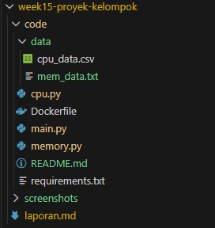
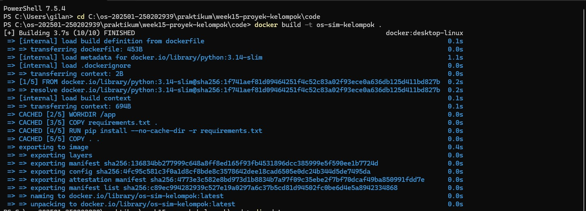
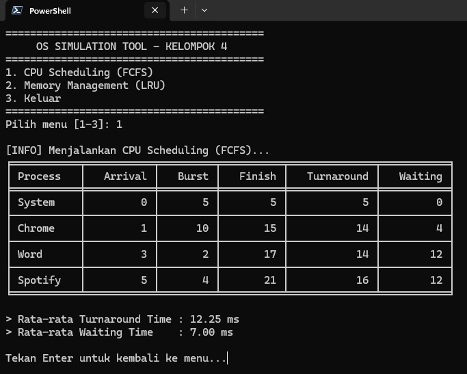
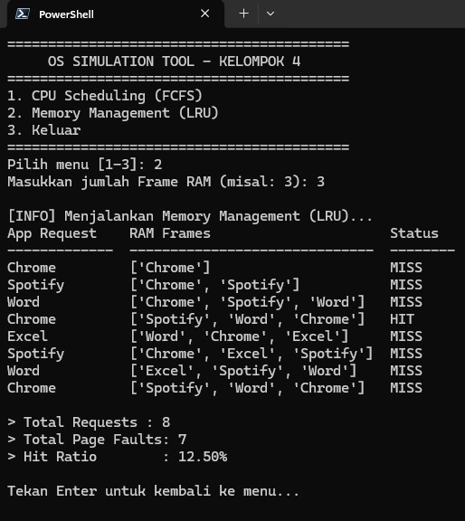

# Laporan Proyek Kelompok: Mini Simulasi Sistem Operasi

### Judul Proyek: Mini Simulasi Sistem Operasi – CPU Scheduling FCFS + Memory Management LRU

### Mata Kuliah: Sistem Operasi (Minggu 15)

### Kelompok: 4
---

## A. Latar Belakang dan Tujuan Proyek

### 1. Latar Belakang
Manajemen proses dan memori merupakan fungsi vital dalam sistem operasi. Konsep *First-Come First-Served* (FCFS) pada penjadwalan CPU dan *Least Recently Used* (LRU) pada manajemen memori seringkali dipelajari secara teoritis. Proyek ini bertujuan untuk memvisualisasikan mekanisme tersebut melalui simulasi berbasis terminal, menggunakan studi kasus aktivitas aplikasi nyata (seperti browser, pemutar musik, dan pengolah kata) agar lebih mudah dipahami.

### 2. Tujuan.
* Mengimplementasikan dua modul utama sistem operasi: CPU Scheduling (FCFS) dan Memory Management (LRU).
* Membangun lingkungan aplikasi yang *reproducible* menggunakan teknologi Docker.
* Menerapkan kolaborasi tim menggunakan Git (pembagian *branch* fitur dan *merge*).
* Menganalisis kinerja sistem berdasarkan metrik *Waiting Time*, *Turnaround Time*, dan *Hit Ratio*.

---

## B. Arsitektur Aplikasi

Aplikasi dikembangkan menggunakan **Python 3.14** dengan arsitektur modular sederhana (*flat structure*) untuk memudahkan integrasi kode antar anggota tim.

### 1. Struktur Repositori
Berikut adalah susunan folder proyek kami di VS Code:



```text
praktikum/week15-proyek-kelompok/
├── code/
│   ├── data/
│   │   ├── cpu_data.csv
│   │   └── mem_data.txt
│   ├── cpu.py 
│   ├── memory.py
│   ├── main.py          
│   ├── Dockerfile
│   ├── requirements.txt
│   └── README.md
├── screenshots/
│   ├── menu_utama.png
│   ├── hasil_cpu.png
│   ├── hasil_memory.png
│   └── demo_docker.png
└── laporan.md

```

### 2. Modul dan Alur Data

* **Modul Utama (`main.py`):** Bertindak sebagai antarmuka (CLI). Modul ini menangani navigasi menu dan memastikan jalur file (*file path*) dataset terbaca dengan benar menggunakan library `os`.
* **Modul CPU (`cpu.py`):**
* *Input:* File CSV berisi daftar proses (Nama Aplikasi, Arrival Time, Burst Time).
* *Proses:* Mengurutkan antrian berdasarkan waktu kedatangan (*Arrival Time*) dan menghitung waktu eksekusi secara berurutan.
* *Output:* Tabel metrik waktu (Start, Finish, Turnaround, Waiting).


* **Modul Memory (`memory.py`):**
* *Input:* File TXT berisi urutan *request* aplikasi dan parameter jumlah *Frame* RAM dari user.
* *Proses:* Simulasi *stack* memori. Jika aplikasi tidak ada di RAM, terjadi *Page Fault* dan sistem mengganti aplikasi yang paling lama tidak digunakan (LRU).
* *Output:* Visualisasi isi Frame per langkah dan persentase *Hit Ratio*.


---

## C. Demo Menjalankan Aplikasi (via Docker)

Penggunaan Docker memastikan aplikasi berjalan konsisten tanpa kendala dependensi library.

### 1. Proses Build Image
Perintah: `docker build -t os-sim-kelompok .`
Docker mengunduh *base image* Python, menginstal library `tabulate`, dan menyalin source code.



### 2. Tampilan Menu Utama
Aplikasi dijalankan dengan perintah: `docker run -it --rm os-sim-kelompok`


---

## D. Hasil Pengujian dan Analisis

Pengujian dilakukan menggunakan dataset simulasi *multitasking* aplikasi komputer.

### 1. CPU Scheduling (FCFS)
Algoritma ini memprioritaskan proses yang datang lebih awal.
* **Dataset:** System (Arrival 0), Chrome (Arrival 1), Word (Arrival 3), Spotify (Arrival 5).



**Analisis:**
* **Rata-rata Turnaround Time:** 12.25 ms
* **Rata-rata Waiting Time:** 7.00 ms
* Proses "System" langsung dieksekusi karena datang paling awal. Proses "Spotify" meskipun durasinya pendek (Burst 4), harus menunggu antrian selesai (Waiting Time 12 ms). Ini menunjukkan kelemahan FCFS terhadap proses singkat yang datang belakangan (*convoy effect*).

### 2. Memory Management (LRU)
Simulasi manajemen RAM dengan kapasitas terbatas (**3 Frame**) terhadap request aplikasi yang masuk bertubi-tubi.



**Analisis:**
* **Total Requests:** 8
* **Hit Ratio:** 12.50% (7 Page Faults)
* Pada pengujian ini, kapasitas 3 frame diuji dengan request aplikasi berulang. Terlihat sistem melakukan penggantian (*replacement*) aplikasi lama saat memori penuh. Rasio Hit 12.50% menunjukkan kapasitas 3 frame kurang optimal untuk menangani variasi aplikasi yang dibuka secara bergantian (*thrashing*).

### 2. Memory Management (LRU)

Simulasi manajemen RAM dengan kapasitas terbatas (**3 Frame**) terhadap request aplikasi yang masuk bertubi-tubi.

**Analisis:**

* **Total Requests:** 8
* **Hit Ratio:** 12.50% (7 Page Faults)
* Pada pengujian ini, kapasitas 3 frame diuji dengan request aplikasi berulang. Terlihat sistem melakukan penggantian (*replacement*) aplikasi lama saat memori penuh. Rasio Hit 12.50% menunjukkan kapasitas 3 frame kurang optimal untuk menangani variasi aplikasi yang dibuka secara bergantian (*thrashing*).

---

## E. Pembagian Peran dan Kontribusi

| Nama Anggota | Peran | Kontribusi Detail |
| --- | --- | --- |
| **Gilang Ananda Putra** | Project Lead & Integrator | - Mengembangkan `main.py` (sistem menu)<br> - Membuat `Dockerfile` agar aplikasi berjalan di container <br> - Menginisialisasi Git Repo, melakukan *Merge Request* dari seluruh anggota<br> - Pengujian Aplikasi<br> - Finalisasi kode. |
| **Pasya Awan Rizky Saputro** | - Developer Modul CPU | - Mengimplementasikan logika FCFS di `cpu.py`<br> - Membuat dataset CSV studi kasus<br> - Mendesain format tabel output CPU. |
| **Faizal Muzaki** | - Developer Modul Memory | Mengimplementasikan logika LRU di `memory.py`<br> - Menangani parsing input file TXT<br> - Logika penggantian halaman (*replacement*). |
| **Yusuf Anwar** | Docs & QA | - Melakukan pengujian (*debugging* path file)<br> - Mengambil *screenshot*<br> - Menyusun laporan. |

---

## F. Quiz

**1. Tantangan terbesar saat menggabungkan modul CPU dan Memory serta bagaimana solusinya?**

Tantangan teknis terbesar adalah penanganan **File Path**. Saat aplikasi dijalankan dari folder yang berbeda (misal dari *root* vs dari dalam *code/*), Python sering gagal menemukan file dataset (`FileNotFoundError`).

* **Solusi:** Kami menambahkan kode `os.path.dirname(os.path.abspath(__file__))` di `main.py` untuk mendeteksi lokasi absolut skrip secara otomatis, sehingga dataset selalu terbaca akurat.

**2. Mengapa Docker mempermudah demo, distribusi, dan penilaian?**

Docker mengatasi masalah *"It works on my machine"*. Docker membungkus aplikasi beserta lingkungan berjalannya (Python 3.14-slim, library `tabulate`) menjadi satu *Image*. Penilai tidak perlu menginstal library secara manual; cukup jalankan perintah `docker run`, dan aplikasi dijamin berjalan persis sama seperti di komputer pengembang.

**3. Jika dataset diperbesar 10x, modul mana yang paling terdampak performanya dan kenapa?**

Modul **Memory Management (LRU)** akan paling terdampak.

* **Alasan:** CPU FCFS hanya melakukan pengurutan satu kali di awal (). Sedangkan Memory LRU harus melakukan operasi pencarian dan manipulasi *list* (hapus elemen lama, tambah elemen baru) pada **setiap langkah** request yang masuk. Jika input menjadi 10x lipat, beban komputasi Memory Management meningkat linear seiring jumlah request (), yang lebih berat secara operasional dibanding sekadar penjumlahan waktu di CPU.

---

```

```