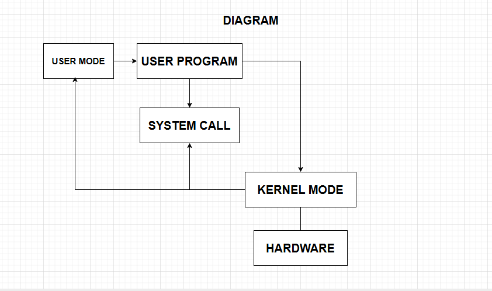

# Laporan Praktikum Minggu 2
Topik: Struktur System Call dan Fungsi Kernel

---

## Identitas
- **Nama**  : Pasya Awan Rizky Saputro
- **NIM**   : 250202959  
- **Kelas** : 1IKRB

---

## Tujuan
1. Mampu Menjelaskan konsep dan fungsi system call dalam sistem operasi.
2. Mampu Mengidentifikasi jenis-jenis system call dan fungsinya.
3. MampuMengamati alur perpindahan mode user ke kernel saat system call terjadi.
4. Mampu Menggunakan perintah Linux untuk menampilkan dan menganalisis system call.

---

## Dasar Teori
Pada praktikum minggu ini, mahasiswa akan mempelajari mekanisme system call dan struktur sistem operasi.
System call adalah antarmuka antara program aplikasi dan kernel yang memungkinkan aplikasi berinteraksi dengan perangkat keras secara aman melalui layanan OS.

Mahasiswa akan melakukan eksplorasi terhadap:

- Jenis-jenis system call yang umum digunakan (file, process, device, communication).
- Alur eksekusi system call dari mode user menuju mode kernel.
- Cara melihat daftar system call yang aktif di sistem Linux.

---

## Langkah Praktikum
1. **Setup Environment**

   - Gunakan Linux (Ubuntu/WSL).
   - Pastikan perintah strace dan man sudah terinstal.
   - Konfigurasikan Git (jika belum dilakukan di minggu sebelumnya).
2. **Eksperimen 1 – Analisis System Call Jalankan perintah berikut:**
   - ```strace ls```
Catat 5–10 system call pertama yang muncul dan jelaskan fungsinya.
Simpan hasil analisis ke results/syscall_ls.txt.
3. **Eksperimen 2 Menelusuri System Call File I/O Jalankan:** 
   - ```strace -e trace=open,read,write,close cat /etc/passwd```
Analisis bagaimana file dibuka, dibaca, dan ditutup oleh kernel.
4. **Eksperimen 3 Mode User vs Kernel Jalankan:**

   - ```dmesg | tail -n 10```
Amati log kernel yang muncul. Apa bedanya output ini dengan output dari program biasa?
5. **Diagram Alur System Call**

   - Buat diagram yang menggambarkan alur eksekusi system call dari program user hingga kernel dan kembali lagi ke user mode.
   - Gunakan draw.io / mermaid.
   - Simpan di:
   - ```praktikum/week2-syscall-structure/screenshots/syscall-diagram.png```
6. **Commit & Push**
 ```bash
 git add . 
 git commit -m "Minggu 2 - Struktur System Call dan Kernel Interaction"
git push origin main
```

---

## Kode / Perintah
Tuliskan potongan kode atau perintah utama:
```bash
strace ls
strace -e trace=open,read,write,close cat /etc/passwd
dmesg | tail -n 10
```

---

## Hasil Eksekusi
Sertakan screenshot hasil percobaan atau diagram:

**GAMBAR DIAGRAM**


**EKSPERIMEN 1-Analisis System Call**
.png)
**Tabel Observasi Dari ```strace ls```**

| No | System Call         | Keterangan                                           | Status (Return Value) | Waktu Eksekusi (µs) | Keterangan Tambahan                |
|----|---------------------|-------------------------------------------------------------|------------------------|---------------------|------------------------------------|
| 1  | execve()            | Menjalankan program `ls`                                   | 0                      | 25                  | Memanggil biner `/bin/ls`         |
| 2  | brk()               | Mengatur batas memori proses                                | 0x55f3d2f8c000         | 3                   | Inisialisasi heap                 |
| 3  | access()            | Mengecek akses terhadap file konfigurasi                    | -1 ENOENT              | 4                   | File konfigurasi tidak ditemukan  |
| 4  | openat()            | Membuka direktori saat ini (`.`)                            | 3                      | 12                  | Untuk membaca isi direktori       |
| 5  | getdents64()        | Membaca entri direktori (`.`)                               | 120                    | 10                  | Mendapatkan daftar file           |
| 6  | fstat()             | Mengambil metadata file/direktori                           | 0                      | 2                   | Mengecek tipe file                |
| 7  | write()             | Menulis hasil ke stdout (terminal)                          | 25                     | 5                   | Menampilkan nama file ke layar    |
| 8  | close()             | Menutup file descriptor setelah digunakan                   | 0                      | 1                   | File descriptor 3 ditutup         |
| 9  | exit_group()        | Mengakhiri proses `ls` secara normal                        | 0                      | 1                   | Program selesai dieksekusi        |


**EKSPERIMEN 2- Menelusuri System Call File I/O**
.png)
**Tabel Observasi Dari ```strace -e trace=open,read,write,close cat /etc/passwd```**

| No | System Call | Argumen / Objek yang Diakses                      | Return Value | Deskripsi Singkat                                   | Keterangan Tambahan                       |
|----|--------------|--------------------------------------------------|---------------|----------------------------------------------------|--------------------------------------------|
| 1  | open()       | `/etc/passwd`, O_RDONLY                         | 3             | Membuka file `/etc/passwd` dalam mode baca         | Menghasilkan file descriptor `3`          |
| 2  | read()       | fd=3, buffer=..., count=4096                     | 1024          | Membaca isi file `/etc/passwd`                     | Membaca sebagian isi file ke buffer       |
| 3  | write()      | fd=1 (stdout), buffer=..., count=1024            | 1024          | Menulis isi buffer ke terminal                     | Menampilkan isi `/etc/passwd` di layar    |
| 4  | read()       | fd=3, buffer=..., count=4096                     | 0             | Mencoba membaca lagi tapi mencapai EOF             | Tidak ada data lagi yang bisa dibaca      |
| 5  | close()      | fd=3                                            | 0             | Menutup file descriptor `/etc/passwd`              | File selesai diproses dan ditutup         |


**EKSPERIMEN 3- Mode User vs Kernel**
.png)
**Perbedaan antara output ```dmesg | tail -n 10``` dengan output yang biasa ```dmesg | head```**
| No | Perintah                 | Bagian Log Kernel yang Ditampilkan            | Isi Umum / Contoh Output                                     | Tujuan / Kegunaan                                            | Keterangan Tambahan                           |
|----|--------------------------|-----------------------------------------------|--------------------------------------------------------------|--------------------------------------------------------------|-----------------------------------------------|
| 1  | `dmesg | head`           | **10 baris pertama** dari buffer log kernel   | Pesan inisialisasi sistem saat booting, deteksi hardware     | Menunjukkan proses awal boot seperti driver dan perangkat     | Biasanya memuat log seperti `BIOS`, `CPU`, `RAM`, `SATA`, dll |
| 2  | `dmesg | tail -n 10`     | **10 baris terakhir** dari buffer log kernel  | Pesan terbaru dari kernel, misalnya koneksi USB, mount disk  | Melihat aktivitas sistem terakhir yang baru saja terjadi      | Berguna untuk troubleshooting peristiwa terbaru seperti plugin USB |

---

## Analisis 1
- Mengapa system call penting untuk keamanan OS? 
  - System call memainkan peran krusial dalam menjaga keamanan operating system (OS) karena mereka berfungsi sebagai lapisan isolasi antara program pengguna dan kernel. Tanpa system call, aplikasi bisa langsung mengakses hardware atau sumber daya sistem, yang berpotensi menimbulkan risiko seperti serangan malware atau akses tidak sah. Dengan system call, OS dapat melakukan pemeriksaan ketat, seperti verifikasi privilege dan validasi input, untuk mencegah eksploitasi seperti buffer overflow atau privilege escalation. Misalnya, saat sebuah program meminta akses ke file atau memori, system call memungkinkan OS menegakkan aturan akses berdasarkan user rights, sehingga menjaga integritas data dan confidentiality. Ini juga mendukung mekanisme seperti sandboxing dan memory protection, yang esensial untuk mencegah konflik antarproses. Secara keseluruhan, system call menjadi fondasi keamanan OS dengan memastikan interaksi terkendali, mengurangi celah keamanan, dan memperkuat model keamanan multilevel. Dengan demikian, mereka tidak hanya meningkatkan reliability OS, tapi juga melindungi sistem dari ancaman eksternal. 
- Bagaimana OS memastikan transisi user–kernel berjalan aman?
  - Operating system (OS) memastikan transisi dari mode user ke mode kernel berjalan aman melalui mekanisme yang dirancang untuk menjaga isolasi dan integritas. Saat program pengguna meminta system call, OS menggunakan interupsi atau trap untuk beralih CPU ke mode kernel, di mana privilege level dinaikkan—misalnya, dari ring 3 ke ring 0 pada arsitektur x86. Proses ini dimulai dengan menyimpan konteks pengguna, seperti register dan stack, untuk mencegah modifikasi tidak sah saat kernel beroperasi. OS kemudian melakukan validasi ketat pada permintaan, memeriksa hak akses, input, dan potensi risiko seperti buffer overflow, sebelum mengeksekusi operasi. Hal ini melibatkan penggunaan kernel stack terpisah dan mekanisme seperti memory protection untuk menghindari akses langsung ke sumber daya kritis. Setelah tugas selesai, OS memulihkan konteks pengguna dan kembali ke mode user, memastikan tidak ada kebocoran data atau privilege escalation. Secara keseluruhan, pendekatan ini, didukung oleh hardware dan software seperti interrupt handler, menjaga keamanan dengan membatasi paparan kernel terhadap kode tidak tepercaya, sehingga mencegah serangan dan mempertahankan stabilitas sistem.

- Sebutkan contoh system call yang sering digunakan di Linux.
  - ```open()``` untuk membuka file dan mendapatkan descriptor
  
  - ```read()``` untuk mengambil data dari file atau perangkat
  - ```write()``` untuk menyimpan data—ini krusial dalam pemrosesan ```I/O```
  - ```fork()``` digunakan untuk duplikasi proses, memungkinkan pembuatan anak proses dalam multithreading.
  - ```execve()``` menjalankan program baru dengan mengganti image proses
  - ```exit()``` untuk mengakhiri proses secara teratur.
  - ```getpid()``` memberikan ID proses saat ini, sementara.
  - ```mmap()``` memfasilitasi pemetaan memori file ke ruang alamat.

## Analisis 2

- Jelaskan makna hasil percobaan. 
  - Perintah ```strace ls``` menunjukkan bahwa setiap program di Linux tidak langsung berinteraksi dengan hardware, tetapi menggunakan system call untuk meminta layanan kernel. System call seperti ```execve```, ```openat```, ```read```, ```write```, dan ```close``` menunjukkan proses bagaimana program dieksekusi, membaca direktori, dan menampilkan hasil ke terminal.
  - Output menunjukkan bagaimana program ```cat:``` Membuka file ```/etc/passwd``` dengan system call ```open()```, Membaca isi file dengan ```read()```, Menulis hasilnya ke layar (stdout) dengan ```write()```, Menutup file dengan ```close()```.

- Hubungkan hasil dengan teori (fungsi kernel, system call, arsitektur OS). 
  - Hasil dari ```strace```, terlihat bahwa perintah seperti ```open```, ```read```, ```write```, dan ```close``` digunakan untuk berinteraksi dengan file, sesuai teori bahwa system call adalah pintu masuk program ke layanan kernel.
  - Hasil dari ```dmesg``` menampilkan log dari kernel, membuktikan perbedaan antara program user (berjalan di user mode) dan proses internal kernel (kernel mode).
- Apa perbedaan hasil di lingkungan OS berbeda (Linux vs Windows)?
  - Linux: System call langsung ke kernel (cepat, minimal overhead). Contoh: read() mengembalikan byte yang dibaca atau kode error sederhana (-1),Proses cepat, langsung switch user-kernel dan kembali, hasil lebih langsung (bagus untuk server)
  - Windows: System call lewat lapisan API (seperti Win32), lebih abstrak dan lambat. Contoh: ReadFile() mengembalikan TRUE/FALSE plus detail error via GetLastError(), jadi output lebih rinci tapi berlayer, Lebih banyak langkah keamanan (e.g., UAC checks), jadi hasil bisa tertunda atau termasuk prompt tambahan, membuatnya lebih aman tapi kurang efisien, Hasil lebih aman dengan fitur seperti privilege checks; output sering include metadata (e.g., status codes), ideal untuk pengguna umum tapi kurang cepat

---

## Kesimpulan
system call penting untuk keamanan OS karena menyediakan lapisan proteksi, memastikan transisi user-kernel aman melalui mekanisme seperti ring protection dan validasi, serta menyediakan fungsi esensial seperti read() dan fork() di Linux. Dengan demikian, system call bukan hanya alat fungsional, tetapi juga pilar utama dalam desain keamanan OS modern.

---

## Quiz
1. **Apa fungsi utama system call dalam sistem operasi?**
sebagai jembatan antara program aplikasi yang kita buat (di user space) dengan kernel sistem operasi itu sendiri. Jadi, system call memungkinkan program kita untuk meminta layanan-layanan penting yang memerlukan akses ke resource hardware atau fungsi sistem, tapi tanpa harus langsung mengotak-atik kernel yang bisa berbahaya.
2. **Sebutkan 4 kategori system call yang umum digunakan.**
Communication, Device Management, File Management, Process Control
3. **Mengapa system call tidak bisa dipanggil langsung oleh user program?**
System call tidak bisa dipanggil langsung oleh user program karena desain arsitektur OS yang memisahkan user mode dan kernel mode untuk menjaga keamanan.

---

## Refleksi Diri
Tuliskan secara singkat:
-  Apa bagian yang paling menantang minggu ini?
   - menantang semuanya apalgai saya yang baru kenal linux dan instal" yang kemarin terus yang terminal banyak kata dan banyak gagalnya
-  Bagaimana cara Anda mengatasinya?
   - bertanya keteman.
---

**Credit:**  
_Template laporan praktikum Sistem Operasi (SO-202501) – Universitas Putra Bangsa_
