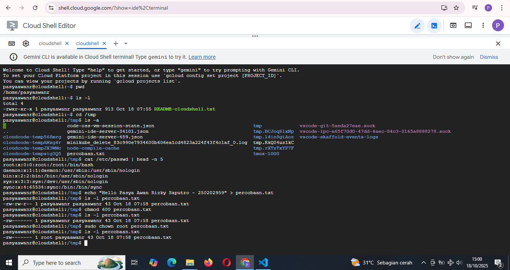
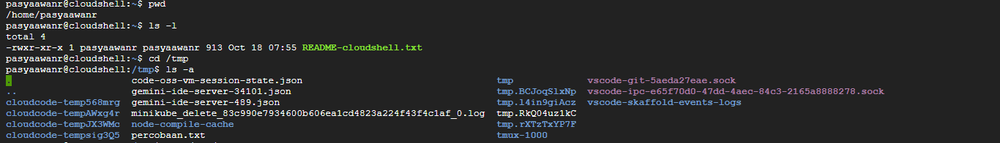
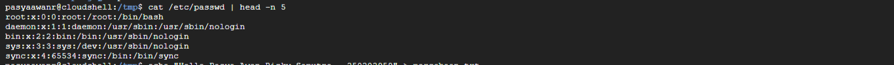
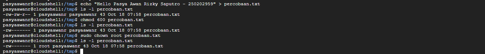

# Laporan Praktikum Minggu 3
Topik: Manajemen File dan Permission di Linux

---

## Identitas
- **Nama**  : Pasya Awan Rizky Saputro
- **NIM**   : 250202959  
- **Kelas** : 1IKRB

---

## Tujuan
1. Mampu Menggunakan perintah ```ls```, ```pwd```, ```cd```, ```cat``` untuk navigasi file dan direktori.
2. Mampu Menggunakan ```chmod``` dan ```chown``` untuk manajemen hak akses file.
3. Mampu enjelaskan hasil output dari perintah Linux dasar.
4. Mampu Menyusun laporan praktikum dengan struktur yang benar.
5. Mampu Mengunggah dokumentasi hasil ke Git Repository tepat waktu.

---

## Dasar Teori
Pada praktikum minggu ini, mahasiswa akan mempelajari **pengelolaan file dan direktori menggunakan perintah dasar Linux**, serta konsep **permission dan ownership.**
Praktikum berfokus pada:
- Navigasi sistem file dengan ``ls``, ``pwd``, ``cd``, dan ``cat``.
- Pengaturan hak akses file menggunakan ``chmod``.
- Pengubahan kepemilikan file menggunakan ``chown``.
- Dokumentasi hasil eksekusi dan pengelolaan repositori praktikum.

Tujuan utama dari praktikum ini adalah agar mahasiswa mampu **mengoperasikan perintah Linux dasar dengan benar**, memahami sistem izin (permission), dan mendokumentasikan hasilnya dalam format laporan Git.

---

## Langkah Praktikum
1. **Setup Environment**
   - Gunakan Linux (Ubuntu/WSL).
Pastikan folder kerja berada di dalam direktori repositori Git praktikum:
   ```bash
   praktikum/week3-linux-fs-permission/
   ```

2. **Eksperimen 1 – Navigasi Sistem File Jalankan perintah berikut:**
   - Jelaskan hasil tiap perintah.
   - Catat direktori aktif, isi folder, dan file tersembunyi (jika ada).
   ```bash 
   pwd
   ls -l
   cd /tmp
   ls -a
   ```
3. **Eksperimen 2 – Membaca File Jalankan perintah:**
   - Jelaskan isi file dan struktur barisnya (user, UID, GID, home, shell).
   ```bash 
   cat /etc/passwd | head -n 5
   ```
4. **Eksperimen 3 – Permission & Ownership Buat file baru:**
   - Analisis perbedaan sebelum dan sesudah chmod.
   - Ubah pemilik file (jika memiliki izin sudo):
   ```bash
   echo "Hello <NAME><NIM>" > percobaan.txt 
   ls -l percobaan.txt 
   chmod 600 percobaan.txt 
   ls -l percobaan.txt
   ```
   - Catat hasilnya.
   ```bash
   sudo chown root percobaan.txt 
   ls -l percobaan.txt
   ```
5. **Eksperimen 4 – Dokumentasi**
   - Ambil screenshot hasil terminal dan simpan di:
   ```bash
   praktikum/week3-linux-fs-permission/screenshots/
   ```
6. **Commit & Push**   
   ```bash
   git add .
   git commit -m "Minggu 3 - Linux File System & Permission"
   git push origin main
   ```
---

## Kode / Perintah
Tuliskan potongan kode atau perintah utama:
```bash
pwd
ls -l
cd /tmp
ls -a
cat /etc/passwd | head -n 5
echo "Hello <NAME><NIM>" > percobaan.txt
ls -l percobaan.txt
chmod 600 percobaan.txt
ls -l percobaan.txt
sudo chown root percobaan.txt
ls -l percobaan.txt
```

---

## Hasil Eksekusi dan Dokumentasikan hasil seluruh perintah pada tabel observasi
Hasil percobaan: 

### 1. Eksperimen 1 – Navigasi Sistem File
| **No** | **Perintah** | **Hasil / Output (Dari Gambar)**                                                                                                                                                                                                                                                                                                     | **Penjelasan Hasil**                                                                                                                                                                                                            |
| ------ | ------------ | ------------------------------------------------------------------------------------------------------------------------------------------------------------------------------------------------------------------------------------------------------------------------------------------------------------------------------------ | ------------------------------------------------------------------------------------------------------------------------------------------------------------------------------------------------------------------------------- |
| 1      | `pwd`        | `/home/pasyaawanr`                                                                                                                                                                                                                                                                                                                   | Menunjukkan direktori aktif saat ini berada di *home directory* pengguna bernama **pasyaawanr**.                                                                                                                                |
| 2      | `ls -l`      | `-rwxr-xr-x 1 pasyaawanr pasyaawanr 913 Oct 18 07:55 README-cloudshell.txt`                                                                                                                                                                                                                                                          | Menampilkan isi direktori saat ini, yaitu satu file bernama **README-cloudshell.txt** dengan permission **rwxr-xr-x** (pemilik dapat membaca, menulis, dan menjalankan, sedangkan lainnya hanya dapat membaca dan menjalankan). |
| 3      | `cd /tmp`    | *(tidak ada output)*                                                                                                                                                                                                                                                                                                                 | Berpindah direktori dari `/home/pasyaawanr` ke direktori sementara `/tmp`.                                                                                                                                                      |
| 4      | `ls -a`      | `.  ..  code-oss-vm-session-state.json  gemini-ide-server-34101.json  gemini-ide-server-489.json  minikube_delete_83c990e7934600b606ealc4823a224f43f4c1afE_0.log  node-module-cache  percobaan.txt  tmp.*  vscode-git-5aeda27eae.sock  vscode-ipc-e65f70d0-47dd-4aec-84c3-2165a8888278.sock  vscode-skaffold-events-logs  tmux-1000` | Menampilkan seluruh isi direktori `/tmp`, termasuk file dan folder tersembunyi (`.` dan `..`). Terlihat ada berbagai file sementara sistem, file log, cache, dan file hasil percobaan (`percobaan.txt`).                        |
- Direktori aktif awal berada di ```/home/pasyaawanr```, lalu berpindah ke ```/tmp```.
- File yang ada di home hanya ```README-cloudshell.txt```.
- Di /tmp terdapat banyak file sistem dan file tersembunyi (```.```, ```..```).
- Perintah ```ls -a``` membantu melihat seluruh isi direktori termasuk file tersembunyi, sedangkan ```pwd``` digunakan untuk mengetahui posisi direktori aktif saat ini.


### 2. Eksperimen 2 – Membaca File
| **No** | **Perintah**                   | **Hasil**                                                                                                                                                                        | **Penjelasan Hasil dan Struktur Baris**                                                                                                                                                                                                                                                                                                                                                                                                                  |
| ------ | ------------------------------ | -------------------------------------------------------------------------------------------------------------------------------------------------------------------------------------------------- | -------------------------------------------------------------------------------------------------------------------------------------------------------------------------------------------------------------------------------------------------------------------------------------------------------------------------------------------------------------------------------------------------------------------------------------------------------- |
| 1      | `cat /etc/passwd \| head -n 5` | `root:x:0:0:root:/root:/bin/bash  daemon:x:1:1:daemon:/usr/sbin:/usr/sbin/nologin  bin:x:2:2:bin:/bin:/usr/sbin/nologin  sys:x:3:3:sys:/dev:/usr/sbin/nologin  sync:x:4:65534:sync:/bin:/bin/sync` | File `/etc/passwd` menyimpan daftar akun pengguna sistem. Tiap baris berisi informasi user dengan format:  **username:password:UID:GID:deskripsi:home:shell**. <br> Contoh: <br> • **root** → nama pengguna <br> • **x** → sandi tersimpan di file shadow <br> • **0** → UID (User ID) untuk root <br> • **0** → GID (Group ID) <br> • **root** → deskripsi akun <br> • **/root** → direktori home pengguna <br> • **/bin/bash** → shell yang digunakan. |


### 3. Eksperimen 3 – Permission & Ownership
| **No** | **Perintah**                                                        | **Hasil / Output (Dari Gambar)**                                   | **Penjelasan dan Analisis**                                                                                                       |
| ------ | ------------------------------------------------------------------- | ------------------------------------------------------------------ | --------------------------------------------------------------------------------------------------------------------------------- |
| 1      | `echo "Hello Pasya Awan Rizky Saputro - 250202959" > percobaan.txt` | *(tidak ada output)*                                               | Membuat file baru bernama **percobaan.txt** dan menulis teks ke dalamnya.                                                         |
| 2      | `ls -l percobaan.txt`                                               | `-rw-r--r-- 1 pasyaawanr pasyaawanr 43 Oct 18 07:58 percobaan.txt` | File awal memiliki izin **rw-r--r--**, artinya pemilik bisa membaca dan menulis, grup dan user lain hanya bisa membaca.           |
| 3      | `chmod 600 percobaan.txt`                                           | *(tidak ada output)*                                               | Mengubah izin file agar hanya pemilik yang dapat membaca dan menulis.                                                             |
| 4      | `ls -l percobaan.txt`                                               | `-rw------- 1 pasyaawanr pasyaawanr 43 Oct 18 07:58 percobaan.txt` | Setelah `chmod`, izin berubah menjadi **rw-------**, menandakan file kini hanya bisa diakses oleh pemilik, meningkatkan keamanan. |
| 5      | `sudo chown root percobaan.txt`                                     | *(tidak ada output)*                                               | Mengubah kepemilikan file dari pengguna biasa (**pasyaawanr**) menjadi **root** (administrator sistem).                           |
| 6      | `ls -l percobaan.txt`                                               | `-rw------- 1 root pasyaawanr 43 Oct 18 07:58 percobaan.txt`       | Pemilik file sekarang **root**, sedangkan grup masih **pasyaawanr**. Artinya, hak penuh atas file kini dimiliki oleh sistem. 

Analisis Perbedaan Sebelum dan Sesudah ```chmod```:

Sebelum ```chmod```, file dapat dibaca oleh semua pengguna **(rw-r--r--)**.
Setelah ```chmod 600```, hanya pemilik file yang memiliki hak akses **(rw-------)**.
Perubahan ini menunjukkan fungsi ```chmod``` dalam membatasi akses file untuk menjaga keamanan data.

Setelah ```chown```, kepemilikan berpindah ke root, menandakan file kini dikelola oleh administrator sistem.


---

## Analisis
#### 1. Jelaskan makna hasil percobaan  
- **Jawaban**: Makna hasil percobaan Manajemen File dan Permission di Linux adalah untuk menunjukkan bagaimana sistem Linux mengatur akses terhadap file dan direktori. Dari percobaan ini, terlihat bahwa setiap file memiliki izin ```(permission)``` dan pemilik ```(ownership)``` yang menentukan siapa saja yang boleh membaca, menulis, atau menjalankannya. Dengan memahami ini, pengguna bisa mengelola keamanan, mencegah perubahan tidak sengaja, dan mengontrol siapa yang bisa mengakses data tertentu.
#### 2.  Hubungkan hasil dengan teori (fungsi kernel, system call, arsitektur OS).  
- **Jawaban**: Dalam teori sistem operasi, kernel berfungsi sebagai penghubung antara pengguna dan perangkat keras. Saat pengguna menjalankan perintah seperti ```chmod```, ```chown```, atau ```ls```, perintah tersebut sebenarnya memicu system call — yaitu permintaan layanan dari program ke kernel.
#### 3. Apa perbedaan hasil di lingkungan OS berbeda (Linux vs Windows)?
-  Untuk di Linux pengaturan file dan permission dilakukan dengan sistem hak akses berbasis pengguna (owner, group, others) menggunakan perintah seperti ```chmod``` dan ```chown```.
- Sedangkan di Windows, pengaturan izin dilakukan melalui **GUI (Properties → Security)** dengan sistem **ACL (Access Control List)** yang lebih detail tapi tidak berbasis perintah terminal seperti di Linux.

---

## Kesimpulan
mahasiswa belajar dasar pengelolaan file dan direktori di Linux, termasuk navigasi sistem file, pengaturan izin akses dengan chmod, serta pengubahan kepemilikan dengan chown, untuk memahami konsep ```permission``` dan ```ownership``` yang penting bagi keamanan dan kontrol akses.

---

## Quiz
1. Apa fungsi dari perintah ``chmod``?  
   **Jawaban:**  
   - untuk mengubah izin akses file atau direktori di sistem operasi Unix/Linux, seperti membaca, menulis, atau mengeksekusi.
2. Apa arti dari kode permission ``rwxr-xr--``?  
   **Jawaban:**  
   - ```rwx``` → Pemilik/pengguna file bisa membaca, menulis, dan menjalankan.
   - ```r-x``` → Grup hanya bisa digunakan untuk membaca dan menjalankan.
   - ```r--``` → Untuk pengguna yang lain hanya bisa membaca
3. Jelaskan perbedaan antara ``chown`` dan ``chmod``.  
   **Jawaban:**  
   - ```chown``` digunakan untuk mengubah kepemilikan file atau direktori (siapa pemilik dan grupnya)
    - ```chmod``` digunakan untuk mengubah izin akses file atau direktori (siapa yang boleh baca, tulis, atau eksekusi).

---

## Refleksi Diri
Tuliskan secara singkat:
- Apa bagian yang paling menantang minggu ini?  
   - Sebenarnya banyak tapi yang membingungkan itu urut urutan soalnya
- Bagaimana cara Anda mengatasinya?  
   - Bertanya keteman
---

**Credit:**  
_Template laporan praktikum Sistem Operasi (SO-202501) – Universitas Putra Bangsa_
