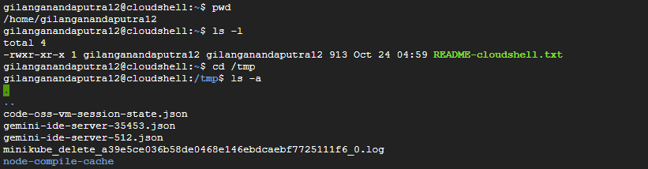
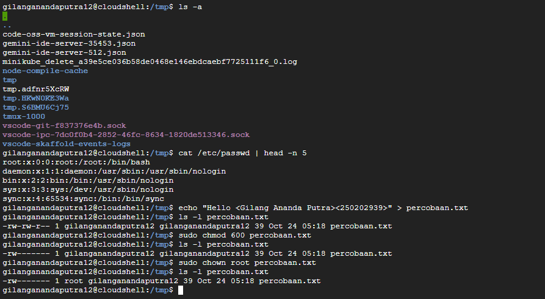

# Laporan Praktikum Minggu 3
Topik: Manajemen File dan Permission di Linux  

---

## Identitas
- **Nama**  : Gilang Ananda Putra  
- **NIM**   : 250202939  
- **Kelas** : 1IKRB

---

## Tujuan
Setelah menyelesaikan tugas ini, mahasiswa mampu:
1. Menggunakan perintah `ls`, `pwd`, `cd`, `cat` untuk navigasi file dan direktori.
2. Menggunakan `chmod` dan `chown` untuk manajemen hak akses file.
3. Menjelaskan hasil output dari perintah Linux dasar.
4. Menyusun laporan praktikum dengan struktur yang benar.
5. Mengunggah dokumentasi hasil ke Git Repository tepat waktu.

---

## Dasar Teori


### 1. Struktur File Hirarkis (FHS)
Sistem Linux menggunakan struktur direktori berbentuk pohon yang dimulai dari **root (`/`)**. Perintah seperti `pwd` (menampilkan lokasi direktori aktif) dan `cd` (berpindah direktori) digunakan untuk melakukan navigasi secara efisien di dalam sistem berkas.

### 2. Izin File dan Kontrol Akses (`chmod`)
Keamanan file dikendalikan melalui **permission (izin akses)** yang menentukan hak **Baca (r/4)**, **Tulis (w/2)**, dan **Eksekusi (x/1)**. Izin ini diterapkan pada tiga kategori pengguna: **Pemilik (Owner)**, **Grup (Group)**, dan **Lainnya (Others)**. Perintah `chmod` digunakan untuk mengubah hak akses tersebut guna menjaga **kerahasiaan**, **integritas**, dan **keamanan** file dalam sistem.

### 3. Kepemilikan dan Otoritas (`chown`)
Setiap file memiliki satu **Pemilik (User)** dan satu **Grup (Group)** yang menentukan otoritas terhadap file tersebut. Perintah `chown` digunakan untuk mengubah kepemilikan file atau direktori. Konsep ini penting untuk menjaga **isolasi keamanan**, serta memastikan tanggung jawab dan pembatasan hak akses antar pengguna dalam sistem Linux.


---

## Langkah Praktikum
1. **Setup Environment**
   - Gunakan Linux (Ubuntu/WSL).
   - Pastikan folder kerja berada di dalam direktori repositori Git praktikum:
     ```
     praktikum/week3-linux-fs-permission/
     ```

2. **Eksperimen 1 – Navigasi Sistem File**
   Jalankan perintah berikut:
   ```bash
   pwd
   ls -l
   cd /tmp
   ls -a
   ```
   - Jelaskan hasil tiap perintah.
   - Catat direktori aktif, isi folder, dan file tersembunyi (jika ada).

3. **Eksperimen 2 – Membaca File**
   Jalankan perintah:
   ```bash
   cat /etc/passwd | head -n 5
   ```
   - Jelaskan isi file dan struktur barisnya (user, UID, GID, home, shell).

4. **Eksperimen 3 – Permission & Ownership**
   Buat file baru:
   ```bash
   echo "Hello <NAME><NIM>" > percobaan.txt
   ls -l percobaan.txt
   chmod 600 percobaan.txt
   ls -l percobaan.txt
   ```
   - Analisis perbedaan sebelum dan sesudah chmod.  
   - Ubah pemilik file (jika memiliki izin sudo):
   ```bash
   sudo chown root percobaan.txt
   ls -l percobaan.txt
   ```
   - Catat hasilnya.

5. **Eksperimen 4 – Dokumentasi**
   - Ambil screenshot hasil terminal dan simpan di:
     ```
     praktikum/week3-linux-fs-permission/screenshots/
     ```
   - Tambahkan analisis hasil pada `laporan.md`.

6. **Commit & Push**
   ```bash
   git add .
   git commit -m "Minggu 3 - Linux File System & Permission"
   git push origin main
   ```

---

## Kode Perintah
```bash
pwd
ls -l
cd /tmp
ls -a
cat /etc/passwd | head -n 5
echo "Hello <NAME><NIM>" > percobaan.txt
ls -l percobaan.txt
chmod 600 percobaan.txt
ls -l percobaan.txt
sudo chown root percobaan.txt
ls -l percobaan.txt
```

---

## Hasil Eksekusi
Sertakan screenshot hasil percobaan atau diagram:




---

## Tabel Observasi Perintah

| Perintah | Hasil (Output) | Keterangan |
|-----------|----------------|-------------|
| `pwd` | `/home/gilanaganandaputra12` | Menampilkan direktori kerja saat ini. |
| `ls -l` | `total 4` | Menampilkan daftar file di direktori home, hanya ada README-cloudshell.txt. |
| `cd /tmp` | Tidak ada output eksplisit | Berpindah ke direktori `/tmp`. |
| `ls -a` | Menampilkan daftar file dan direktori, termasuk file tersembunyi (diawali dengan .) di `/tmp`. |  |
| ``cat /etc/passwd \| head -n 5`` | ```root:x:0:0:root:/root:/bin/bash<br>daemon:x:1:1:daemon:/usr/sbin:/usr/sbin/nologin<br>bin:x:2:2:bin:/bin:/usr/sbin/nologin<br>sys:x:3:3:sys:/dev:/usr/sbin/nologin<br>sync:x:4:65534:sync:/bin:/bin/sync``` | Menampilkan 5 baris pertama dari file `/etc/passwd`. |
| `echo "Hello <Gilang Ananda Putra><250202939>" > percobaan.txt` | Tidak ada output eksplisit | Membuat file `percobaan.txt` dengan isi teks yang diberikan. |
| `ls -l percobaan.txt` | `-rw-r--r-- 1 gilangandaputra12 gilangandaputra12 39 Oct 24 05:18 percobaan.txt` | Menampilkan detail file `percobaan.txt`. Izin awal adalah `-rw-r--r--`. |
| `sudo chmod 600 percobaan.txt` | Tidak ada output eksplisit | Mengubah izin file `percobaan.txt` menjadi hanya dapat dibaca dan ditulis oleh pemilik (`rw-------`). |
| `ls -l percobaan.txt` | `-rw------- 1 gilangandaputra12 gilangandaputra12 39 Oct 24 05:18 percobaan.txt` | Menampilkan detail file setelah `chmod 600`. Izin telah berubah menjadi `-rw-------`. |
| `sudo chown root percobaan.txt` | Tidak ada output eksplisit | Mengubah pemilik file `percobaan.txt` menjadi `root` dan grup tetap `gilangandaputra12`. |
| `ls -l percobaan.txt` | `-rw------- 1 root gilangandaputra12 39 Oct 24 05:18 percobaan.txt` | Menampilkan detail file setelah `chown`. Pemilik telah berubah menjadi `root`. |
| `sudo chown root:root percobaan.txt` | Tidak ada output eksplisit | Mengubah pemilik dan grup file `percobaan.txt` menjadi `root`. |
| `ls -l percobaan.txt` | `-rw------- 1 root root 39 Oct 24 05:18 percobaan.txt` | Menampilkan detail file setelah `chown root:root`. Pemilik dan grup telah berubah menjadi `root`. |

## Fungsi Perintah dan Arti Kolom Permission

### 1. Fungsi Perintah

| Perintah | Fungsi |
|-----------|---------|
| `pwd` | (Print Working Directory) Menampilkan path lengkap dari direktori kerja saat ini. |
| `ls -l` | (List) Menampilkan daftar file dan direktori dalam format panjang (-l), termasuk detail seperti izin, kepemilikan, ukuran, dan tanggal. |
| `ls -a` | (List) Menampilkan daftar file dan direktori, termasuk file tersembunyi (yang namanya diawali dengan titik, .). |
| `cd /tmp` | (Change Directory) Berpindah ke direktori `/tmp`. |
| `cat /etc/passwd` | (Catenate) Menampilkan konten file `/etc/passwd`, yang berisi informasi dasar akun pengguna sistem. |
| `head -n 5` | Menampilkan 5 baris pertama dari input yang diteruskan (dalam hal ini, output dari `cat /etc/passwd`). |
| `echo "..." > file.txt` | Mencetak string `"..."` dan mengarahkan (`>`) output tersebut ke file baru bernama `file.txt`, menimpa isinya jika sudah ada. |
| `sudo` | (Substitute User DO) Mengeksekusi perintah dengan hak akses pengguna lain, biasanya sebagai root (administrator), untuk menjalankan perintah yang memerlukan izin tinggi. |
| `chmod` | (CHange MODe) Mengubah izin akses (hak baca, tulis, eksekusi) suatu file atau direktori. |
| `chown` | (CHange OWNer) Mengubah pemilik (user dan/atau grup) suatu file atau direktori. |


### 2. Arti Kolom Permission (`rwxr-xr--`)

| Posisi | Izin | Hak Akses | Arti |
|---------|------|------------|------|
| 1 | `-` | Jenis File | Karakter pertama (`-`) menunjukkan bahwa ini adalah file biasa. Jika `d`, berarti direktori. |
| 2–4 | `rw-` | Pemilik (Owner) | Pemilik file memiliki hak read (baca) dan write (tulis), tetapi tidak memiliki hak execute (eksekusi) (`-`). |
| 5–7 | `r--` | Grup (Group) | Anggota grup yang memiliki file hanya memiliki hak read (baca). |
| 8–10 | `r--` | Lainnya (Others) | Semua pengguna lain di sistem hanya memiliki hak read (baca). |

**Kode Izin:
- r= read (Baca, nilai numerik 4)
- w= write (Tulis, nilai numerik 2)
- x= execute (Eksekusi, nilai numerik 1)
- -= Tidak ada izin (nilai numerik 0)

---

## Analisis Peran `chmod` dan `chown` dalam Keamanan Sistem Linux

### 1. Peran `chmod` (Pengaturan Hak Akses)
Perintah `chmod` (**CHange MODe**) bertanggung jawab langsung atas kontrol akses data dan integritas sistem.

- **Penerapan Least Privilege:**  
`chmod` memungkinkan administrator untuk menetapkan hak akses seminimal mungkin (*Least Privilege*) yang diperlukan untuk fungsi tertentu. Misalnya, menetapkan izin `600` untuk file konfigurasi rahasia akan memastikan bahwa hanya pemilik (user) yang dapat membaca dan menulis file tersebut, sementara pengguna lain (Grup dan Lainnya) sama sekali tidak memiliki akses (`---`). Ini secara drastis mengurangi risiko kebocoran atau modifikasi data yang tidak sah.

- **Pengendalian Eksekusi:**  
Dengan mengatur hak eksekusi (`x`), `chmod` mencegah file data biasa dijalankan sebagai program atau skrip berbahaya. Ini vital untuk mencegah *privilege escalation* atau eksekusi kode yang tidak diinginkan.

### 2. Peran `chown` (Pengaturan Kepemilikan)
Perintah `chown` (**CHange OWNer**) menentukan otoritas tertinggi dan tanggung jawab administratif atas sebuah file.

- **Pemisahan Hak Akses (*Privilege Separation*):**  
Peran keamanan terbesar `chown` adalah memisahkan file yang dijalankan oleh layanan sistem dari pengguna `root`. Misalnya, web server seringkali dijalankan oleh pengguna non-privilege seperti `www-data`. `chown` digunakan untuk memberikan kepemilikan direktori web kepada `www-data`. Jika web server disusupi, penyerang hanya mendapatkan hak akses terbatas milik `www-data`, bukan hak akses penuh milik `root`, sehingga membatasi kerusakan yang dapat ditimbulkan.

- **Pengamanan File Sistem:**  
Semua file sistem kritis (misalnya `/etc/passwd` atau file kernel) harus dimiliki oleh `root`. Hal ini memastikan bahwa pengguna biasa tidak dapat mengubah izin file tersebut dengan `chmod` (karena hanya pemilik atau `root` yang bisa) atau mengubah kontennya.


## Analisis Hasil Praktikum

### 1. Makna Hasil Percobaan

Percobaan ini mendemonstrasikan interaksi langsung pengguna dengan **sistem file (filesystem)** dan **mekanisme keamanan berbasis izin** di lingkungan **Linux**.

- **Navigasi dan Inspeksi:**  
  Perintah `pwd`, `cd /tmp`, dan `ls -a` menunjukkan bagaimana sistem file diakses secara hierarkis, dan bagaimana direktori khusus seperti `/tmp` (untuk file sementara) digunakan.

- **Membaca File Sistem:**  
  Perintah `cat /etc/passwd | head -n 5` menunjukkan bahwa file konfigurasi sistem dapat diakses, memberikan wawasan langsung tentang informasi dasar akun pengguna (nama, ID, shell *login*).

- **Pengendalian Akses (`chmod`):**  
  Izin file diubah dari `-rw-r--r--` menjadi `-rw-------` menggunakan `chmod 600`.  
  Maknanya adalah file tersebut menjadi **terisolasi**, hanya **Pemilik (Owner)** yang dapat membaca dan menulis, sementara **Grup (Group)** dan **Lainnya (Others)** kehilangan semua akses.

- **Pengendalian Kepemilikan (`chown`):**  
  Kepemilikan file diubah dari pengguna biasa (`gilangandaputra12`) menjadi **`root`**.  
  Artinya, **otoritas administratif** atas file tersebut berpindah ke *superuser*, dan pengguna biasa tidak lagi memiliki hak untuk mengubah izin (`chmod`) atau menghapus file tersebut, meskipun ia yang membuatnya.

---

### 2. Hubungan Hasil dengan Teori OS

Hasil percobaan ini sangat erat kaitannya dengan fungsi inti **Kernel** dan konsep **System Call** dalam arsitektur sistem operasi.

- **System Call dan Kernel:**  
  Setiap perintah yang memanipulasi file (seperti `ls`, `chmod`, `chown`, `cat`, `echo >`) diterjemahkan menjadi **System Call** (misalnya `open()`, `read()`, `write()`, `stat()`, `chown()`, `chmod()`).  
  Kernel bertindak sebagai **pengendali utama (core)** yang memvalidasi permintaan system call terhadap izin pengguna sebelum memberikan akses ke perangkat keras atau sumber daya file.  

  Contohnya:
  - Saat `chown` dijalankan, **Kernel** memeriksa apakah pengguna memiliki hak `sudo` (*root privilege*), kemudian menjalankan system call `chown()` untuk memodifikasi *inode* file.  
  - Saat `cat` membaca file, **Kernel** memanggil `read()` setelah memverifikasi *permission* file tersebut.

- **Arsitektur Monolitik (Linux):**  
  Dalam arsitektur monolitik Linux, fungsionalitas utama seperti *file system management* dan *security enforcement* dijalankan langsung di *kernel space*.  
  Ini membuat validasi izin (`chmod` dan `chown`) menjadi **cepat, aman, dan langsung** karena dikontrol penuh oleh kernel.

---

### 3. Perbedaan Hasil di Lingkungan OS Berbeda (Linux vs Windows)

| Fitur | Linux (UNIX-like) | Windows (NTFS) |
|:------|:------------------|:---------------|
| **Model Izin** | **Discretionary Access Control (DAC)** berbasis **Pemilik/Grup/Lainnya** dan **bit izin** (`rwx`). | **Access Control List (ACL)** yang lebih granular, berdasarkan daftar pengguna dan grup spesifik. |
| **Perintah Pengubah Izin** | `chmod` (mengubah bit izin) dan `chown` (mengubah kepemilikan). | GUI *Properties* atau perintah `icacls` / `takeown`. |
| **File `/etc/passwd`** | File teks biasa yang dapat dibaca (`r--`) oleh semua pengguna, tetapi hanya *root* yang dapat mengubahnya. | Informasi akun disimpan dalam database **Security Account Manager (SAM)** dan tidak dapat diakses langsung oleh pengguna biasa. |
| **Pengaruh `chmod 600`** | Sangat ketat; **akses mutlak diblokir** untuk Grup dan Lainnya. | Tidak berdampak langsung karena Windows menggunakan ACL yang harus diatur spesifik untuk setiap pengguna/grup. |

---

## Kesimpulan

1. **Izin File (`chmod`) adalah Mekanisme Kontrol Akses Dasar**
 Perintah `chmod` krusial untuk mengimplementasikan *Discretionary Access Control (DAC)* di Linux. Dengan memanipulasi izin dalam format numerik (oktal) seperti `600`, kita dapat secara efektif membatasi akses baca/tulis/eksekusi ke file, sehingga memastikan **kerahasiaan** dan **integritas** data hanya dimiliki oleh entitas yang berhak (Pemilik, Grup, atau Lainnya).

2. **Kepemilikan (`chown`) Menentukan Otoritas Tertinggi**
 Perintah `chown` berperan penting dalam keamanan dan pengelolaan sistem dengan menetapkan **tanggung jawab** dan **otoritas tertinggi** atas file. Dengan mengubah kepemilikan file ke pengguna `root` seperti yang ditunjukkan dalam eksperimen—file tersebut menjadi terlindungi dari modifikasi oleh pengguna biasa, sebuah langkah esensial untuk mengamankan file konfigurasi dan sistem yang sensitif.

3. **Navigasi dan Inspeksi Sistem File Merupakan Fondasi**
 Perintah seperti `pwd`, `ls`, `cd`, dan `cat` adalah fondasi untuk berinteraksi dengan sistem operasi Linux. Kemampuan untuk menavigasi (`cd`), menginspeksi detail (`ls -l`), dan membaca konten file sistem (`cat /etc/passwd`) adalah prasyarat dasar untuk melakukan manajemen file yang lebih kompleks dan penerapan kebijakan keamanan yang efektif.

---

## Quiz
1. Apa fungsi dari perintah `chmod`?  

   **Jawaban:**  
   Fungsi dari perintah `cmode` adalah untuk mengubah hak akses (izin/permission) sebuah file atau direktori. Izin ini mengontrol apa yang dapat dilakukan oleh **Pemilik (Owner)**, **Grup (Group)**, dan **Lainnya (Others)** terhadap file tersebut (yaitu, **Read**/Baca, **Write/Tulis, atau Execute/Eksekusi).

2. Apa arti dari kode permission `rwxr-xr--`?  

   **Jawaban:**  
   - **Karakter ke-1 (`1`)** : Menunjukan jenis file. Tanda `-` berarti itu adalah file biasa.
   - **Segmen 1 (`rwx`)**: Izin untuk **Pemilik (Owner)**. Pemilik memiliki hak read (baca), write (tulis), dan execute (eksekusi).
   - **Segmen 2 (`r-x`)**: Izin untuk **Grup (Group)**. Anggota grup memiliki hak read (baca) dan execute (eksekusi), tetapi tidak memiliki hak tulis (-).
   - **Segmen 3 (`r--`)**: Izin untuk **Lainnya (Others)**. Semua pengguna lain di sistem hanya memiliki hak read (baca), tetapi tidak memiliki hak tulis atau eksekusi.
   
3. Jelaskan perbedaan antara `chown` dan `chmod`. 

   **Jawaban:**  

| Perintah | Fungsi | Fokus Pengelolaan | Peran Keamanan |
|-----------|---------|-------------------|----------------|
| `chown` | CHange OWNer (Mengubah Pemilik) | Mengubah kepemilikan file, yaitu siapa Pengguna dan Grup yang bertanggung jawab atas file tersebut. | Menentukan otoritas tertinggi dan tanggung jawab atas file. |
| `chmod` | CHange MODe (Mengubah Mode) | Mengubah hak akses (permission) file, yaitu apa yang dapat dilakukan (baca, tulis, eksekusi) oleh setiap kategori pengguna (Owner, Group, Others). | Menentukan kontrol akses harian terhadap file. |


---

## Refleksi Diri
Tuliskan secara singkat:
- Apa bagian yang paling menantang minggu ini?  

Saya mengalami kesulitan dalam memahami alasan konseptual dari perintah `sudo chown root`, yaitu mengapa pengguna harus menyerahkan kepemilikan file miliknya kepada root demi keamanan sistem (*privilege separation*).

- Bagaimana cara Anda mengatasinya?  

Saya mencoba mengaitkannya dengan prinsip *Least Privilege*. Dari situ saya memahami bahwa pemberian kepemilikan kepada root berfungsi sebagai bentuk pembatasan hak akses, sehingga jika akun pengguna biasa mengalami pelanggaran keamanan, file tersebut tetap terlindungi karena tidak dapat diubah tanpa hak administratif.

---

**Credit:**  
_Template laporan praktikum Sistem Operasi (SO-202501) – Universitas Putra Bangsa_
