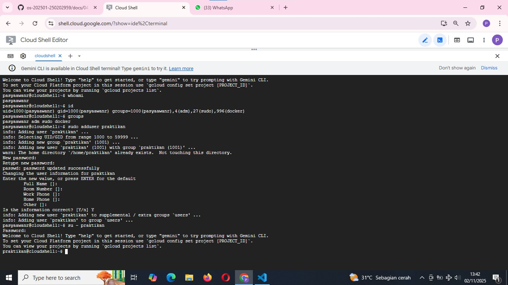
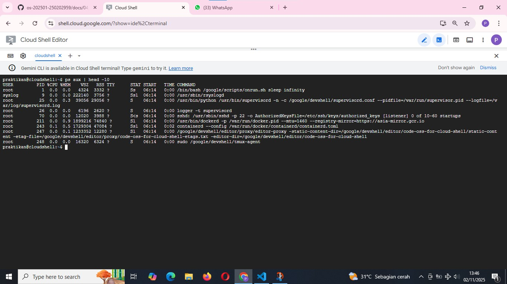
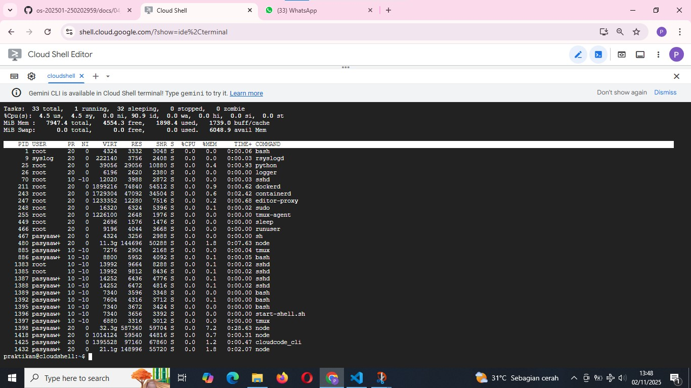
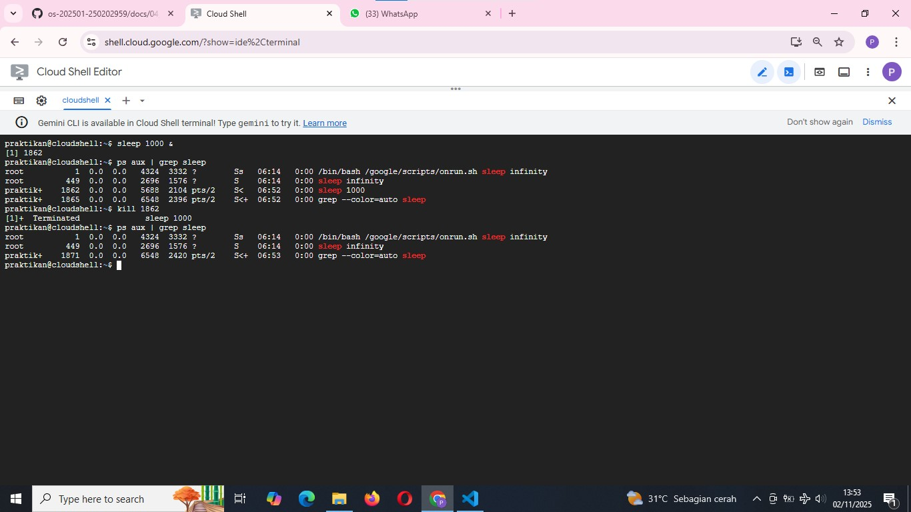
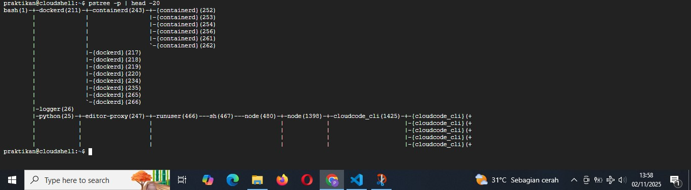

# Laporan Praktikum Minggu 4
Topik: Manajemen Proses dan User di Linux

---

## Identitas
- **Nama**  : Pasya Awan Rizky Saputro  
- **NIM**   : 250202959  
- **Kelas** : 1IKRB

---

## Tujuan
1. Mampu menjelaskan konsep proses dan user dalam sistem operasi Linux.
2. Mampu menampilkan daftar proses yang sedang berjalan dan statusnya.
3. Mampu menggunakan perintah untuk membuat dan mengelola user.
4. Mampu menghentikan atau mengontrol proses tertentu menggunakan PID.
5. Mampu menjelaskan kaitan antara manajemen user dan keamanan sistem.

---

## Dasar Teori
Pada praktikum minggu ini, mahasiswa akan mempelajari **konsep proses dan manajemen user dalam sistem operasi Linux**.
Mahasiswa akan memahami bagaimana sistem operasi:

- Membuat dan mengatur proses (process management).
- Mengelola user, group, serta hak akses pengguna.
- Menampilkan, menghentikan, dan mengontrol proses yang sedang berjalan.
- Menghubungkan konsep user management dengan keamanan sistem operasi.

Eksperimen dilakukan melalui penggunaan perintah dasar seperti ```ps```, ```top```, ```kill```, ```adduser```, ```passwd```, ```id```, dan ```groups```.

---

## Langkah Praktikum
1. **Setup Environment**

   - Gunakan Linux (Ubuntu/WSL).
   - Pastikan Anda sudah login sebagai user non-root.
   - Siapkan folder kerja.
     ```bash
     praktikum/week4-proses-user/
     ```
2. **Eksperimen 1 – Identitas User** Jalankan perintah berikut:
   ```bash
   whoami
   id
   groups
   ```
   - Jelaskan setiap output dan fungsinya.
   - Buat user baru (jika memiliki izin sudo):
     ```bash
     sudo adduser praktikan
     sudo passwd praktikan
     ```
   - Uji login ke user baru.
3. **Eksperimen 2 – Monitoring Proses** Jalankan:
   ```bash
   ps aux | head -10
   top -n 1
   ```
    - Jelaskan kolom penting seperti PID, USER, %CPU, %MEM, COMMAND.
    - Simpan tangkapan layar ```top``` ke:
      ```bash
      praktikum/week4-proses-user/screenshots/top.png
      ```
4. **Eksperimen 3 – Kontrol Proses**

   - Jalankan program latar belakang:
     ```bash
     sleep 1000 &
     ps aux | grep sleep
     ```
   - Catat PID proses ```sleep```.
   - Hentikan proses:
     ```bash
     kill <PID>
     ```
   - Pastikan proses telah berhenti dengan ```ps aux | grep sleep```.
5. **Eksperimen 4 – Analisis Hierarki Proses** Jalankan:
   ```bash
   pstree -p | head -20
   ```
   - Amati hierarki proses dan identifikasi proses induk (```init/systemd```).
   - Catat hasilnya dalam laporan.
6. **Commit & Push**
   ```bash
   git add .
   git commit -m "Minggu 4 - Manajemen Proses & User"
   git push origin main
   ```

---

## Kode / Perintah
Tuliskan potongan kode atau perintah utama:
```bash
whoami
id
groups
sudo adduser praktikan
su praktikan
ps aux | head -10
top -n 1
sleep 1000 &
ps aux | grep sleep
kill <PID>
pstree -p | head -20
```

---

## Hasil Eksekusi
Sertakan screenshot hasil percobaan atau diagram:
1. **Eksperimen 1 – Identitas User**


| No | Perintah            | Hasil                                                                                                          | Keterangan                                                                           |
| -- | ----------------------------------- | -------------------------------------------------------------------------------------------------------------------------------- | --------------------------------------------------------------------------------------------- |
| 1  | `whoami`                            | `pasyaawanr`                                                                                                                     | Menampilkan **nama user aktif** yang sedang login ke sistem.                                  |
| 2  | `id`                                | `uid=1000(pasyaawanr) gid=1000(pasyaawanr) groups=1000(pasyaawanr),4(adm),27(sudo),996(docker)`                                  | Menampilkan **UID, GID**, serta daftar **grup** yang diikuti oleh user `pasyaawanr`.          |
| 3  | `groups`                            | `pasyaawanr adm sudo docker`                                                                                                     | Menampilkan **nama-nama grup** tempat user `pasyaawanr` menjadi anggota.                      |
| 4  | `sudo adduser praktikan`            | Menambahkan user baru bernama `praktikan`, membuat home directory `/home/praktikan`, dan mengatur password serta informasi user. | Digunakan untuk **membuat akun user baru** di sistem.                                         |
| 5  | `su - praktikan`                    | Mengubah user aktif menjadi `praktikan`, login shell baru muncul (`praktikan@cloudshell:~$`).                                    | Digunakan untuk **berpindah user** (switch user) ke akun `praktikan`.                         |
| 6  | `whoami` (setelah `su - praktikan`) | `praktikan`                                                                                                                      | Menampilkan nama user aktif baru yaitu `praktikan`, menandakan **perpindahan user berhasil**. |


2. **Eksperimen 2 – Monitoring Proses**   



| No | Perintah   | Kolom yang Diamati             | Hasil Pengamatan                                                                                                                                                              | Keterangan                                                                                                                                                                                                        |                                                                                                                                                           |
| -- | ---------- | ------------------------------ | ----------------------------------------------------------------------------------------------------------------------------------------------------------------------------- | ----------------------------------------------------------------------------------------------------------------------------------------------------------------------------------------------------------------- | --------------------------------------------------------------------------------------------------------------------------------------------------------- |
| 1  | `ps aux    | head -10`                      | PID, USER, %CPU, %MEM, COMMAND                                                                                                                                                | Menampilkan proses dengan berbagai user seperti `root`, `syslog`, dan `praktikan`. Contoh: PID 1 (`root`) menjalankan `bash`, PID 9 (`syslog`) menjalankan `rsyslogd`, PID 243 (`root`) menjalankan `containerd`. | Perintah ini menampilkan daftar proses sistem secara statis (snapshot) dan memperlihatkan berapa banyak CPU dan memori yang digunakan oleh setiap proses. |
| 2  | `top -n 1` | PID, USER, %CPU, %MEM, COMMAND | Menampilkan proses secara dinamis dalam satu kali tampilan. Terlihat proses dengan penggunaan CPU dan memori rendah, seperti `bash`, `python`, `dockerd`, `node`, dan `sshd`. | Menunjukkan aktivitas sistem secara real-time, termasuk penggunaan CPU dan memori pada saat perintah dijalankan.                                                                                                  |                                                                                                                                                           |

Penjelasan ```PID```, ```USER```, ```%CPU```, ```%MEM```, ```COMMAND```.

| Kolom       | Keterangan                                                                                                         |
| ----------- | ------------------------------------------------------------------------------------------------------------------ |
| **PID**     | Nomor identitas unik dari setiap proses yang sedang berjalan di sistem.                                            |
| **USER**    | Nama pengguna yang menjalankan proses tersebut.                                                                    |
| **%CPU**    | Persentase penggunaan CPU oleh proses. Semakin besar nilainya, semakin banyak sumber daya prosesor yang digunakan. |
| **%MEM**    | Persentase penggunaan memori (RAM) oleh proses.                                                                    |
| **COMMAND** | Perintah atau nama program yang dijalankan oleh proses tersebut.                                                   |


3. **Eksperimen 3 – Kontrol Proses**


| No | Perintah yang Dijalankan | Hasil Pengamatan                                                                      | Keterangan / Penjelasan                                                                                                  |                                                                                                                       |
| -- | ------------------------ | ------------------------------------------------------------------------------------- | ------------------------------------------------------------------------------------------------------------------------ | --------------------------------------------------------------------------------------------------------------------- |
| 1  | `sleep 1000 &`           | Sistem menjalankan proses `sleep` di **background** dengan **PID = 1862**.            | Tanda `&` menunjukkan proses dijalankan di latar belakang, sehingga terminal tetap bisa digunakan untuk perintah lain.   |                                                                                                                       |
| 2  | `ps aux                  | grep sleep`                                                                           | Ditampilkan beberapa proses dengan nama `sleep`, salah satunya adalah `praktikan 1862 0.0 0.0 ... sleep 1000`.           | Dari output ini, **PID 1862** teridentifikasi sebagai proses `sleep 1000` yang baru dijalankan oleh user `praktikan`. |
| 3  | `kill 1862`              | Proses `sleep` dihentikan. Terminal menampilkan pesan `[1]+  Terminated  sleep 1000`. | Perintah `kill` digunakan untuk mengakhiri proses berdasarkan PID-nya. Proses dengan PID 1862 telah berhasil dihentikan. |                                                                                                                       |
| 4  | `ps aux                  | grep sleep` (setelah kill)                                                            | Proses `sleep 1000` sudah tidak muncul lagi, hanya tersisa proses `sleep infinity` milik sistem dan proses `grep`.       | Membuktikan bahwa proses dengan PID 1862 benar-benar telah dihentikan.                                                |

**Kesimpulan**

- Perintah sleep 1000 & membuat proses berjalan di background dengan PID 1862.

- ps aux | grep sleep digunakan untuk memantau proses yang berjalan.

- kill <PID> menghentikan proses yang diinginkan.

- Setelah dieksekusi, hasil pengecekan ulang menunjukkan proses tersebut sudah tidak aktif lagi.


4. **Eksperimen 4 – Analisis Hierarki Proses**


   - Hasil perintah ```pstree -p | head -20``` menunjukkan bahwa pada lingkungan ```Google Cloud Shell```, proses induk tertinggi adalah ```bash(1)```, bukan systemd, karena sistem berjalan di dalam container environment.
Semua proses lain seperti ```dockerd```, ```containerd```, ```python```, dan ```cloudcode_cli``` merupakan proses turunan dari ```bash```.

| No | Aspek yang Diamati                                | Hasil Pengamatan                                                      | Keterangan                                                                                             |                                          |
| -- | ------------------------------------------------- | --------------------------------------------------------------------- | ------------------------------------------------------------------------------------------------------ | ---------------------------------------- |
| 1  | Perintah yang dijalankan                          | `pstree -p                                                            | head -20`                                                                                              | Menampilkan hierarki proses dan PID-nya. |
| 2  | Proses paling atas                                | `bash(1)`                                                             | Berfungsi sebagai proses induk (root process) pada lingkungan Cloud Shell.                             |                                          |
| 3  | Proses turunan utama                              | `dockerd`, `containerd`, `python`, `runuser`, `node`, `cloudcode_cli` | Proses-proses ini dijalankan oleh `bash(1)` untuk mendukung eksekusi perintah dan layanan Cloud Shell. |                                          |
| 4  | Proses induk sebenarnya (pada sistem Linux biasa) | `systemd` atau `init`                                                 | Namun, di Cloud Shell digantikan oleh `bash(1)` sebagai parent process tertinggi.                      |                                          |


---

## Analisis
- Dalam sistem operasi Linux, ```user``` adalah identitas pengguna yang memiliki hak akses tertentu terhadap sistem, sedangkan proses adalah program yang sedang dijalankan. Setiap user memiliki ID dan grup yang menentukan izin aksesnya, dan setiap proses memiliki PID sebagai identitas uniknya. Linux bersifat multiuser dan multitasking, sehingga banyak pengguna dan proses dapat berjalan bersamaan dengan pengelolaan yang teratur oleh sistem. 
- Hubungan antara user management dan keamanan sistem Linux sangat erat karena pengelolaan pengguna berfungsi untuk membatasi dan mengatur hak akses agar sistem tetap aman. Dengan manajemen user yang baik, setiap pengguna hanya dapat mengakses file dan proses sesuai izin yang diberikan, sehingga mencegah penyalahgunaan atau kerusakan sistem. Administrator (root) memiliki kendali penuh untuk menambah, menghapus, atau membatasi pengguna melalui pengaturan hak akses dan grup. Dengan demikian, user management menjadi kunci utama dalam menjaga keamanan, stabilitas, dan integritas sistem Linux. 
- Hubungan antara **user management** dan keamanan **sistem Linux** adalah bahwa pengelolaan pengguna berfungsi untuk menjaga agar hanya orang yang berwenang dapat mengakses dan mengubah sistem. Melalui user management, administrator dapat mengatur hak akses, membatasi tindakan pengguna, serta memisahkan data dan proses antar user. Dengan pembagian hak yang jelas antara user biasa dan root, Linux mencegah penyalahgunaan, perusakan, maupun kebocoran data. Jadi, user management berperan penting sebagai dasar pengendalian dan perlindungan keamanan sistem Linux.


---

## Kesimpulan
Tuliskan 2–3 poin kesimpulan dari praktikum ini.

---

## Quiz
1. Apa fungsi dari proses ```init``` atau ```systemd``` dalam sistem Linux?  
   **Jawaban:**  
   Proses ```init``` atau ```systemd``` adalah proses pertama yang dijalankan oleh sistem operasi Linux setelah kernel aktif. Fungsinya untuk menginisialisasi sistem, menjalankan layanan-layanan penting (service/daemon), dan mengatur urutan startup hingga sistem siap digunakan. Selain itu, proses ini juga bertugas mengelola proses lain di sistem, menangani proses yatim (orphan process), serta mengatur proses shutdown dan reboot.
2. Apa perbedaan antara ```kill``` dan ```killall```?
   **Jawaban:**  
   - ```kill``` = menghentikan proses tertentu berdasarkan PID
   - ```killall``` = menghentikan semua proses berdasarkan nama program
3. Mengapa user ```root``` memiliki hak istimewa di sistem Linux? 
   **Jawaban:**  
administrator utama yang memiliki kendali penuh terhadap seluruh sistem artinya Ia memiliki kendali penuh terhadap seluruh sistem, termasuk mengubah konfigurasi, menginstal atau menghapus program, menambah pengguna, serta mengatur hak akses file dan perangkat. Karena memiliki wewenang penuh, user root digunakan untuk pengelolaan dan pemeliharaan sistem, serta memastikan keamanan dan kestabilan sistem operasi.

---

## Refleksi Diri
Tuliskan secara singkat:
- Apa bagian yang paling menantang minggu ini?  
  - Di bagian eksperimen 1 pada saat mau uji login keuser baru
- Bagaimana cara Anda mengatasinya?  
  - Bertanya teman
---

**Credit:**  
_Template laporan praktikum Sistem Operasi (SO-202501) – Universitas Putra Bangsa_
