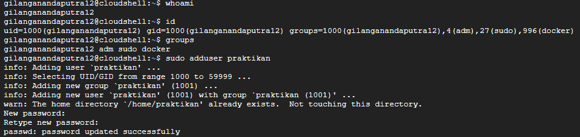
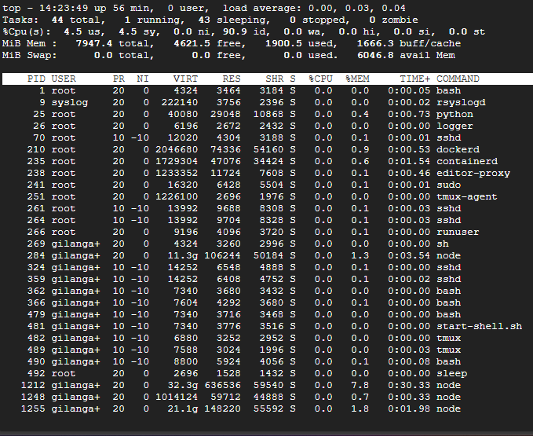
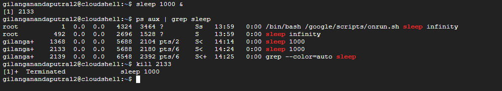

# Laporan Praktikum Minggu 4
Topik: Manajemen Proses dan User di Linux

---

## Identitas
- **Nama**  : Gilang Ananda Putra  
- **NIM**   : 250202939  
- **Kelas** : 1IKRB

---

## Tujuan
Tuliskan tujuan praktikum minggu ini.  
1. Menjelaskan konsep proses dan user dalam sistem operasi Linux.  
2. Menampilkan daftar proses yang sedang berjalan dan statusnya.  
3. Menggunakan perintah untuk membuat dan mengelola user.  
4. Menghentikan atau mengontrol proses tertentu menggunakan PID.  
5. Menjelaskan kaitan antara manajemen user dan keamanan sistem. 

---

## Dasar Teori

1.  **Manajemen Proses**
    **Proses** adalah program yang sedang dieksekusi oleh sistem operasi. Kernel Linux bertugas mengelola siklus hidupnya (membuat, menjadwalkan, menghentikan) dan memberinya ID unik (**PID**).

2.  **Manajemen User & Grup**
    Linux adalah sistem **multi-user**. Setiap *user* (memiliki **UID**) dan *group* (memiliki **GID**) digunakan sebagai basis untuk menentukan kepemilikan file dan proses.

3.  **Hak Akses dan Keamanan**
    Keamanan di Linux bergantung pada **izin (permission)** file. Sistem operasi memeriksa siapa pemilik file (user/group) dan izin apa (baca, tulis, eksekusi) yang dimiliki oleh *user* yang mencoba mengaksesnya.

4.  **Hierarki Proses dan Superuser**
    Semua proses membentuk hierarki (pohon) yang dimulai dari proses `init`/`systemd` (**PID 1**). User **`root`** adalah *superuser* dengan hak akses tak terbatas, berbeda dengan *user* biasa yang haknya dibatasi untuk keamanan.

---

## Langkah Praktikum
1. **Setup Environment**
   - Gunakan Linux (Ubuntu/WSL).  
   - Pastikan Anda sudah login sebagai user non-root.  
   - Siapkan folder kerja:
     ```
     praktikum/week4-proses-user/
     ```

2. **Eksperimen 1 – Identitas User**
   Jalankan perintah berikut:
   ```bash
   whoami
   id
   groups
   ```
   - Jelaskan setiap output dan fungsinya.  
   - Buat user baru (jika memiliki izin sudo):
     ```bash
     sudo adduser praktikan
     sudo passwd praktikan
     ```
   - Uji login ke user baru.

3. **Eksperimen 2 – Monitoring Proses**
   Jalankan:
   ```bash
   ps aux | head -10
   top -n 1
   ```
   - Jelaskan kolom penting seperti PID, USER, %CPU, %MEM, COMMAND.  
   - Simpan tangkapan layar `top` ke:
     ```
     praktikum/week4-proses-user/screenshots/top.png
     ```

4. **Eksperimen 3 – Kontrol Proses**
   - Jalankan program latar belakang:
     ```bash
     sleep 1000 &
     ps aux | grep sleep
     ```
   - Catat PID proses `sleep`.  
   - Hentikan proses:
     ```bash
     kill <PID>
     ```
   - Pastikan proses telah berhenti dengan `ps aux | grep sleep`.

5. **Eksperimen 4 – Analisis Hierarki Proses**
   Jalankan:
   ```bash
   pstree -p | head -20
   ```
   - Amati hierarki proses dan identifikasi proses induk (`init`/`systemd`).  
   - Catat hasilnya dalam laporan.

6. **Commit & Push**
   ```bash
   git add .
   git commit -m "Minggu 4 - Manajemen Proses & User"
   git push origin main
   ```

---

## Kode / Perintah
```bash
whoami
id
groups
sudo adduser praktikan
sudo passwd praktikan
ps aux | head -10
top -n 1
sleep 1000 &
ps aux | grep sleep
kill <PID>
pstree -p | head -20
```

---

## Hasil Eksekusi
### Eksperimen 1

- **Perintah**

```bash
whoami
id
groups
sudo adduser praktikan
sudo passwd praktikan
```
- **Hasil Eksekusi**


- **Analisis**

| Perintah                 | Fungsi Perintah                                                                                  | Output Eksekusi                                                                                                     | Analisis Hasil                                                                                                                                               |
|--------------------------|--------------------------------------------------------------------------------------------------|----------------------------------------------------------------------------------------------------------------------|--------------------------------------------------------------------------------------------------------------------------------------------------------------|
| `whoami`                 | Menampilkan nama user yang saat ini sedang aktif atau login.                                    | `gilanganandaputra12`                                                                                               | User yang menjalankan perintah adalah `gilanganandaputra12`.                                                                                                 |
| `id`                     | Menampilkan identitas user dan grup secara numerik dan nama.                                    | `uid=1000(gilanganandaputra12) gid=1000(gilanganandaputra12) groups=1000(gilanganandaputra12),4(adm),27(sudo),996(docker)` | User memiliki UID dan GID utama **1000**. User merupakan anggota grup `sudo`, sehingga memiliki hak administratif.                                           |
| `groups`                 | Menampilkan nama-nama grup tempat user menjadi anggota.                                         | `gilanganandaputra12 adm sudo docker`                                                                               | Mengonfirmasi user tergabung dalam grup `sudo` dan `docker`.                                                                                                |
| `sudo adduser praktikan` | Membuat akun user baru bernama *praktikan*. Perintah ini memerlukan hak administratif (sudo).   | Berhasil membuat user dan grup `praktikan` dengan `UID/GID 1001`.                                                   | User `praktikan` berhasil dibuat dengan UID dan GID unik (**1001**), terpisah dari user utama (**1000**).                                                   |
| `sudo passwd praktikan`  | Mengatur atau mengubah kata sandi user `praktikan`. Membutuhkan hak istimewa (sudo).           | `passwd: password updated successfully`                                                                             | Password untuk user `praktikan` berhasil diatur, sehingga akun siap digunakan.                                                                              |

### Eksperimen 2

#### 1.  **Perintah**

```bash
ps aux | head -10
```
- **Hasil Eksekusi**


- **Analisis Kolom**

| Kolom   | Penjelasan                                                                                                 |
|---------|-------------------------------------------------------------------------------------------------------------|
| `USER`   | Nama user yang memiliki dan menjalankan proses.                                                            |
| `PID`    | *Process ID*, nomor identifikasi unik untuk proses.                                                        |
| `%CPU`   | Persentase penggunaan **CPU (Central Processing Unit)** oleh proses.                                       |
| `%MEM`   | Persentase penggunaan **memori fisik (RAM)** oleh proses.                                                 |
| `STAT`   | Status proses. Contoh: `Ss` (Sleeping, Session leader), `Ssl` (Sleeping, Session leader, Multi-threaded). |
| `COMMAND`| Perintah lengkap yang memulai proses.                                                                     |

- **Analisis Proses**

| PID | USER   | %CPU | %MEM | STAT | COMMAND                                                   | Keterangan / Fungsi                                                                                                                                               |
|-----|--------|------|------|------|-----------------------------------------------------------|------------------------------------------------------------------------------------------------------------------------------------------------------------------|
| 1   | root   | 0.0  | 0.0  | Ss   | /bin/bash /google/scripts/onrun.sh sleep infinity        | Proses inisialisasi utama (PID 1). Menjalankan script inisialisasi dan `sleep infinity` untuk menjaga lingkungan tetap aktif.                                   |
| 9   | syslog | 0.0  | 0.0  | Ssl  | /usr/sbin/rsyslogd                                       | **rsyslogd** — daemon sistem untuk mengumpulkan dan mengelola pesan log sistem.                                                                                  |
| 25  | root   | 0.0  | 0.3  | S    | /usr/bin/python /usr/bin/supervisord ...                 | **Supervisord** — daemon yang mengontrol dan memonitor proses lain secara berkelanjutan.                                                                         |
| 26  | root   | 0.0  | 0.0  | S    | logger -t supervisord                                    | Proses logging yang digunakan untuk mencatat aktivitas supervisord ke sistem.                                                                                   |
| 70  | root   | 0.0  | 0.0  | S<s  | sshd: /usr/sbin/sshd ... [listener]                      | **SSH daemon** — mendengarkan koneksi SSH masuk untuk akses shell aman.                                                                                         |
| 210 | root   | 0.0  | 0.9  | Sl   | /usr/bin/dockerd ...                                     | **Docker daemon** — proses inti yang mengelola container Docker.                                                                                                 |
| 235 | root   | 0.1  | 0.5  | Ssl  | containerd --config ...                                  | **containerd** — daemon pengelola siklus hidup container (pembuatan, eksekusi, dll.) yang digunakan oleh Docker.                                                |
| 238 | root   | 0.0  | 0.1  | Sl   | /google/devshell/editor/proxy/editor-proxy ...           | Editor Proxy — menangani akses editor kode pada lingkungan cloud shell.                                                                                          |
| 241 | root   | 0.0  | 0.0  | S    | sudo /google/devshell/tmux-agent                         | Menjalankan `tmux-agent` untuk menjaga sesi terminal tetap berjalan dan dapat dipulihkan kembali (persistent shell session).                                    |


#### 2.  **Perintah**

```bash
top -n 1
```
- **Hasil Eksekusi**
  


- **Ringkasan Proses**

| Metrik         | Nilai                                   | Penjelasan                                                                                                                                                     |
|----------------|-----------------------------------------|----------------------------------------------------------------------------------------------------------------------------------------------------------------|
| Time & Uptime  | 14:23:49 up 56 min                      | Waktu sistem saat ini dan durasi sistem telah berjalan (**uptime**) yaitu 56 menit.                                                                            |
| Load Average   | 0.00, 0.03, 0.04                        | Beban rata-rata CPU selama **1, 5, dan 15 menit** terakhir. Nilai mendekati 0 menunjukkan sistem sangat idle atau tidak ada proses berat yang berjalan.       |
| Tasks          | 44 total, 1 running, 43 sleeping

- **Daftar Proses**

| Kolom   | Kepanjangan        | Fungsi dan Makna                                                                                                                                      |
|---------|---------------------|-------------------------------------------------------------------------------------------------------------------------------------------------------|
| `PID`   | Process ID          | Nomor identifikasi unik untuk setiap proses. Digunakan untuk mengontrol proses (misalnya dengan `kill`).                                             |
| `USER`  | User                | Nama user yang memiliki dan menjalankan proses tersebut.                                                                                             |
| `PR`    | Priority            | Prioritas proses untuk penjadwalan kernel. Rentang nilai: `0` = prioritas tertinggi

- **Analisis Proses**

| PID  | USER    | %MEM | COMMAND | Keterangan                                                                 |
|------|---------|------|---------|-----------------------------------------------------------------------------|
| 1212 | gilanga+| 7.8  | node    | Proses yang paling banyak menggunakan memori (sekitar 8% dari total RAM).  |
| 1255 | gilanga+| 1.8  | node    | Proses Node.js lainnya yang juga memakai memori cukup besar.               |
| 210  | root    | 0.9  | dockerd | Proses Docker Daemon, menggunakan memori untuk menjalankan layanan container. |


### Eksperimen 3

- **Perintah**

```bash
sleep 1000 &
ps aux | grep sleep
kill <PID>
```
- **Hasil Eksekusi**


- **Analisis**

| Kode Perintah           | Fungsi                              | Output/Tujuan                                                                                                                                                            |
|-------------------------|--------------------------------------|---------------------------------------------------------------------------------------------------------------------------------------------------------------------------|
| `sleep 1000 &`          | Memulai Proses di Latar Belakang.   | Perintah ini menjalankan program **sleep** yang akan menunggu selama 1000 detik. Tanda `&` (ampersand) memastikan proses ini berjalan di background sehingga terminal tetap bisa digunakan. |
| `ps aux \| grep sleep`  | Memverifikasi dan Mengidentifikasi PID. | Perintah ini adalah gabungan dua perintah yang dihubungkan oleh pipe (`\|`) untuk menampilkan proses yang mengandung kata *sleep*, sehingga dapat mengetahui PID proses tersebut. |
| `kill <PID>`            | Mengakhiri Proses Menggunakan ID.   | Mengirimkan sinyal **SIGTERM** (sinyal terminasi default) untuk meminta proses mengakhiri diri dengan baik berdasarkan `<PID>` (misalnya `kill 2133`). Digunakan untuk menghentikan proses background. |


### Eksperimen 5

- **Perintah**

```bash
pstree -p | head -20
```
- **Hasil Eksekusi**

```bash
bash(1)-+-dockerd(239)-+-containerd(267)-+-{containerd}(286)
        |              |                 |-{containerd}(287)
        |              |                 |-{containerd}(288)
        |              |                 |-{containerd}(289)
        |              |                 |-{containerd}(290)
        |              |                 `-{containerd}(294)
        |              |-{dockerd}(245)
        |              |-{dockerd}(246)
        |              |-{dockerd}(247)
        |              |-{dockerd}(248)
        |              |-{dockerd}(263)
        |              |-{dockerd}(264)
        |              |-{dockerd}(295)
        |              |-{dockerd}(296)
        |              `-{dockerd}(297)
        |-logger(26)
        |-python(25)-+-editor-proxy(276)-+-runuser(517)---sh(523)---node(541)-+-node(1240)-+-cloudcode_cli(1305)-+-{cloudcode_cli}(+
        |            |                   |                                    |            |                     |-{cloudcode_cli}(+
        |            |                   |                                    |            |                     |-{cloudcode_cli}(+
        |            |                   |                                    |            |                     |-{cloudcode_cli}(+
```
---

## **Hubungan antara User Management dan Keamanan Sistem Linux**

User management memiliki peran sentral dalam menjaga keamanan sistem Linux. Pengaturan pengguna bukan hanya tugas administratif, tetapi menjadi **fondasi utama arsitektur keamanan**. Setiap kebijakan keamanan diterapkan berdasarkan identitas pengguna dan grup.

#### **Hubungan Kunci**

1. **Prinsip Hak Istimewa Minimum (PoLP)**

   * Pemisahan antara pengguna biasa dan root.
   * Penggunaan `sudo` untuk akses admin terbatas.
   * Mengurangi risiko jika akun/ aplikasi disusupi.

2. **Kontrol Akses Sistem**

   * Hak akses file dan direktori berbasis *user*, *group*, dan *others*.
   * Menjamin hanya pengguna berhak yang bisa membaca/menulis/menjalankan file.
   * Pengelompokan pengguna memungkinkan kontrol akses lebih efisien.

3. **Otentikasi dan Otorisasi**

   * Validasi kredensial melalui sistem seperti `/etc/shadow`.
   * Penentuan hak akses setelah login berdasarkan grup dan konfigurasi sistem.
   * Pengelolaan siklus hidup akun (buat, ubah, hapus) mencegah penyalahgunaan akun tidak aktif.

4. **Audit dan Akuntabilitas**

   * Setiap aktivitas sistem tercatat berdasarkan user ID.
   * Memudahkan pelacakan aktivitas mencurigakan dan investigasi insiden.
   * Menjamin setiap tindakan dapat dipertanggungjawabkan.

---

### **Kesimpulan**

User management merupakan **elemen fundamental dalam keamanan Linux**. Dengan pengaturan pengguna dan hak akses yang baik, sistem dapat mempertahankan keamanan, mencegah akses tidak sah, mengurangi risiko serangan, serta memastikan akuntabilitas pengguna.

---

## Analisis
1.  **Makna Hasil Percobaan**

| Eksperimen           | Makna Hasil                                                                                                                                                                                                                                                                 |
|----------------------|-----------------------------------------------------------------------------------------------------------------------------------------------------------------------------------------------------------------------------------------------------------------------------|
| Identitas User       | Perintah `whoami`, `id`, dan `groups` menunjukkan bahwa user **gilanganandaputra12** adalah user biasa (UID 1000), namun memiliki hak istimewa karena berada dalam grup **sudo**. Ini memungkinkan user menjalankan perintah administratif seperti `adduser`, yang biasanya hanya bisa dilakukan oleh root (UID 0). |
| Monitoring Proses    | Output dari `ps aux` dan `top` memperlihatkan bahwa proses dalam sistem Linux berjalan dalam struktur hirarki. Proses sistem penting seperti `dockerd` dan `containerd` dijalankan oleh **root**, sedangkan proses aplikasi seperti `node` dijalankan oleh user biasa. Ini menunjukkan **prinsip pemisahan hak akses**. |
| Kontrol Proses       | Perintah `sleep 1000 &`, `ps aux`, dan `kill <PID>` membuktikan bahwa user dapat membuat proses di background, melihat PID-nya, dan menghentikannya. Ini menunjukkan bahwa setiap proses memiliki **PID unik** dan kernel menyediakan mekanisme kontrol proses melalui sinyal (misal SIGTERM). |
| Hierarki (pstree)    | Output `pstree` menunjukkan bahwa setiap proses memiliki induk (parent process). Proses sistem utama berasal dari `systemd` (PID 1) sebagai akar dari semua proses. Ini membuktikan **arsitektur hierarki proses** di Linux, di mana proses anak diwariskan dari proses induk.                                   |

2.  **Hubungkan hasil dengan teori (fungsi kernel, system call, arsitektur OS)**

Hasil percobaan secara langsung menggambarkan tiga konsep inti dalam arsitektur sistem operasi (OS) modern, khususnya Linux:

#### A. Fungsi Kernel dan System Call

- **Manajemen Sumber Daya (Kernel)** 
Ketika Anda menjalankan `sleep 1000 &`, user shell memanggil System Call (seperti `fork()` dan `exec()`) ke Kernel Linux. Kernel kemudian membuat entitas proses baru, menetapkan PID unik (misalnya 2133), mengalokasikan memori (%MEM), dan mendaftarkannya dalam tabel prosesnya.

- **Kontrol Proses (System Call)** 
Perintah `kill 2133` juga memicu System Call ke Kernel. Kernel akan menerima sinyal terminasi dan bertindak sebagai perantara untuk mengakhiri proses 2133 secara paksa, karena user tidak dapat secara langsung mengubah state proses di memori.

#### B. Arsitektur Multi-User dan Pemisahan Hak Istimewa
- **Mode User vs. Mode Kernel** 
Operasi yang memerlukan akses ke sumber daya inti (misalnya, `sudo adduser`) harus dilakukan dalam Mode Kernel dan hanya bisa dipicu oleh user dengan izin yang tepat (root atau anggota sudo). Operasi biasa (seperti `sleep` atau `bash`) berjalan di Mode User yang dibatasi.

- **Keamanan OS** 
Hasil ini menggarisbawahi arsitektur keamanan Linux: User biasa (gilanga+) hanya dapat mematikan proses yang ia miliki (`kill 2133`), tetapi tidak dapat mematikan proses milik user lain atau sistem (root), kecuali melalui mekanisme sudo.

3.  **Perbedaan Hasil di Lingkungan OS Berbeda (Linux vs. Windows)**

Meskipun fungsi inti manajemen user dan proses serupa (setiap OS memiliki PID dan user), implementasi dan hasil perintah akan sangat berbeda:

| Fitur | Linux (Sistem UNIX-like) | Windows (NT Kernel) |
|-------|---------------------------|----------------------|
| Identitas User | Didasarkan pada UID (Numeric ID) dan GID. Pengguna utama adalah root (UID 0). | Didasarkan pada SID (Security Identifier). Pengguna utama adalah Administrator atau akun SYSTEM. |
| Alat Monitoring | Perintah berbasis teks seperti `ps aux` dan `top` (berjalan di shell). | Graphical interface seperti Task Manager atau perintah command line seperti `tasklist` dan `taskkill`. |
| Kontrol Proses | "Menggunakan `kill <PID>` untuk mengirim sinyal (SIGTERM, SIGKILL)." | Menggunakan `taskkill /PID <PID>` atau `taskkill /IM <ImageName>` untuk menghentikan. |
| Filosofi Keamanan | Kuat dalam pemisahan hak akses file dan proses berdasarkan kepemilikan. Akses root seringkali diperlukan untuk tugas sistem. | Akses dikelola melalui UAC (User Account Control) dan sistem Registry. Izin terikat pada Security Descriptor. |


---

## Kesimpulan
1. Praktikum ini memberikan pemahaman tentang cara kerja proses dalam sistem operasi Linux, termasuk melihat daftar proses, memonitor penggunaan sumber daya, serta mengelola proses menggunakan perintah seperti `ps`, `top`, dan `kill`.

2. Melalui percobaan manajemen user, mahasiswa mempelajari cara membuat dan mengelola akun pengguna, memahami peran user dan group, serta kaitannya dengan keamanan sistem Linux melalui pengaturan hak akses dan privilese user.

3. Hierarki proses dan peran `init/systemd` sebagai parent process utama memperlihatkan struktur eksekusi program dalam Linux, sehingga mahasiswa dapat memahami hubungan antar proses dan bagaimana sistem melakukan manajemen proses secara terstruktur.

---

## Quiz
1. Apa fungsi dari proses `init` atau `systemd` dalam sistem Linux?


   **Jawaban:**  
   `init` atau `systemd` adalah proses pertama yang dijalankan oleh kernel saat sistem booting dan memiliki PID 1. Proses ini bertugas menginisialisasi sistem, menjalankan service/daemon, dan menjadi induk (parent process) bagi seluruh proses lain yang berjalan di sistem.

2. Apa perbedaan antara `kill` dan `killall`?  


   **Jawaban:**  
    - `kill`: Mengirim sinyal ke proses berdasarkan **PID (Process ID)** tertentu.  
   - `killall`: Mengirim sinyal ke semua proses berdasarkan **nama program** yang sama, sehingga dapat menghentikan beberapa proses sekaligus tanpa menuliskan PID.

3. Mengapa user `root` memiliki hak istimewa di sistem Linux?


   **Jawaban:**  
   User `root` merupakan **superuser** dengan akses penuh ke seluruh sistem. Hak istimewa ini diperlukan untuk melakukan tugas administrasi seperti mengelola file sistem, menambah user, menginstal software, dan mengubah konfigurasi sistem demi menjaga kontrol dan keamanan sistem operasi.

---

## Refleksi Diri
Tuliskan secara singkat:
- Apa bagian yang paling menantang minggu ini?  
Kesulitan utama adalah memahami sintaksis dan flag perintah yang sangat spesifik (`ps aux`, `top -n 1`, `kill <PID>`) tanpa ada bantuan antarmuka grafis. Presisi kecil pada penulisan sangat menentukan keberhasilan eksekusi kode.

- Bagaimana cara Anda mengatasinya?  
Saya mengatasinya dengan fokus pada dokumentasi dan tab-completion. Saya secara aktif memverifikasi flag perintah (-a, -u, -x, -n 1) dan menggunakan tombol TAB untuk memastikan sintaksis sudah benar sebelum dieksekusi, sehingga meminimalkan error yang disebabkan oleh ketidakakuratan.


---

**Credit:**  
_Template laporan praktikum Sistem Operasi (SO-202501) – Universitas Putra Bangsa_
