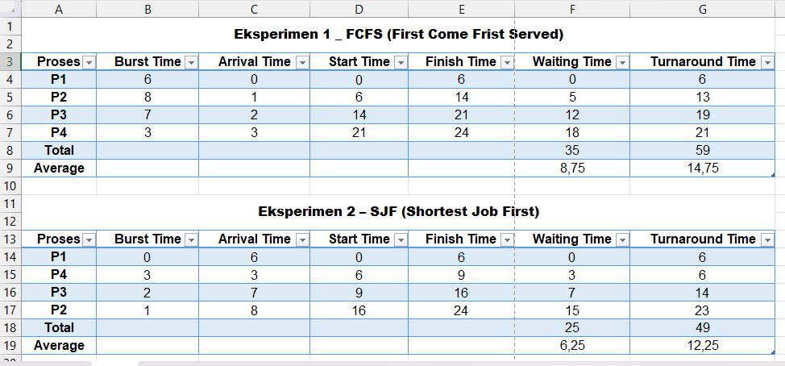
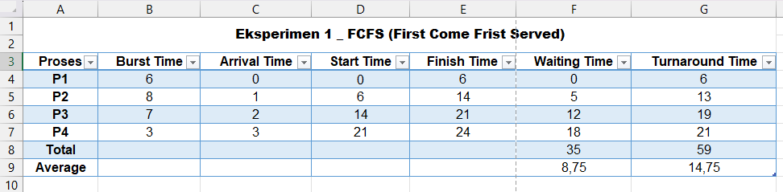
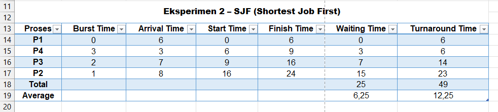

# Laporan Praktikum Minggu 5
Topik: Penjadwalan CPU – FCFS dan SJF 

---

## Identitas
- **Nama**  : Gilang Ananda Putra  
- **NIM**   : 250202939  
- **Kelas** : 1IKRB

---

## Tujuan
Setelah menyelesaikan tugas ini, mahasiswa mampu:
1. Menghitung *waiting time* dan *turnaround time* untuk algoritma FCFS dan SJF.  
2. Menyajikan hasil perhitungan dalam tabel yang rapi dan mudah dibaca.  
3. Membandingkan performa FCFS dan SJF berdasarkan hasil analisis.  
4. Menjelaskan kelebihan dan kekurangan masing-masing algoritma.  
5. Menyimpulkan kapan algoritma FCFS atau SJF lebih sesuai digunakan. 

---

## Dasar Teori

### 1. Tujuan Penjadwalan CPU

   Penjadwalan CPU (**CPU Scheduling**) adalah fungsi vital dari sistem operasi yang menentukan proses mana yang akan mendapatkan akses ke CPU, dan untuk berapa lama. Tujuannya adalah memaksimalkan **utilisasi CPU**, mencapai *throughput* yang tinggi, dan meminimalkan tiga metrik utama: **Waiting Time (WT)**, **Turnaround Time (TAT)**, dan waktu respons (*response time*).

### 2. Metrik Kinerja Utama
Dua metrik kunci yang digunakan untuk mengevaluasi kinerja algoritma penjadwalan:
* **Waiting Time (WT)**: Total waktu yang dihabiskan proses dalam *ready queue* menunggu giliran eksekusi.
    > $$WT = \text{Start Time} - \text{Arrival Time}$$
* **Turnaround Time (TAT)**: Total waktu yang dibutuhkan suatu proses dari saat tiba hingga selesai dieksekusi.
    > $$TAT = \text{Finish Time} - \text{Arrival Time}$$
* **Burst Time**: Waktu yang dibutuhkan proses untuk dieksekusi oleh CPU.

### 3. Algoritma FCFS (First Come First Served)
Algoritma ini adalah yang **paling sederhana** dan bersifat **non-preemptive**. Proses yang tiba pertama kali akan dieksekusi terlebih dahulu.
* **Prinsip**: FIFO (*First-In, First-Out*).
* **Kelebihan**: Mudah diimplementasikan dan bebas *starvation*.
* **Kekurangan**: Rata-rata *Waiting Time* dapat tinggi, terutama jika ada proses pendek yang terjebak di belakang proses panjang (**efek *convoy***).

### 4. Algoritma SJF (Shortest Job First)
Algoritma ini bersifat **non-preemptive** dalam skenario ini, dan memilih proses dari *ready queue* yang memiliki **Burst Time (waktu eksekusi) terpendek** berikutnya.
* **Prinsip**: Optimal karena cenderung menghasilkan **rata-rata *Waiting Time* minimum**.
* **Implementasi**: Membutuhkan perkiraan *Burst Time* di masa depan, yang sulit dilakukan pada sistem riil.
* **Kekurangan**: Berpotensi menyebabkan **starvation** (proses yang sangat panjang mungkin tidak pernah mendapat giliran jika proses-proses pendek terus berdatangan).

### 5. Non-Preemptive Scheduling
Kedua algoritma (FCFS dan SJF yang digunakan pada praktikum ini) adalah **non-preemptive**. Ini berarti setelah suatu proses mulai dieksekusi, proses tersebut akan berjalan hingga selesai (*terminate*) atau secara sukarela melepaskan CPU (*wait*) dan **tidak dapat dihentikan** oleh *scheduler* untuk memberikan giliran kepada proses lain yang lebih prioritas.

---

## Langkah Praktikum
1. **Siapkan Data Proses**
   Gunakan tabel proses berikut sebagai contoh (boleh dimodifikasi dengan data baru):
   | Proses | Burst Time | Arrival Time |
   |:--:|:--:|:--:|
   | P1 | 6 | 0 |
   | P2 | 8 | 1 |
   | P3 | 7 | 2 |
   | P4 | 3 | 3 |

2. **Eksperimen 1 – FCFS (First Come First Served)**
   - Urutkan proses berdasarkan *Arrival Time*.  
   - Hitung nilai berikut untuk tiap proses:
     ```
     Waiting Time (WT) = waktu mulai eksekusi - Arrival Time
     Turnaround Time (TAT) = WT + Burst Time
     ```
   - Hitung rata-rata Waiting Time dan Turnaround Time.  
   - Buat Gantt Chart sederhana:  
     ```
     | P1 | P2 | P3 | P4 |
     0    6    14   21   24
     ```

3. **Eksperimen 2 – SJF (Shortest Job First)**
   - Urutkan proses berdasarkan *Burst Time* terpendek (dengan memperhatikan waktu kedatangan).  
   - Lakukan perhitungan WT dan TAT seperti langkah sebelumnya.  
   - Bandingkan hasil FCFS dan SJF pada tabel berikut:

     | Algoritma | Avg Waiting Time | Avg Turnaround Time | Kelebihan | Kekurangan |
     |------------|------------------|----------------------|------------|-------------|
     | FCFS | ... | ... | Sederhana dan mudah diterapkan | Tidak efisien untuk proses panjang |
     | SJF | ... | ... | Optimal untuk job pendek | Menyebabkan *starvation* pada job panjang |

4. **Eksperimen 3 – Visualisasi Spreadsheet (Opsional)**
   - Gunakan Excel/Google Sheets untuk membuat perhitungan otomatis:
     - Kolom: Arrival, Burst, Start, Waiting, Turnaround, Finish.
     - Gunakan formula dasar penjumlahan/subtraksi.
   - Screenshot hasil perhitungan dan simpan di:
     ```
     praktikum/week5-scheduling-fcfs-sjf/screenshots/
     ```

5. **Analisis**
   - Bandingkan hasil rata-rata WT dan TAT antara FCFS & SJF.  
   - Jelaskan kondisi kapan SJF lebih unggul dari FCFS dan sebaliknya.  
   - Tambahkan kesimpulan singkat di akhir laporan.

6. **Commit & Push**
   ```bash
   git add .
   git commit -m "Minggu 5 - CPU Scheduling FCFS & SJF"
   git push origin main
   ```

---

## Perhitungan
Perhitungan **Waiting Time (WT)** dan **Turnaround Time (TAT)**
```bash
Waiting Time (WT) = waktu mulai eksekusi - Arrival Time
Turnaround Time (TAT) = WT + Burst Time
```

---

## Hasil Eksekusi
Hasil eksekusi dari **FCFS** dan **SJF**



### Eksperimen 1 – FCFS (First Come First Served)

Urutkan proses berdasarkan *Arrival Time*.  



### Eksperimen 2 – SJF (Shortest Job First)

Urutkan proses berdasarkan *Burst Time* terpendek (dengan memperhatikan waktu kedatangan).  



### Perbandingan hasil FCFS dan SJF

| Algoritma            | Avg Waiting Time | Avg Turnaround Time | Kelebihan                                                                 | Kekurangan                                                                 |
|----------------------|------------------|---------------------|---------------------------------------------------------------------------|------------------------------------------------------------------------------|
| **FCFS**             | 8.75             | 14.75               | Sederhana, mudah diterapkan; adil (urut datang).                          | Tidak efisien jika ada job panjang (meningkatkan avg WT).                   |
| **SJF (non-preemptive)** | 6.25         | 12.25               | Memberikan rata-rata waktu tunggu dan turnaround lebih kecil → lebih efisien untuk throughput. | Dapat menyebabkan *starvation* untuk job panjang; butuh info burst time yang akurat. |


---

##  Analisis Perbandingan

### 1. Perbandingan Rata-rata WT dan TAT

| Algoritma | Avg. Waiting Time (WT) | Avg. Turnaround Time (TAT) |
|:---:|:---:|:---:|
| **FCFS** | **8.75** | **14.75** |
| **SJF** | **6.25** | **12.25** |

**Analisis:**
   * Hasilnya dengan jelas menunjukkan bahwa algoritma **SJF (Shortest Job First)** menghasilkan **kinerja yang lebih unggul** dibandingkan FCFS untuk skenario ini.
   * Baik **Avg. Waiting Time** (6.25) maupun **Avg. Turnaround Time** (12.25) pada SJF secara signifikan **lebih rendah** daripada FCFS (8.75 dan 14.75).
   * Ini membuktikan bahwa SJF lebih efisien dalam mengelola antrian proses, mengurangi waktu tunggu rata-rata, dan menyelesaikan proses secara keseluruhan lebih cepat.

#### 2. Kondisi Keunggulan SJF vs FCFS

**SJF lebih unggul dari FCFS ketika:**

   1.  **Terdapat variasi *Burst Time* (BT) yang signifikan.** SJF unggul saat ada campuran proses pendek dan proses panjang. SJF akan "membersihkan" proses-proses pendek terlebih dahulu, sehingga proses-proses tersebut tidak perlu menunggu lama di belakang proses panjang.
   2.  **Tujuan utamanya adalah meminimalkan waktu tunggu rata-rata.** SJF secara teoretis terbukti optimal untuk mengurangi *Average Waiting Time*.
   3.  **Sistem tidak bersifat interaktif (sistem *batch*).** Dalam sistem *batch*, *starvation* (proses panjang tidak pernah dieksekusi) mungkin dapat ditoleransi demi efisiensi total.
   4.  ***Burst Time* proses dapat diprediksi secara akurat.** Ini adalah syarat utama agar SJF bisa diimplementasikan.

**FCFS lebih unggul (atau lebih sesuai) dari SJF ketika:**

   1.  **Prioritas utama adalah kesederhanaan dan keadilan (*fairness*).** FCFS adalah algoritma yang paling mudah diimplementasikan dan menjamin **tidak ada *starvation***. Setiap proses pasti akan dieksekusi sesuai urutan kedatangannya.
   2.  **Sistem bersifat interaktif dan responsif.** Dalam sistem interaktif, penting bagi setiap proses untuk mendapatkan giliran. Menggunakan SJF bisa menyebabkan proses interaktif yang kebetulan memiliki BT panjang (misal, kompilasi kode) tertunda terus-menerus, membuat sistem terasa tidak responsif.
   3.  ***Burst Time* tidak dapat diprediksi.** Jika BT tidak diketahui, SJF tidak dapat diimplementasikan. FCFS tidak memerlukan informasi ini.
   4.  **Semua proses memiliki *Burst Time* yang hampir sama.** Jika semua BT mirip, FCFS akan menghasilkan performa yang hampir sama dengan SJF tanpa kerumitan tambahan atau risiko *starvation*.

---

#### 3.  Kesimpulan

   Dalam praktikum ini, **SJF (Shortest Job First)** terbukti **lebih efisien** daripada **FCFS (First Come First Served)**, dengan menghasilkan rata-rata *Waiting Time* dan *Turnaround Time* yang lebih rendah (SJF: 6.25 WT, 12.25 TAT vs FCFS: 8.75 WT, 14.75 TAT).

   Keunggulan SJF terletak pada kemampuannya **meminimalkan waktu tunggu** dengan memprioritaskan tugas-tugas terpendek, sehingga sangat ideal untuk sistem *batch*. Namun, kelemahannya adalah **kesulitan memprediksi *Burst Time*** secara akurat di dunia nyata dan adanya **risiko *starvation*** untuk proses yang panjang.

   Sebaliknya, FCFS unggul dalam **kesederhanaan implementasi** dan **keadilan** (tanpa *starvation*), tetapi kinerjanya buruk jika proses pendek harus mengantri di belakang proses panjang (dikenal sebagai *convoy effect*). Pemilihan algoritma tergantung pada tujuan sistem: **efisiensi (SJF)** atau **kesederhanaan dan keadilan (FCFS)**.

---

## Kesimpulan Praktikum

1.  **SJF Mengungguli FCFS dalam Efisiensi**
Secara perhitungan, algoritma **SJF (Shortest Job First)** terbukti lebih **efisien** daripada FCFS, menghasilkan **rata-rata *Waiting Time*** dan ***Turnaround Time* minimum** untuk set data yang diberikan. Hal ini disebabkan oleh prinsip SJF yang memprioritaskan penyelesaian proses-proses pendek terlebih dahulu, mengurangi akumulasi waktu tunggu.

2.  **Trade-off Antara Kesederhanaan dan Optimalitas**
**FCFS** unggul dalam **kesederhanaan implementasi** dan menjamin tidak ada *starvation*, tetapi performanya buruk karena adanya *convoy effect* (proses pendek harus menunggu proses panjang yang datang lebih awal). Sebaliknya, **SJF** bersifat optimal tetapi rentan terhadap **masalah *starvation*** pada proses panjang dan sulit diimplementasikan pada OS nyata karena membutuhkan **prediksi *Burst Time*** yang akurat.

3.  **Algoritma Ideal Bergantung pada Konteks**
Pemilihan algoritma penjadwalan bergantung pada tujuan sistem. **FCFS** cocok untuk sistem *batch* sederhana yang memprioritaskan **keadilan** dan kemudahan. Sedangkan **SJF** (terutama varian *preemptive*-nya seperti SRTF) lebih disukai ketika tujuan utama adalah **meminimalkan waktu tunggu** dan meningkatkan *throughput* sistem secara keseluruhan.

---

## Quiz
1. Apa perbedaan utama antara FCFS dan SJF?  

   **Jawaban:**  

   - **FCFS (First Come First Served):** Memilih proses berdasarkan **waktu kedatangan (*Arrival Time*)**; proses yang tiba pertama akan dieksekusi pertama (prinsip FIFO).
   - **SJF (Shortest Job First):** Memilih proses berdasarkan **waktu eksekusi (*Burst Time*)** terpendek; proses yang membutuhkan waktu CPU paling sedikit akan dieksekusi terlebih dahulu.

2. Mengapa SJF dapat menghasilkan rata-rata waktu tunggu minimum?  

   **Jawaban:**  

   SJF menghasilkan rata-rata waktu tunggu minimum karena **meminimalkan penundaan proses pendek**. Dengan memprioritaskan proses yang cepat selesai, SJF secara efektif membersihkan antrian dari "beban" waktu eksekusi yang kecil, mencegah proses-proses pendek tersebut menunggu lama di belakang satu proses yang sangat panjang. Secara matematis, memindahkan proses panjang ke belakang akan memberikan dampak penundaan total (akumulasi *waiting time*) yang paling kecil pada sistem.

3. Apa kelemahan SJF jika diterapkan pada sistem interaktif? 

   **Jawaban:**  

   Kelemahan utama SJF pada sistem interaktif (seperti *desktop* atau *server*) adalah potensi terjadinya **Starvation** dan masalah **prediktabilitas**:

   * **Starvation**: Proses interaktif yang membutuhkan *burst time* CPU yang panjang (*heavy computation*) mungkin **tidak pernah mendapat giliran** eksekusi jika proses-proses pendek (*background tasks*, *I/O handling*) terus-menerus berdatangan.
   * **Kurangnya Responsivitas**: Karena SJF *non-preemptive* (yang disimulasikan di sini) tidak bisa menginterupsi proses yang sedang berjalan, sistem akan terasa **tidak responsif** jika proses panjang mulai dieksekusi, meskipun ada *job* interaktif penting (misalnya, klik mouse) yang tiba.

---

## Refleksi Diri
Tuliskan secara singkat:
- Apa bagian yang paling menantang minggu ini?  

  Kesulitan utama terletak pada perhitungan manual waktu mulai, *waiting time*, dan *turnaround time*, terutama pada algoritma SJF yang memerlukan pemilihan proses dengan *burst time* terpendek berdasarkan waktu kedatangan.

- Bagaimana cara Anda mengatasinya?    

   Saya membuat tabel langkah demi langkah dan menambahkan rumus otomatis di Excel untuk membantu proses perhitungan. Dengan cara ini, saya bisa memverifikasi hasil dengan cepat dan memahami perbedaan kinerja antara FCFS dan SJF secara lebih jelas.

---

**Credit:**  
_Template laporan praktikum Sistem Operasi (SO-202501) – Universitas Putra Bangsa_
