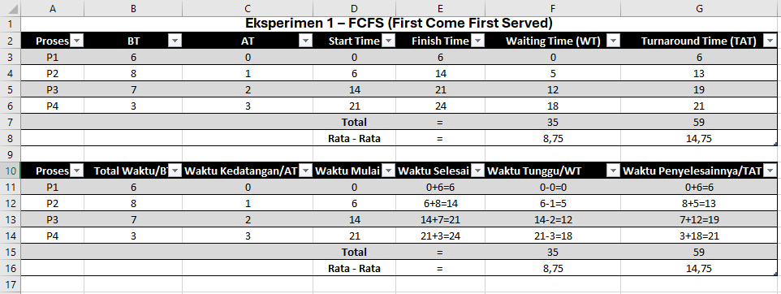
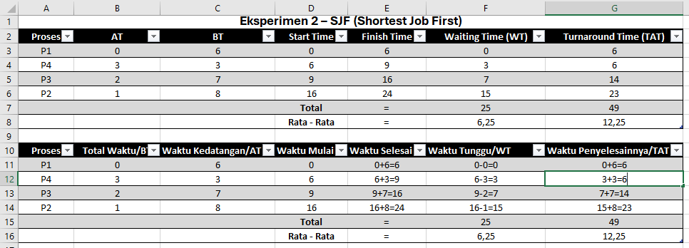

# Laporan Praktikum Minggu 5
Topik: Penjadwalan CPU – FCFS dan SJF

---

## Identitas
- **Nama**  : Pasya Awan Rizky Saputro  
- **NIM**   : 250202959
- **Kelas** : 1IKRB

---

## Tujuan
1. Menghitung waiting time dan turnaround time untuk algoritma FCFS dan SJF.
2. Menyajikan hasil perhitungan dalam tabel yang rapi dan mudah dibaca.
3. Membandingkan performa FCFS dan SJF berdasarkan hasil analisis.
4. Menjelaskan kelebihan dan kekurangan masing-masing algoritma.
5. Menyimpulkan kapan algoritma FCFS atau SJF lebih sesuai digunakan.

---

## Dasar Teori
Pada praktikum minggu ini, mahasiswa akan mempelajari **algoritma penjadwalan CPU (CPU Scheduling)** menggunakan dua pendekatan dasar:

- **FCFS (First Come First Served)**
- **SJF (Shortest Job First)**

Tujuan utamanya adalah memahami bagaimana sistem operasi menentukan urutan eksekusi proses, serta bagaimana waiting time dan turnaround time memengaruhi performa sistem.

Mahasiswa akan melakukan simulasi dan perbandingan hasil perhitungan kedua algoritma ini menggunakan **tabel observasi manual atau spreadsheet (Excel/Google Sheets)** — tanpa perlu melakukan instalasi atau pemrograman tambahan.

---

## Langkah Praktikum
1. **Siapkan Data Proses** Gunakan tabel proses berikut sebagai contoh (boleh dimodifikasi dengan data baru):

   | Proses | Burst Time | Arrival Time |
   | :----: | :--------: | :----------: |
   |   P1   |      6     |       0      |
   |   P2   |      8     |       1      |
   |   P3   |      7     |       2      |
   |   P4   |      3     |       3      |

2. **Eksperimen 1 – FCFS (First Come First Served)**
   - Urutkan proses berdasarkan _Arrival Time_.
   - Hitung nilai berikut untuk tiap proses:
      ```bash
      Waiting Time (WT) = waktu mulai eksekusi - Arrival Time
      Turnaround Time (TAT) = WT + Burst Time
      ```
   - Hitung rata-rata Waiting Time dan Turnaround Time.
   - Buat Gantt Chart sederhana:
      ```bash
      | P1 | P2 | P3 | P4 |
      0    6    14   21   24
      ```
3. **Eksperimen 2 – SJF (Shortest Job First)**
   - Urutkan proses berdasarkan Burst Time terpendek (dengan memperhatikan waktu kedatangan).
   - Lakukan perhitungan WT dan TAT seperti langkah sebelumnya.
   - Bandingkan hasil FCFS dan SJF pada tabel berikut:

   | **Algoritma**                     | **Avg Waiting Time** | **Avg Turnaround Time** | **Kelebihan**                  | **Kekurangan**                            |
   | --------------------------------- | -------------------- | ----------------------- | ------------------------------ | ----------------------------------------- |
   | **FCFS (First Come First Serve)** | ...                  | ...                     | Sederhana dan mudah diterapkan | Tidak efisien untuk proses panjang        |
   | **SJF (Shortest Job First)**      | ...                  | ...                     | Optimal untuk job pendek       | Menyebabkan *starvation* pada job panjang |
4. **Eksperimen 3 – Visualisasi Spreadsheet (Opsional)**
   - Gunakan Excel/Google Sheets untuk membuat perhitungan otomatis:
     - Kolom: Arrival, Burst, Start, Waiting, Turnaround, Finish.
     - Gunakan formula dasar penjumlahan/subtraksi.
   - Screenshot hasil perhitungan dan simpan di:
     ```bash
     praktikum/week5-scheduling-fcfs-sjf/screenshots/
     ```
5. **Analisis**
   - Bandingkan hasil rata-rata WT dan TAT antara FCFS & SJF.
   - Jelaskan kondisi kapan SJF lebih unggul dari FCFS dan sebaliknya.
   - Tambahkan kesimpulan singkat di akhir laporan.
6. **Commit & Push**       
   ```bash
   git add .
   git commit -m "Minggu 5 - CPU Scheduling FCFS & SJF"
   git push origin main
   ``` 
---

## Kode / Perintah
Tuliskan potongan kode atau perintah utama:
```bash
Waiting Time (WT) = Start Time - Arrival Time
Turnaround Time (TAT) = Finish Time - Arrival Time atau  Waiting Time + Burst Time
Average Waiting Time (WT) = Total Waiting Time
Average Turnaround Time (TAT) = Total Turnaround Time
```

---

## Hasil Eksekusi
Sertakan screenshot hasil percobaan atau diagram:




1. **Eksperimen 1 – FCFS (First Come First Served).**
   - Proses berdasarkan _Arrival Time_ :  ``P1 -> P2 -> P3 -> P4`` s

   - Gantt Chart FCFS
     ```bash
     | P1 | P2 | P3 | P4 |
     0    6    14   21   24
     ```    

2. **Eksperimen 2 – SJF (Shortest Job First)**
    - Proses berdasarkan _burst time_ terpendek : ``P1 -> P4 -> P3 -> P2``

   - Gantt Chart FJS
     ```bash
     | P1 | P4 | P3 | P2 |
     0    6    9    16   24
     ```

3. **Eksperimen 3 - Perbandingan FCFS & SJF**

   | **Algoritma** | **Avg Waiting Time** | **Avg Turnaround Time** | **Kelebihan**                                                             | **Kekurangan**                                                                     |
   | ------------- | -------------------- | ----------------------- | ------------------------------------------------------------------------- | ---------------------------------------------------------------------------------- |
   | **FCFS**      | 8,75                 | 14,75                   | Sederhana, mudah diterapkan, dan memastikan semua proses mendapat giliran | Tidak efisien untuk proses yang panjang dan menimbulkan convoy effect              |
   | **SJF**       | 6,25                 | 12,25                   | Optimal untuk job pendek dan menghasilkan waktu tunggu rata-rata minimum  | Menyebabkan starvation pada proses panjang dan membutuhkan estimasi waktu eksekusi |


---

## Analisis
- Pada hasil perhitungan, terlihat bahwa ```algoritma FCFS``` menghasilkan rata-rata waktu tunggu sebesar 8,75 dan rata-rata waktu penyelesaian 14,75. Nilai ini lebih besar dibandingkan ```algoritma SJF``` yang memiliki rata-rata waktu tunggu 6,25 dan waktu penyelesaian 12,25. Perbedaan ini terjadi karena ```FCFS``` memproses setiap job berdasarkan urutan kedatangan tanpa melihat durasi prosesnya. Ketika ada proses yang memiliki burst time panjang berada di urutan awal, proses lain yang lebih singkat harus menunggu lebih lama, sehingga waktu tunggu dan waktu penyelesaian meningkat.

   Sebaliknya, ```SJF``` memilih proses dengan ```burst time``` paling pendek untuk dieksekusi lebih dulu. Strategi ini membuat proses singkat cepat selesai dan tidak tertunda oleh proses panjang. Akibatnya, sebagian besar proses menyelesaikan tugas lebih cepat, dan waktu tunggu rata-rata menjadi lebih rendah. Efek ini juga berpengaruh langsung pada waktu penyelesaian yang ikut turun karena proses singkat tidak terjebak menunggu antrian yang panjang.
- ```SJF``` lebih unggul ketika proses-proses memiliki durasi yang berbeda jauh dan banyak proses yang waktunya pendek, karena algoritma ini bisa menyelesaikan proses cepat terlebih dahulu sehingga waktu tunggu menjadi lebih kecil. Sebaliknya, ```FCFS``` lebih unggul ketika durasi proses relatif mirip atau ketika ```burst time``` sulit diprediksi, karena algoritma ini lebih sederhana, lebih stabil, dan menjamin semua proses mendapat giliran tanpa risiko starvation.    

---

## Kesimpulan
- Kesimpulannya, FCFS adalah algoritma yang sangat sederhana dan adil karena menjalankan proses sesuai urutan kedatangan, tetapi sering tidak efisien ketika ada proses berdurasi panjang yang bisa menghambat proses lain. Sementara itu, SJF mampu memberikan kinerja yang lebih baik karena selalu mengeksekusi proses yang paling cepat terlebih dahulu, sehingga waktu tunggu dan penyelesaian rata-rata menjadi lebih kecil. Namun, SJF membutuhkan perkiraan waktu eksekusi yang akurat dan dapat membuat proses panjang tertunda terlalu lama. Jadi, FCFS unggul dalam kesederhanaan dan kepastian giliran, sedangkan SJF unggul dalam efisiensi dan kecepatan penyelesaian proses

---

## Quiz
1. Apa perbedaan utama antara FCFS dan SJF?  
   **Jawaban:**  
   Perbedaan utamanya, **FCFS** menjalankan proses berdasarkan urutan kedatangan, sedangkan **SJF** berdasarkan waktu eksekusi paling singkat agar lebih efisien.
2. Mengapa SJF dapat menghasilkan rata-rata waktu tunggu minimum?  
   **Jawaban:**  
   **SJF (Shortest Job First)** dapat menghasilkan rata-rata waktu tunggu minimum karena cara kerjanya yang selalu memprioritaskan proses dengan waktu eksekusi paling singkat terlebih dahulu, Dengan mengeksekusi proses yang cepat selesai lebih dulu, proses-proses tersebut tidak menumpuk di antrian dan segera selesai, sehingga mengurangi total waktu tunggu semua proses secara keseluruhan. Proses yang lebih panjang memang menunggu, tetapi karena banyak proses kecil sudah selesai lebih awal, rata-rata waktu tunggunya menjadi lebih rendah.
3. Apa kelemahan SJF jika diterapkan pada sistem interaktif?  
   **Jawaban:**  
   Kelemahan algoritma **SJF (Shortest Job First)** jika diterapkan pada **sistem interaktif** sulitnya memperkirakan waktu eksekusi setiap proses secara akurat. Dalam sistem interaktif, proses datang secara tidak teratur dan memiliki durasi yang tidak pasti karena bergantung pada input pengguna. Akibatnya, SJF tidak bisa menentukan dengan tepat proses mana yang benar-benar paling singkat.

---

## Refleksi Diri
Tuliskan secara singkat:
- Apa bagian yang paling menantang minggu ini?  
maaf pak saya telat karena keterbatasan waktu.
- Bagaimana cara Anda mengatasinya?  
sebisa mungkin saya mengerjakannya

---

**Credit:**  
_Template laporan praktikum Sistem Operasi (SO-202501) – Universitas Putra Bangsa_
