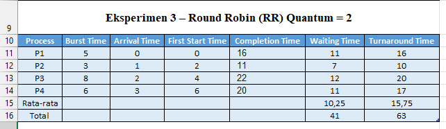
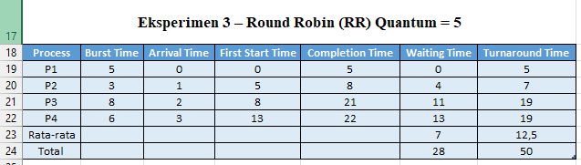

# Laporan Praktikum Minggu 6
Topik: Penjadwalan CPU – Round Robin (RR) dan Priority Scheduling  

---

## Identitas
- **Nama**  : Gilang Ananda Putra  
- **NIM**   : 250202939  
- **Kelas** : 1IKRB

---

## Tujuan
Tuliskan tujuan praktikum minggu ini.  
1. Menghitung *waiting time* dan *turnaround time* pada algoritma RR dan Priority.  
2. Menyusun tabel hasil perhitungan dengan benar dan sistematis.  
3. Membandingkan performa algoritma RR dan Priority.  
4. Menjelaskan pengaruh *time quantum* dan prioritas terhadap keadilan eksekusi proses.  
5. Menarik kesimpulan mengenai efisiensi dan keadilan kedua algoritma.  


---

## Dasar Teori
### Konsep Penjadwalan CPU
   Pengelolaan alokasi CPU (Penjadwalan CPU) merupakan suatu konsep esensial pada sistem operasi multitasking yang bertujuan untuk **menentukan** proses di dalam *ready queue* (antrian siap) yang **akan diberikan** jatah CPU. Sasaran pokok dari mekanisme ini adalah agar eksekusi proses **dapat diatur** secara berdaya guna, utilisasi CPU **dimaksimalkan**, *waiting time* (waktu tunggu) **ditekan**, dan responsivitas sistem **tetap terjaga**.

#### Algoritma Round Robin (RR)
   Round Robin (RR) merupakan sebuah algoritma penjadwalan bersifat *preemptive* yang **didesain secara spesifik** untuk penggunaan pada sistem *time-sharing*. Jatah waktu CPU yang identik, yang dikenal sebagai *Time Quantum* (q), **diberikan** kepada setiap proses. Apabila suatu proses belum rampung dalam satu *quantum*, proses tersebut **akan diambil alih** (*preempted*) serta **ditempatkan** pada bagian akhir *ready queue*. Keadilan (*fairness*) **dijamin** oleh algoritma ini, sebab setiap proses dipastikan memperoleh giliran. Akan tetapi, kinerjanya sangat ditentukan oleh ketepatan pemilihan nilai *quantum*.

#### Algoritma Priority Scheduling
   *Priority Scheduling* merupakan algoritma yang **mengasosiasikan** setiap proses dengan sebuah nilai prioritas. Sistem **mengalokasikan** CPU ke proses yang memiliki prioritas paling tinggi. Dalam pelaksanaan praktikum ini, praktikum **memperlakukan** nilai prioritas terkecil (contohnya, 1) sebagai prioritas tertinggi. Terdapat dua sifat pada algoritma ini: *non-preemptive* (proses dieksekusi hingga tuntas atau terblokir) atau *preemptive* (eksekusi proses **dapat diinterupsi** oleh proses lain yang prioritasnya lebih tinggi).

#### Metrik Kinerja dan Starvation
   Evaluasi kinerja algoritma penjadwalan **dilakukan** dengan **memanfaatkan** beberapa metrik, utamanya:

   * **Waiting Time (WT):**
   Durasi keseluruhan yang **dihabiskan** oleh proses untuk menanti di *ready queue* sebelum **dijalankan**.
   * **Turnaround Time (TAT):**
   Durasi keseluruhan sejak proses tiba hingga proses tersebut **tuntas dijalankan** ($TAT = WT + Burst Time$).

   *Starvation* (kelaparan) adalah sebuah isu yang lazim pada *Priority Scheduling*. Isu ini terjadi ketika proses dengan prioritas rendah **berpotensi gagal mendapatkan alokasi** CPU (tidak pernah **dijalankan**) apabila proses berprioritas lebih tinggi selalu tersedia untuk dieksekusi.

---

## Langkah Praktikum
1. **Siapkan Data Proses**
   Gunakan contoh data berikut (boleh dimodifikasi sesuai kebutuhan):
   | Proses | Burst Time | Arrival Time | Priority |
   |:--:|:--:|:--:|:--:|
   | P1 | 5 | 0 | 2 |
   | P2 | 3 | 1 | 1 |
   | P3 | 8 | 2 | 4 |
   | P4 | 6 | 3 | 3 |

2. **Eksperimen 1 – Round Robin (RR)**
   - Gunakan *time quantum (q)* = 3.  
   - Hitung *waiting time* dan *turnaround time* untuk tiap proses.  
   - Simulasikan eksekusi menggunakan Gantt Chart (manual atau spreadsheet).  
     ```
     | P1 | P2 | P3 | P4 | P1 | P3 | ...
     0    3    6    9   12   15   18  ...
     ```
   - Catat sisa *burst time* tiap putaran.

3. **Eksperimen 2 – Priority Scheduling (Non-Preemptive)**
   - Urutkan proses berdasarkan nilai prioritas (angka kecil = prioritas tinggi).  
   - Lakukan perhitungan manual untuk:
     ```
     WT[i] = waktu mulai eksekusi - Arrival[i]
     TAT[i] = WT[i] + Burst[i]
     ```
   - Buat tabel perbandingan hasil RR dan Priority.

4. **Eksperimen 3 – Analisis Variasi Time Quantum (Opsional)**
   - Ubah *quantum* menjadi 2 dan 5.  
   - Amati perubahan nilai rata-rata *waiting time* dan *turnaround time*.  
   - Buat tabel perbandingan efek *quantum*.

5. **Eksperimen 4 – Dokumentasi**
   - Simpan semua hasil tabel dan screenshot ke:
     ```
     praktikum/week6-scheduling-rr-priority/screenshots/
     ```
   - Buat tabel perbandingan seperti berikut:

     | Algoritma | Avg Waiting Time | Avg Turnaround Time | Kelebihan | Kekurangan |
     |------------|------------------|----------------------|------------|-------------|
     | RR | ... | ... | Adil terhadap semua proses | Tidak efisien jika quantum tidak tepat |
     | Priority | ... | ... | Efisien untuk proses penting | Potensi *starvation* pada prioritas rendah |

6. **Commit & Push**
   ```bash
   git add .
   git commit -m "Minggu 6 - CPU Scheduling RR & Priority"
   git push origin main
   ```


---

## Perhitungan

```bash
Waiting Time (WT) = waktu mulai eksekusi - Arrival Time
Turnaround Time (TAT) = WT + Burst Time
```

---

## Hasil Eksekusi
### 1. Eksperimen 1 – Round Robin (RR)

Menganalisis algoritma Round Robin dengan parameter **Time Quantum (q) = 3.** Simulasi ini menunjukkan bahwa RR berhasil mencapai keadilan waktu (fairness) dengan menginterupsi proses panjang (P1, P3, P4) dan memberikannya jatah eksekusi secara bergantian.

.png)

Simulasi eksekusi menggunakan Gantt Chart

     ```
     | P1 | P2 | P3 | P4 | P1 | P3 | P4 | P3 |
     0    3    6    9   12   14   17    20   22
     ```

### 2. Eksperimen 2 – Priority Scheduling (Non-Preemptive)

Menganalisis kinerja berdasarkan **prioritas statis** (angka kecil = prioritas tinggi). Karena bersifat Non-Preemptive, proses yang telah dieksekusi tidak dapat diinterupsi. Alur eksekusi ditentukan oleh Arrival Time (AT) dan kemudian oleh nilai Priority.

.png)

Simulasi eksekusi menggunakan Gantt Chart

     ```
     | P1 | P2 | P3 | P4 |
     0    5    8    14   22
     ```

### Eksperimen 3 – Analisis Variasi Time Quantum

##### Quantum = 2


Simulasi eksekusi menggunakan Gantt Chart

     ```
     | P1 | P2 | P3 | P4 | P1 | P2 | P3 | P4 | P1 | P3 | P4 | P3 |
     0    2    4    6    8    10   11   13   15   16   18   20   22
     ```

##### Quantum = 5


Simulasi eksekusi menggunakan Gantt Chart

     ```
     | P1 | P2 | P3 | P4 | P3 | P4 |
     0    5    8    13   18   21   22
     ```

##### Perbandingan efek *quantum*

* **Quantum Kecil ($q=2$):** Menyebabkan **Avg WT/TAT tertinggi** (10.25/15.75). Ini adalah cerminan dari **overhead *context switch*** yang berlebihan. CPU menghabiskan terlalu banyak waktu untuk berpindah proses daripada eksekusi.
* **Quantum Besar ($q=5$):** Menyebabkan **Avg WT/TAT terendah** (7.0/12.5). Ini karena $q$ yang besar membuat RR berperilaku mirip **FCFS**, meminimalkan *context switch* dan meningkatkan efisiensi.
* **Kesimpulan:** Semakin besar $q$ akan meningkatkan efisiensi (menurunkan WT/TAT), tetapi mengurangi *fairness* (keadilan) algoritma RR.

### Eksperimen 4 – Dokumentasi

| Algoritma            | Avg Waiting Time | Avg Turnaround Time | Kelebihan                                                | Kekurangan                                      |
|----------------------|------------------|----------------------|----------------------------------------------------------|-------------------------------------------------|
| Round Robin (RR)     | 8.5              | 14.0                 | Adil terhadap semua proses; Memberikan response time cepat. | Tidak efisien jika quantum tidak tepat. Overhead context switch tinggi. |
| Priority             | 5.25             | 10.75                | Efisien untuk proses penting. Kinerja rata-rata lebih baik untuk data ini. | Potensi starvation pada prioritas rendah. |


---

## Analisis dan Perbandingan Hasil

#### 1. Tabel Perbandingan Performa Utama

Berikut adalah perbandingan kinerja berdasarkan hasil perhitungan:

| Algoritma | Avg Waiting Time (WT) | Avg Turnaround Time (TAT) | Kinerja Relatif |
|:---|:---:|:---:|:---|
| **Priority Scheduling** | **5.25** | **10.75** | **Lebih Baik**. Nilai Avg WT/TAT terendah. |
| **Round Robin (RR)** | **8.5** | **14.0** | **Lebih Buruk**. Nilai Avg WT/TAT lebih tinggi. |

### 2. Analisis Pengaruh Prioritas

* **Kinerja Lebih Baik:** Priority Scheduling menghasilkan **Avg WT dan TAT yang lebih rendah** (5.25/10.75) dibandingkan RR. Hal ini disebabkan karena proses-proses penting (P2) mendapatkan akses CPU dengan cepat, meningkatkan efisiensi penyelesaian.
* **Risiko *Starvation*:** Kelemahan utamanya adalah risiko ***starvation***. Proses dengan prioritas rendah (seperti P3) dapat tidak terlayani (kelaparan) jika proses prioritas tinggi terus-menerus datang. RR tidak memiliki risiko ini karena menjamin keadilan waktu untuk semua proses.

### 3. Analisis Pengaruh Time Quantum (q)

Variasi nilai *quantum* dalam RR menunjukkan trade-off antara **efisiensi** dan **keadilan**:

| Quantum ($q$) | Performa | Keterangan |
|:---:|:---:|:---|
| **Kecil** ($q=2$) | **Avg WT/TAT Tertinggi** | Menyebabkan **overhead *context switch* berlebihan**, membuat sistem lambat, meskipun adil. |
| **Besar** ($q=5$) | **Avg WT/TAT Terendah** | **Efisiensi tertinggi** karena *context switch* berkurang. RR berperilaku seperti FCFS. |

* **Kesimpulan Quantum:** Nilai *quantum* harus dipilih secara optimal. Terlalu kecil meningkatkan *overhead*; terlalu besar mengurangi keadilan RR.

---

## Kesimpulan
1.  **Adanya *Trade-off* antara Keadilan dan Urgensi**
    Praktikum ini menunjukkan *trade-off* fundamental dalam penjadwalan CPU. **Round Robin (RR)** unggul dalam **keadilan (*fairness*)**; dengan memberikan jatah *time quantum* yang sama, ia memastikan semua proses mendapatkan perhatian CPU secara bergantian dan mencegah satu proses memonopoli sistem. Sebaliknya, **Priority Scheduling** unggul dalam **urgensi**; ia memastikan bahwa proses-proses yang dianggap paling penting (seperti P2 dengan prioritas 1) didahulukan, yang sangat krusial untuk tugas kritis, meskipun mengorbankan keadilan bagi proses lain.

2.  **Priority Scheduling Rentan terhadap *Starvation***
    Salah satu temuan kunci adalah kelemahan algoritma Priority Scheduling, yaitu potensi terjadinya **starvation** (kelaparan). Dalam simulasi, proses dengan prioritas rendah (seperti P3 dengan prioritas 4) akan terus-menerus ditunda eksekusinya jika ada proses lain dengan prioritas lebih tinggi (P1, P2, P4) yang terus datang atau siap dieksekusi. Ini menyebabkan *waiting time* yang sangat tinggi dan tidak terprediksi untuk proses berprioritas rendah.

3.  **Efisiensi RR Bergantung pada *Time Quantum***
    Eksperimen (terutama Eksperimen 4 Opsional) membuktikan bahwa performa algoritma Round Robin sangat sensitif terhadap pemilihan nilai *time quantum (q)*.
    * **Quantum terlalu kecil** akan meningkatkan *context switching overhead* secara signifikan, karena CPU terlalu sering berpindah antar proses, sehingga menurunkan throughput sistem.
    * **Quantum terlalu besar** akan membuat RR berperilaku mirip dengan algoritma First-Come, First-Served (FCFS), yang menghilangkan manfaat responsivitas dan keadilannya.

---

## Quiz
1. Apa perbedaan utama antara Round Robin dan Priority Scheduling?

   **Jawaban:**  

   Perbedaan utama antara **Round Robin** dan **Priority Scheduling** terletak pada **cara menentukan proses yang dieksekusi**.
   -  **Round Robin** menekankan **keadilan waktu** dengan memberikan *time quantum* yang sama dan mengeksekusi proses secara bergiliran.
   - **Priority Scheduling** mengutamakan **urgensi** dengan menjalankan proses berdasarkan **tingkat prioritas tertinggi** terlebih dahulu.

2. Apa pengaruh besar/kecilnya *time quantum* terhadap performa sistem? 

   **Jawaban:**  

   Jika *time quantum* **terlalu kecil**, sistem menjadi sangat **responsif** namun **meningkatkan *overhead context switching*** secara signifikan, yang pada akhirnya **menurunkan *throughput*** dan efisiensi sistem; sebaliknya, *time quantum* yang **terlalu besar** **mengurangi *overhead***, tetapi menyebabkan algoritma **Round Robin merosot menjadi FCFS** (*First-Come, First-Served*) sehingga **menurunkan responsivitas** sistem.

3. Mengapa algoritma Priority dapat menyebabkan *starvation*?   

   **Jawaban:**  

   Karena mekanisme penjadwalannya yang secara ketat **selalu mendahulukan proses dengan prioritas tertinggi**. Jika proses berprioritas lebih tinggi terus-menerus tiba dan siap dieksekusi, proses berprioritas rendah akan **tertunda eksekusinya tanpa batas waktu**, sehingga tidak pernah mendapatkan akses CPU.

---

## Refleksi Diri
Tuliskan secara singkat:
- Apa bagian yang paling menantang minggu ini?  

   Simulasi **Round Robin (RR)**, terutama saat *quantum* kecil ($q=2$). Tantangannya adalah menjaga keakuratan pelacakan **Sisa *Burst Time*** dan urutan proses di **Ready Queue** setelah setiap *preemption*.

- Bagaimana cara Anda mengatasinya? 

   Menggunakan **metode *step-by-step* yang sistematis** (tabel/Gantt Chart) untuk memvisualisasikan dan memastikan perhitungan akurat pada setiap *time marker* eksekusi.

---

**Credit:**  
_Template laporan praktikum Sistem Operasi (SO-202501) – Universitas Putra Bangsa_
