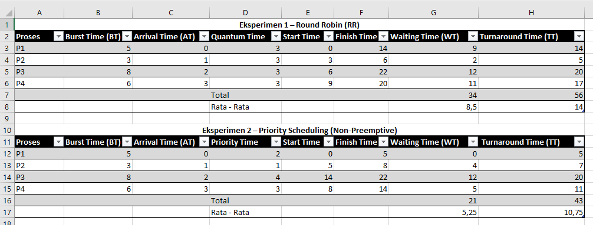
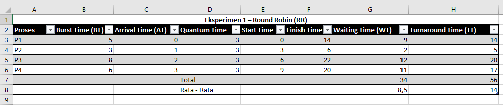
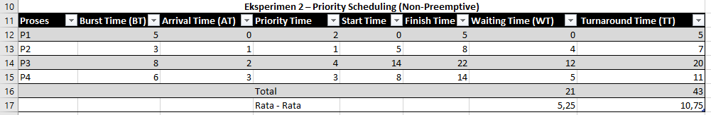

# Laporan Praktikum Minggu 6
Topik: Penjadwalan CPU – Round Robin (RR) dan Priority Scheduling

---

## Identitas
- **Nama**  : Pasya Awan Rizky Saputro  
- **NIM**   : 250202959
- **Kelas** : 1IKRB

---

## Tujuan
1. Menghitung waiting time dan turnaround time pada algoritma RR dan Priority.
2. Menyusun tabel hasil perhitungan dengan benar dan sistematis.
3. Membandingkan performa algoritma RR dan Priority.
4. Menjelaskan pengaruh time quantum dan prioritas terhadap keadilan eksekusi proses.
5. Menarik kesimpulan mengenai efisiensi dan keadilan kedua algoritma.

---

## Dasar Teori
Pada praktikum minggu ini, mahasiswa akan mempelajari **dua algoritma lanjutan penjadwalan CPU**, yaitu:
- **Round Robin (RR)**
- **Priority Scheduling**
Kedua algoritma ini banyak digunakan pada sistem modern karena mempertimbangkan **keadilan waktu eksekusi (time quantum)** dan **tingkat prioritas proses**.

Mahasiswa akan melakukan simulasi perhitungan manual untuk menghitung waiting time dan turnaround time, serta menganalisis efek perbedaan _time quantum_ dan prioritas terhadap performa CPU scheduling.

---

## Langkah Praktikum
1. **Siapkan Data Proses** Gunakan contoh data berikut (boleh dimodifikasi sesuai kebutuhan) :

   | Proses | Burst Time | Arrival Time | Priority |
   | ------ | ---------- | ------------ | -------- |
   | P1     | 5          | 0            | 2        |
   | P2     | 3          | 1            | 1        |
   | P3     | 8          | 2            | 4        |
   | P4     | 6          | 3            | 3        |

2. **Eksperimen 1 – Round Robin (RR)**
   - Gunakan _time quantum (q) = 3_.
   - Hitung _waiting time_ dan _turnaround time_ untuk tiap proses.
   - Simulasikan eksekusi menggunakan _Gantt Chart_ (manual atau spreadsheet)
     ```bash
     | P1 | P2 | P3 | P4 | P1 | P3 | ...
     0    3    6    9   12   15   18  ...
     ```
3. **Eksperimen 2 – Priority Scheduling (Non-Preemptive)**
   - Urutkan proses berdasarkan nilai prioritas (angka kecil = prioritas tinggi).
   - Lakukan perhitungan manual untuk:
     ```bash
     WT[i] = waktu mulai eksekusi - Arrival[i]
     TAT[i] = WT[i] + Burst[i]
     ```
4. **Eksperimen 3 – Analisis Variasi Time Quantum (Opsional)**
   - Ubah _quantum_ menjadi 2 dan 5.
   -  Amati perubahan nilai rata-rata _waiting time_ dan _turnaround time_.
   - Buat tabel perbandingan efek _quantum_.
5. **Eksperimen 4 – Dokumentasi**
   - Simpan semua hasil tabel dan screenshot ke:
     ```bash
     praktikum/week6-scheduling-rr-priority/screenshots/
     ```   
   - Buat tabel perbandingan seperti berikut:

     | Algoritma | Avg Waiting Time | Avg Turnaround Time | Kelebihan                    | Kekurangan                               |
     | --------- | ---------------- | ------------------- | ---------------------------- | ---------------------------------------- |
     | RR        | ...              | ...                 | Adil terhadap semua proses   | Tidak efisien jika quantum tidak tepat   |
     | Priority  | ...              | ...                 | Efisien untuk proses penting | Potensi starvation pada prioritas rendah |
6. **Commit & Push**
   ```bash
   git add .
   git commit -m "Minggu 6 - CPU Scheduling RR & Priority"
   git push origin main
   ```     

---

## Kode / Perintah
Tuliskan potongan kode atau perintah utama:
```bash
WT[i] = waktu mulai eksekusi - Arrival[i]
TAT[i] = WT[i] + Burst[i]
```

---

## Hasil Eksekusi
Sertakan screenshot hasil percobaan atau diagram:


1. **Eksperimen 1 – Round Robin (RR)**

   - Gantt Chart 
     ```bash
     | P1 | P2 | P3 | P4 | P1 | P3 | P4 | P4|
     0    3    6    9   12   15   18   21  24
     ```
2. **Eksperimen 2 – Priority Scheduling (Non-Preemptive)**

   - Gantt Chart
     ```bash
     | P1 | P2 | P4 | P3 |
     0    5    8   14   22 
     ```

3.  **Perbandingan**
    | **Algoritma**        | **Avg Waiting Time** | **Avg Turnaround Time** | **Kelebihan**                | **Kekurangan**                                  |
    | -------------------- | -------------------- | ----------------------- | ---------------------------- | ----------------------------------------------- |
    | **Round Robin (RR)** | 8.50                 | 14                      | Adil terhadap semua proses   | Tidak efisien jika quantum tidak tepat          |
    | **Priority**         | 5.25                 | 10.75                   | Efisien untuk proses penting | Potensi starvation pada proses prioritas rendah |


---

## Analisis
- Performa algoritma Round Robin dan Priority berbeda terutama karena cara keduanya menentukan urutan eksekusi proses. Pada Round Robin, faktor yang paling menentukan hasil akhir adalah besar–kecilnya time quantum. Quantum yang terlalu kecil membuat proses sering berpindah konteks sehingga waiting time dan turnaround time cenderung naik akibat overhead. Sebaliknya, quantum yang lebih besar mengurangi perpindahan konteks dan dapat menurunkan waktu tunggu, tetapi mengurangi responsivitas sehingga perilakunya mendekati FCFS. Sementara itu, pada Priority Scheduling, performa ditentukan oleh tingkat prioritas tiap proses. Proses dengan prioritas tinggi selalu diproses lebih cepat sehingga rata-rata waktu tunggu dan turnaround bisa lebih efisien untuk proses penting. Namun, penjadwalan ini berpotensi menyebabkan starvation bagi proses berprioritas rendah bila tidak diberi mekanisme seperti aging.

---

## Kesimpulan
- Round Robin menekankan keadilan dan cocok untuk sistem interaktif, tapi performanya sangat bergantung pada besar kecilnya time quantum. Priority Scheduling lebih efisien untuk proses penting, namun dapat menyebabkan proses berprioritas rendah menunggu terlalu lama. Pemilihan algoritma harus disesuaikan dengan tujuan: keadilan (RR) atau efisiensi prioritas (Priority).

---

## Quiz
1. Apa perbedaan utama antara Round Robin dan Priority Scheduling?  
**Jawaban:**  
   Perbedaan utamanya ada pada cara sistem menentukan urutan eksekusi proses.
   Pada Round Robin, semua proses diperlakukan sama dan dijalankan bergiliran dengan jatah waktu tertentu. Tidak ada proses yang benar-benar diutamakan; yang penting semua kebagian giliran secara adil.
   Sedangkan pada Priority Scheduling, urutan eksekusi ditentukan oleh tingkat prioritas. Proses yang dianggap lebih penting akan dijalankan lebih dulu, meskipun proses lain sudah menunggu lebih lama.

2. Apa pengaruh besar/kecilnya time _quantum_ terhadap performa sistem?  
**Jawaban:**   
 Apabila **time quantum terlalu kecil**, sistem akan terlalu sering melakukan pergantian proses. Kondisi ini membuat banyak waktu terbuang hanya untuk perpindahan konteks, sehingga kinerja keseluruhan menjadi kurang efisien. Sebaliknya, apabila **time quantum terlalu besar**, satu proses dapat berjalan terlalu lama sebelum digilir ke proses berikutnya. Akibatnya, waktu respons menjadi lambat dan sifat interaktif sistem berkurang.
3. Mengapa algoritma Priority dapat menyebabkan _starvation_?  
   **Jawaban:**  
   Setiap kali ada proses baru dengan prioritas lebih tinggi yang masuk, proses berprioritas rendah akan kembali tersisih dan tidak mendapat giliran eksekusi. Jika kondisi ini berlangsung terus, proses tersebut bisa tidak pernah dieksekusi sama sekali.

---

## Refleksi Diri
Tuliskan secara singkat:
- Apa bagian yang paling menantang minggu ini? 
  Laptop ngeleg
- Bagaimana cara Anda mengatasinya?
  Instal ulang  

---

**Credit:**  
_Template laporan praktikum Sistem Operasi (SO-202501) – Universitas Putra Bangsa_
