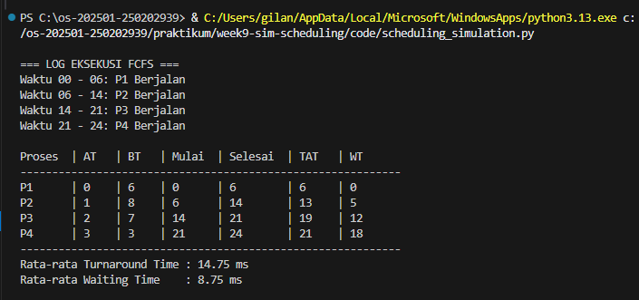

# Laporan Praktikum Minggu 9
Topik: [Tuliskan judul topik, misalnya "Arsitektur Sistem Operasi dan Kernel"]

---

## Identitas
- **Nama**  : Gilang Ananda Putra
- **NIM**   : 250202939 
- **Kelas** : 1IKRB

---

## Tujuan
Setelah menyelesaikan tugas ini, mahasiswa mampu:
1. Membuat program simulasi algoritma penjadwalan FCFS dan/atau SJF.  
2. Menjalankan program dengan dataset uji yang diberikan atau dibuat sendiri.  
3. Menyajikan output simulasi dalam bentuk tabel atau grafik.  
4. Menjelaskan hasil simulasi secara tertulis.  
5. Mengunggah kode dan laporan ke Git repository dengan rapi dan tepat waktu.

---

## Dasar Teori
1. **First-Come, First-Served (FCFS)**
Algoritma penjadwalan non-preemptive di mana proses yang tiba lebih dulu di *ready queue* akan dieksekusi terlebih dahulu oleh CPU.
2. **Arrival Time (AT)**
Waktu saat sebuah proses masuk ke dalam antrean.
3. **Burst Time (BT)**
Durasi waktu yang dibutuhkan oleh proses untuk menyelesaikan eksekusinya di CPU.
4. **Turnaround Time (TAT)**
Total waktu yang dihabiskan proses di dalam sistem, dihitung dengan rumus:

   $TAT = Finish\ Time - Arrival\ Time$.

5. **Waiting Time (WT)**
Waktu tunggu proses di dalam antrean sebelum dieksekusi, dihitung dengan rumus:

   $WT = Turnaround\ Time - Burst\ Time$.

---

## Langkah Praktikum
1. **Menyiapkan Dataset**

   Buat dataset proses minimal berisi:

   | Proses | Arrival Time | Burst Time |
   |:--:|:--:|:--:|
   | P1 | 0 | 6 |
   | P2 | 1 | 8 |
   | P3 | 2 | 7 |
   | P4 | 3 | 3 |

2. **Implementasi Algoritma**

   Program harus:
   - Menghitung *waiting time* dan *turnaround time*.  
   - Mendukung minimal **1 algoritma (FCFS atau SJF non-preemptive)**.  
   - Menampilkan hasil dalam tabel.

3. **Eksekusi & Validasi**

   - Jalankan program menggunakan dataset uji.  
   - Pastikan hasil sesuai dengan perhitungan manual minggu sebelumnya.  
   - Simpan hasil eksekusi (screenshot).

4. **Analisis**

   - Jelaskan alur program.  
   - Bandingkan hasil simulasi dengan perhitungan manual.  
   - Jelaskan kelebihan dan keterbatasan simulasi.

5. **Commit & Push**

   ```bash
   git add .
   git commit -m "Minggu 9 - Simulasi Scheduling CPU"
   git push origin main
   ```

---

## Kode / Perintah
#### Data set

| Proses | Arrival Time | Burst Time |
|:--:|:--:|:--:|
| P1 | 0 | 6 |
| P2 | 1 | 8 |
| P3 | 2 | 7 |
| P4 | 3 | 3 |
   
#### Kode Python Simulasi Algoritma Penjadwalan CPU First-Come, First-Served (FCFS)

```python
import csv
import os

base_dir = os.path.dirname(os.path.abspath(__file__))
path_dataset = os.path.join(base_dir, 'dataset.csv')

proses_list = []

try:
    with open(path_dataset, mode='r', encoding='utf-8-sig') as file:
        reader = csv.DictReader(file)
        for baris in reader:
            proses_list.append({
                'id' : baris['Proses'],
                'at' : int(baris['Arrival_Time']), 
                'bt' : int(baris['Burst_Time']),
                'start' : 0,
                'finish' : 0,
                'tat' : 0,
                'wt' : 0
            })
except FileNotFoundError:
    print(f"ERROR: File tidak ditemukan di: {path_dataset}")
    exit()

proses_list.sort(key=lambda x: x['at'])
waktu_sekarang = 0

print("\n=== LOG EKSEKUSI FCFS ===")
for p in proses_list:
    if waktu_sekarang < p['at']:
        print(f"Waktu {waktu_sekarang:02d} - {p['at']:02d}: CPU Idle")
        waktu_sekarang = p['at']

    p['start'] = waktu_sekarang
    waktu_sekarang += p['bt']
    p['finish'] = waktu_sekarang

    p['tat'] = p['finish'] - p['at']
    p['wt'] = p['tat'] - p['bt']
    
    print(f"Waktu {p['start']:02d} - {p['finish']:02d}: {p['id']} Berjalan")

print(f"\n{'Proses':<7} | {'AT':<4} | {'BT':<4} | {'Mulai':<6} | {'Selesai':<8} | {'TAT':<5} | {'WT':<5}")
print("-" * 60)

for p in proses_list:
    print(f"{p['id']:<7} | {p['at']:<4} | {p['bt']:<4} | {p['start']:<6} | {p['finish']:<8} | {p['tat']:<5} | {p['wt']:<5}")

avg_tat = sum(p['tat'] for p in proses_list) / len(proses_list)
avg_wt = sum(p['wt'] for p in proses_list) / len(proses_list)

print("-" * 60)
print(f"Rata-rata Turnaround Time : {avg_tat:.2f} ms")
print(f"Rata-rata Waiting Time    : {avg_wt:.2f} ms\n")
```

---

## Hasil Eksekusi



---

## **Analisis**

**1. Logika Penanganan CPU Idle (Idle Time Logic)**

Salah satu aspek paling krusial dalam simulasi ini adalah penanganan kondisi di mana CPU tidak memiliki proses untuk dijalankan. Dalam kode, hal ini diatasi dengan logika `if waktu_sekarang < p['at']`.

- **Mekanisme**

   Jika waktu global saat ini (`waktu_sekarang`) lebih kecil dari waktu kedatangan proses berikutnya (`p['at']`), program akan memaksa `waktu_sekarang` maju ke titik `p['at']`.

- **Pentingnya**

   Tanpa logika ini, simulasi akan salah mengasumsikan bahwa proses bisa berjalan sebelum ia tiba. Secara teoritis, celah waktu ini disebut **Idle Time**, di mana utilitas CPU bernilai 0%. Penanganan ini memastikan bahwa *Finish Time* () dihitung secara akurat berdasarkan realitas kronologis.

---

**2. Hubungan Hasil Simulasi dengan Teori (Convoy Effect)**

Berdasarkan dataset (P1 memiliki *Burst Time* 6), kita dapat mengamati karakteristik utama FCFS.

- **Karakteristik**

   FCFS bersifat *non-preemptive*; sekali proses memegang CPU, ia tidak bisa dihentikan hingga selesai.

- **Convoy Effect**

   Meskipun dataset ini kecil, terlihat bahwa proses pendek seperti P4 (BT=3) harus menunggu hingga P1, P2, dan P3 selesai (total tunggu yang lama). Jika P1 memiliki BT yang jauh lebih besar (misal 50), maka  akan membengkak secara tidak proporsional. Hasil simulasi ini membuktikan secara empiris bahwa FCFS sangat bergantung pada urutan kedatangan untuk menentukan efisiensi rata-rata sistem.

---

**3. Portabilitas Environment dan Robustness Kode**

Program ini dirancang dengan memperhatikan aspek portabilitas lintas platform (Windows, Linux, macOS).

- **Masalah Jalur File (Pathing)**

   Masalah "File Not Found" yang dialami sebelumnya terjadi karena terminal (shell) memiliki *Current Working Directory* yang berbeda dengan lokasi fisik script.

- **Solusi `os.path**`

   Dengan menggunakan `os.path.dirname(os.path.abspath(__file__))`, program secara dinamis menentukan lokasi dirinya sendiri. Hal ini memastikan program tetap berjalan dengan benar (robust) meskipun dijalankan dari folder induk (root) maupun folder `code/` secara langsung. Ini adalah praktik standar dalam pengembangan perangkat lunak sistem operasi agar kode tidak *hard-coded* terhadap satu struktur folder pengguna tertentu.


---

## Kesimpulan
1. **Akurasi Perhitungan Terotomatisasi**: Simulasi ini membuktikan bahwa penggunaan algoritma komputasional menghilangkan resiko *human error* dalam perhitungan metrik penjadwalan. Dengan rumus  dan  yang tertanam dalam *looping*, konsistensi data tetap terjaga meskipun jumlah proses () bertambah menjadi ribuan.
2. **Kelemahan Inheren FCFS**: Melalui analisis rata-rata WT dan TAT, dapat disimpulkan bahwa FCFS bukanlah algoritma yang ideal untuk sistem *multitasking* yang responsif. Meskipun adil dari segi antrean (FIFO), FCFS tidak mempertimbangkan efisiensi waktu tunggu proses-proses kecil yang berada di belakang proses besar.
3. **Pentingnya Integrasi Path Relatif**: Praktikum ini mengajarkan bahwa pengembangan alat sistem (system tools) harus memperhatikan cara program berinteraksi dengan sistem file. Penggunaan jalur absolut secara dinamis (`abspath`) adalah kunci utama agar program bersifat portabel dan dapat digunakan oleh pengguna lain dengan struktur direktori yang berbeda tanpa modifikasi kode.

---

## Quiz
1. **Mengapa simulasi diperlukan untuk menguji algoritma scheduling?**

   **Jawaban:**  

   Simulasi memungkinkan pengembang sistem operasi untuk mengevaluasi efisiensi algoritma tanpa harus menerapkannya langsung pada sistem nyata yang berisiko mengganggu performa perangkat keras.

2. **Apa perbedaan hasil simulasi dengan perhitungan manual jika dataset besar?** 

   **Jawaban:**  

   Simulasi memberikan hasil yang instan dan konsisten secara akurasi, sedangkan perhitungan manual pada dataset besar sangat rentan terhadap kesalahan ketelitian dan memakan waktu jauh lebih lama.

3. **Algoritma mana yang lebih mudah diimplementasikan? Jelaskan.**

   **Jawaban:**  

   FCFS (First-Come, First-Served) lebih mudah diimplementasikan karena hanya memerlukan struktur data antrean sederhana (FIFO) tanpa perlu melakukan pemindaian berulang terhadap *Burst Time* terkecil seperti pada SJF.


---

## Refleksi Diri
Tuliskan secara singkat:
- Apa bagian yang paling menantang minggu ini?  

   Bagian paling menantang adalah menangani masalah *File Not Found* di VS Code akibat perbedaan direktori kerja terminal dengan lokasi file `.py`.

- Bagaimana cara Anda mengatasinya?

   Saya mengatasinya dengan mempelajari modul `os` di Python untuk menggunakan *absolute path* sehingga program tetap bisa menemukan file `dataset.csv` di mana pun terminal dijalankan.

---

**Credit:**  
_Template laporan praktikum Sistem Operasi (SO-202501) – Universitas Putra Bangsa_
